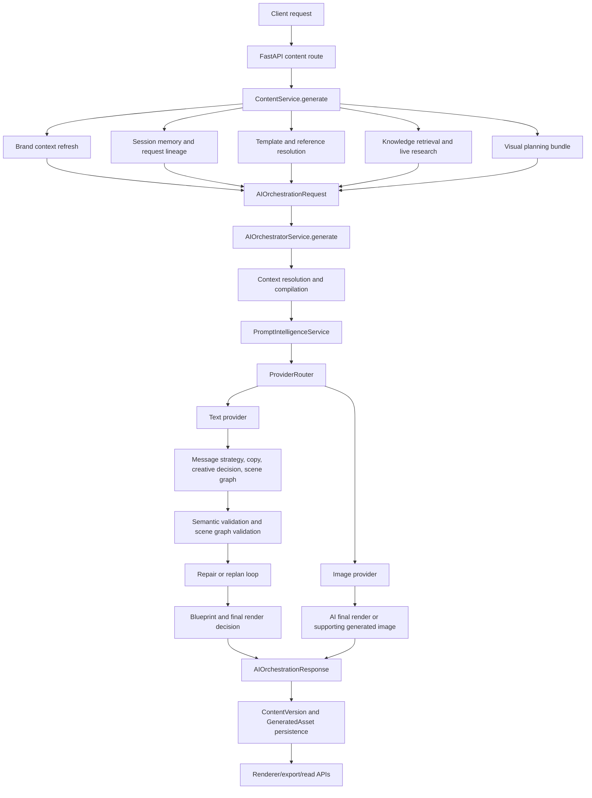
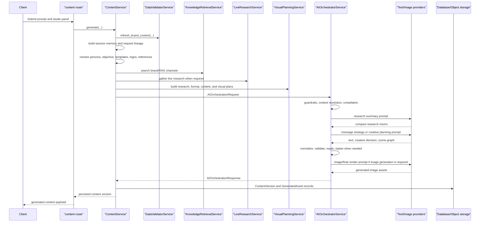
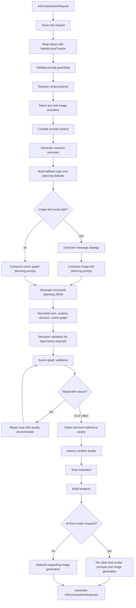
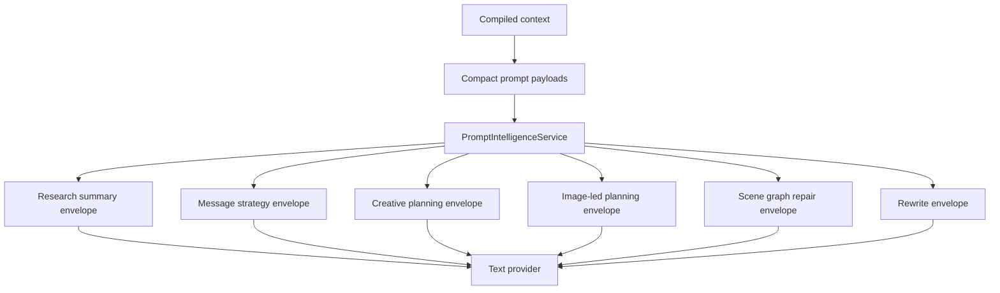
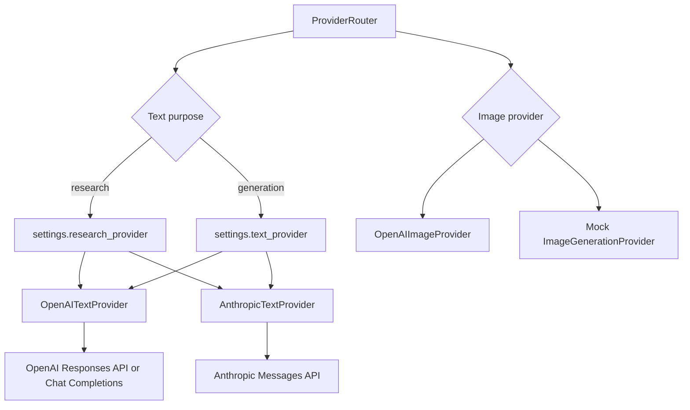
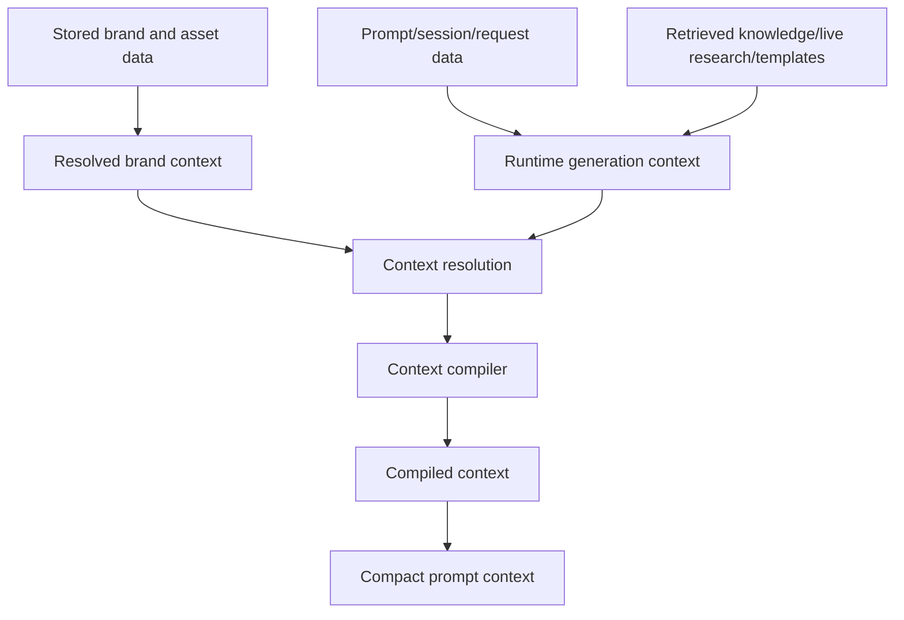
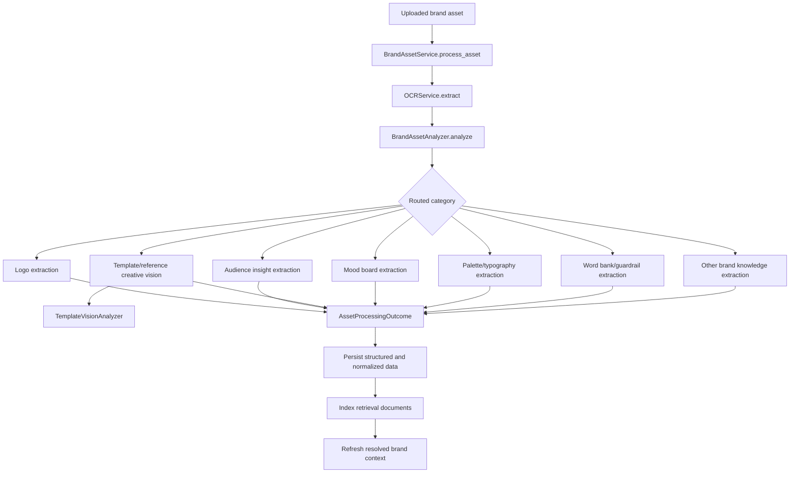
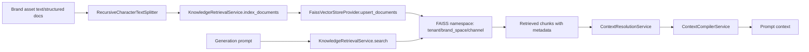

# AI Architecture and Workflow Documentation

## Purpose of this document

This document explains the AI layer as it exists in the current codebase. It follows the full path from an incoming generation request, through context gathering, prompt construction, provider calls, validation, image generation, rendering handoff, persistence, and follow-up usage.

The AI implementation is not a single model call. It is a layered system:

- Service code prepares brand, session, template, research, and retrieval context.
- AI modules normalize that context into stable contracts.
- Prompt builders convert those contracts into model instructions.
- Provider adapters call the configured LLM and image backends.
- The orchestrator validates, repairs, and packages the result.
- The content service persists the output and prepares it for render/export flows.

The most important thing to understand is that the AI layer is contract-driven. The shared contracts in `app/ai/contracts.py` are the handoff language between API/services, the orchestrator, providers, renderer, generated assets, and persisted content versions.

## High-level AI architecture

The content route does not call a model directly. It delegates to `ContentService.generate`, which is responsible for collecting every runtime dependency the AI needs. Only after that preparation does the request enter `AIOrchestratorService.generate`.

## Main AI entry points

| Entry point | File | Role in the AI system |
|---|---|---|
| Content generation route | `app/api/routes/content.py` | Receives the user request and calls the content service. |
| Content workflow | `app/services/content.py` | Builds the complete AI request, calls the orchestrator, persists the response, and records generated assets. |
| AI orchestrator | `app/ai/orchestrator.py` | Owns the model-facing generation pipeline, validation, repair, final render prompts, and response assembly. |
| Brand asset processing | `app/services/brand_assets.py` + `app/ai/brand_asset_analysis.py` | Turns uploaded brand files into structured brand context, retrieval documents, visual DNA, templates, and reusable assets. |
| RAG indexing and retrieval | `app/ai/rag/retrieval.py` + `app/integrations/vector_store.py` | Indexes OCR and structured brand evidence into FAISS namespaces, then retrieves relevant chunks during generation. |
| OCR and visual extraction | `app/ai/rag/ocr.py` | Extracts text and visual candidates from PDFs, images, PPTX, DOCX, and font uploads. |
| Provider routing | `app/ai/providers/router.py` | Selects OpenAI, Anthropic, or fallback/mock providers based on configuration and purpose. |

## Core AI contracts

The AI contracts live in `app/ai/contracts.py`. These models define what moves through the pipeline and what the rest of the application can safely depend on.

| Contract | What it represents | Who builds it | Who consumes it |
|---|---|---|---|
| `AIOrchestrationRequest` | Full runtime input to the orchestrator: prompt, studio panel, brand context, retrieved knowledge, templates, reference assets, planning outputs, logo candidates, trace ID, and image flag. | `ContentService.generate` | `AIOrchestratorService.generate` |
| `MessageStrategyPayload` | Campaign-level messaging direction before final copy and layout are produced. | Orchestrator via LLM or fallback | Orchestrator, explainability metadata |
| `StructuredTextPayload` | Final approved text payload: headline, body, CTA, hashtags, and metadata. | Orchestrator | Renderer, persistence, chat/history views, overlay rendering |
| `CreativeDecisionPayload` | Layout mode, selected template, asset strategy, confidence, reasoning, and planning hints. | Orchestrator | Renderer, final render prompt builder, persistence |
| `GenerationSceneGraph` | Structured visual plan with canvas, layers, elements, geometry, styles, assets, and validation hints. | Orchestrator | Validation, blueprint conversion, renderer, overlays |
| `BlueprintPayload` | Renderer-friendly layout contract with zones, hierarchy, image areas, logo rules, CTA placement, and overflow strategy. | `BlueprintService` | Content persistence, renderer/export code |
| `GeneratedImageAsset` | Stored AI-generated image or final render metadata. | Image provider and orchestrator | Content service, asset persistence, export delivery |
| `AIOrchestrationResponse` | Final AI output bundle returned by the orchestrator. | Orchestrator | `ContentService.generate` |
| `RendererInput` | Input contract used when backend rendering or overlay rendering is needed. | Content service | `RendererService` |

These contracts are the main shared boundary. Existing fields such as `sample_page_blueprint`, `module_counts`, `visual_permissions`, `carousel_slide_specs`, `visual_focus`, `image_zones`, and `blueprint_payload` should be treated as shared contracts, not casual metadata.

## AI module map

| Module | Responsibility | Current behavior |
|---|---|---|
| `app/ai/orchestrator.py` | Central generation pipeline. Chooses strategy, compiles context, builds prompts, calls providers, validates and repairs outputs, generates images, and returns the final AI response. | Main active AI workflow. |
| `app/ai/contracts.py` | Pydantic models for the AI request, response, text payload, scene graph, blueprint, renderer input, and trace data. | Stable contract layer. |
| `app/ai/brand_intelligence.py` | Builds resolved brand context from brand space records, form sections, personas, objectives, and guardrails. | Used by service layer to prepare brand context. |
| `app/ai/brand_asset_analysis.py` | Processes uploaded brand assets through OCR, routing, structured extraction, template vision, normalization, and reusable asset derivation. | Active ingestion pipeline for brand/reference evidence. |
| `app/ai/context_resolution.py` | Defines source priority for brand context, personas, objectives, and retrieved knowledge. | Prevents lower-priority evidence from overriding stronger brand rules. |
| `app/ai/context_compiler.py` | Compresses raw brand, RAG, template, session, and research inputs into bounded prompt-ready context. | Core prompt grounding layer. |
| `app/ai/prompt_intelligence.py` | Builds prompt envelopes for copy generation, creative planning, message strategy, image-led planning, repair, and rewrite. | Main prompt construction module. |
| `app/ai/guardrails.py` | Validates user prompts and generated text against configured blocked words, topics, claims, and patterns. | Used before and after generation. |
| `app/ai/layout_decision.py` | Chooses exact template, adapted template, synthesized layout, or fallback planning mode from template recommendations and request signals. | Used during pre-orchestration planning. |
| `app/ai/blueprint.py` | Converts templates or scene graphs into deterministic renderer zones and layout metadata. | Final render contract builder. |
| `app/ai/composition_planner.py` | Creates composition hints such as layout archetype, background policy, brand element plan, decorative plan, visual plan, and text style plan. | Used as structured planning context. |
| `app/ai/carousel_planner.py` | Builds slide-level plans for carousel flows: cover, detail, data, multi-point, image, and closing slides. | Supports carousel generation and final render metadata. |
| `app/ai/structured_prompt_parser.py` | Extracts structured sections, title, subtitle, tables, chart intent, visual elements, story beats, and disclaimers from prompts. | Used by research/editorial planning and data-heavy flows. |
| `app/ai/data_visualization.py` | Parses chart requests and numeric data from prompts/metadata into chart specifications. Can render charts with matplotlib. | Helper for chart/data visualization support. |
| `app/ai/visual_asset_intelligence.py` | Detects chart needs, illustration styles, visual elements, and data points from prompts. Enhances image prompts with visual guidance. | Used to enrich image generation prompts. |
| `app/ai/icon_matching.py` | Matches semantic icon needs to brand icon assets and inferred icon style. | Partially implemented; current match path returns first available icon with inferred style metadata. |
| `app/ai/template_vision.py` | Uses vision model to audit templates/reference images for layout DNA, editable zones, typography, motifs, hierarchy, image treatment, sample blueprints, and quality. | Active visual analysis path with file-based cache. |
| `app/ai/tone_intelligence.py` | Evaluates generated copy for brand alignment, proof strength, CTA clarity, objection handling, distinctiveness, and overall quality. | Used after generation and before persistence. |
| `app/ai/session_memory.py` | Classifies whether a request is fresh, a variant, or a modification, then decides what previous context can be inherited. | Used before orchestration in content generation. |
| `app/ai/rag/ocr.py` | Extracts OCR text, page images, image analysis sidecars, and file format metadata from uploaded assets. | Used by brand asset ingestion. |
| `app/ai/rag/retrieval.py` | Indexes and searches brand evidence by tenant, brand space, and channel. | Active RAG retrieval layer over FAISS. |
| `app/ai/providers/base.py` | Abstract provider interfaces for text and image generation. | Provider contract layer. |
| `app/ai/providers/router.py` | Chooses configured text/image providers and fallbacks. | Central provider selection. |
| `app/ai/providers/openai_provider.py` | OpenAI text, image generation, and image edit implementation. | Active when OpenAI keys are configured. |
| `app/ai/providers/anthropic_provider.py` | Anthropic text provider for JSON and text generation. | Active when Anthropic is configured and selected. |
| `app/ai/providers/image_generation.py` | Deterministic mock image provider that creates placeholder images and stores them locally. | Fallback image backend. |
| `app/ai/providers/llm.py` | Compatibility import that maps older `LLMProvider` usage to `OpenAITextProvider`. | Kept for older imports. |

## Request-to-response generation workflow

The normal visual generation path starts in `ContentService.generate`.

### 1. Context gathering in `ContentService.generate`

Before the orchestrator sees a request, the content service prepares the complete runtime state:

- Loads the brand space and rejects generation unless the brand space is active.
- Refreshes the resolved brand context through `DataValidatorService.refresh_brand_context`.
- Finds or creates the conversation session.
- Builds session memory with `SessionMemoryPlanner`, then applies request lineage for follow-up edits or variants.
- Sanitizes the prompt based on follow-up mode and previous output usage.
- Resolves persona, objective, templates, template metadata, logo candidates, and reference assets.
- Recommends templates through the template service and filters them for prompt, format, and carousel compatibility.
- Builds a template context payload when a pinned or planned template exists.
- Retrieves knowledge from FAISS-backed brand evidence channels.
- Runs live research when the prompt or research planner says current/exact facts may be needed.
- Builds a planning bundle with `VisualPlanningService`, which returns:
  - `research_editorial_brief`
  - `format_family_plan`
  - `content_plan`
  - `visual_plan`
- Starts a generation trace and wraps key inputs in `InputAccessTracker` so explainability can show which inputs were actually used.

Only then does it construct `AIOrchestrationRequest` and call `AIOrchestratorService.generate` inside a worker thread.

### 2. Strategy routing inside the orchestrator

`AIOrchestratorService.generate` first decides which strategy should own the request:

| Strategy | When it is selected | What happens today |
|---|---|---|
| `STATIC_INFOGRAPHIC_REFERENCE` | Static or infographic request with reference/sample context. | Routed into the guarded main AI pipeline. |
| `TEMPLATE_ADAPTANCE` | Template/sample-led carousel flow where the template is visual authority. | Marks the content plan with template-adaptance metadata, then enters the main pipeline. |
| `CONTENT_INTELLIGENCE` | Auto-template carousel flow without a pinned template. | Enriches the content plan with semantic carousel planning, then enters the main pipeline. |
| `WITHOUT_REFERENCE` | No usable reference/template context. | Uses the main AI pipeline with synthesized layout behavior. |

The strategy methods are intentionally thin. They add mode flags or planning metadata and then reuse `_generate_main_ai`, so all formats still pass through the same guardrails, context compilation, provider calls, validation, and response assembly.

## Main orchestrator pipeline

`_generate_main_ai` is the heart of the AI layer. Its execution can be read as a phased pipeline.

### Phase 1: tracing and input tracking

The orchestrator writes an initial trace payload with the prompt, studio panel, template candidates, layout decision, reference assets, asset catalog, platform constraints, brand context, persona, objective, validation report, template context, research, and other incoming objects.

It then wraps major inputs with `InputAccessTracker`. This tracker is not generation logic by itself; it records which context sources are touched. The final explainability metadata includes an `input_access_summary`, which helps debug cases where a brand rule or uploaded asset existed but was never consumed.

### Phase 2: guardrails and context resolution

`GuardrailService.validate_prompt` checks the prompt against the current brand guardrail configuration. It can block:

- blocked words
- restricted topics
- restricted claims
- forbidden regex patterns

`ContextResolutionService.build_plan` then orders knowledge and context sources. The important rule is that saved brand context and explicit request data have stronger authority than retrieved snippets. Retrieved knowledge is still useful, but it should not override brand foundations, guardrails, visual identity, selected persona, or selected objective.

### Phase 3: provider selection

The orchestrator resolves providers once near the start:

- `research_provider = ProviderRouter.get_text_provider("research")`
- `generation_provider = ProviderRouter.get_text_provider("generation")`
- `image_provider = ProviderRouter.get_image_provider()`

The router uses configured provider names from settings. Research can use a different text provider from normal generation. If a preferred provider is unavailable because the client is not configured, the router falls back to the configured fallback provider. If no real image provider is configured, the mock image provider can still return stored placeholder assets.

### Phase 4: context compilation

`ContextCompilerService.compile` is the main narrowing step before any prompt is built. It receives the raw prompt, brand context, persona, objective, ordered retrieved knowledge, studio panel, conversation context, session memory, template context, reference assets, asset catalog, content format guide, research/editorial plan, format/content/visual plans, and live research.

It returns a compiled context that is still rich enough for generation but bounded enough for prompts. The compiler:

- Deduplicates and truncates evidence.
- Keeps brand copy and brand visual signals separate.
- Preserves audience/persona/objective details.
- Applies visual grounding thresholds so weak visual evidence does not dominate generation.
- Builds template fit, prompt intelligence, content format, live research, and visual knowledge briefs.
- Produces diagnostics for visual grounding and prompt usage.

After compilation, the orchestrator creates a compact generation prompt context with `compact_generation_prompt_context`. This is the version passed to prompt builders.

### Phase 5: research summary

The orchestrator asks the research provider for a compact downstream research memo. This is not meant to produce final copy. It converts scattered brand, audience, retrieved knowledge, template, research, and planning inputs into a short human-readable memo for later model calls.

The prompt explicitly asks the model to preserve:

- audience motivations
- pain points
- objections
- preferences
- differentiators
- proof cues
- research/editorial thesis and angle when active

The returned summary is stored in `compiled_context["research_summary"]` and also appears in explainability metadata.

### Phase 6: fallback construction

Before asking the generation model for the main creative plan, the orchestrator builds deterministic fallback values. These are used when provider output is missing, malformed, weak, or needs normalization.

Fallback construction pulls from:

- audience research highlights
- audience objections and pain points
- desired outcomes
- trust signals and proof cues
- comparison points
- objective context
- brand name
- platform and format

The fallback payload is not only an emergency fallback. It anchors normalization for headline, body, CTA, hashtags, metadata, proof points, stat highlights, visual direction, design style, and image prompt.

### Phase 7: planning route

The orchestrator chooses between two planning routes:

| Route | Meaning | Output authority |
|---|---|---|
| `image_led_social` | The final image model is expected to be the main composition authority. This is used for AI final render style flows, especially static/infographic and style-reference cases. | Image/final render prompt has strong authority. Scene graph is still produced for validation, metadata, overlays, and tracing. |
| `scene_graph_social` | The scene graph is the main layout plan and backend renderer can use it directly. | Scene graph and blueprint have stronger authority. |

For image-led flows, the orchestrator first calls `compose_message_strategy_envelope`, then calls `compose_image_led_social_envelope`. For scene-graph flows, it calls `compose_creative_planning_envelope` directly.

### Phase 8: structured planning call

The generation provider receives one structured planning prompt and is expected to return JSON containing:

- final text payload fields
- optional message strategy
- creative decision
- scene graph

The orchestrator then normalizes this response:

- `normalize_text_payload` repairs missing or malformed copy fields.
- `_repair_prompt_echo_text_payload` reduces direct prompt echo issues.
- `normalize_message_strategy_payload` repairs message strategy shape.
- `normalize_creative_decision_payload` repairs layout and asset strategy shape.
- `normalize_scene_graph_payload` repairs graph structure, canvas, elements, geometry, roles, and validation hints.

This normalization layer is important because the renderer and persistence code expect stable shapes even when the LLM response varies.

### Phase 9: semantic validation

Some requests require stricter semantic checks before visual rendering. This is especially important for data-heavy, ranking, table, chart, comparison, and research-backed surfaces.

When active, `_repair_text_payload_semantics_if_needed` validates that the generated text payload respects the requested data surface and source-backed facts. If unresolved data surface issues remain, the orchestrator raises `GenerationFailureError` instead of silently replacing a table/chart/ranking request with a generic visual.

This is one of the main safeguards in the current AI implementation: data surfaces are not allowed to degrade into unsupported filler.

### Phase 10: scene graph validation and repair

`validate_scene_graph` checks the planned scene graph against layout and content rules. If the graph is not clean and the issues are repairable, the orchestrator enters a repair loop.

Each repair attempt:

- Builds a repair prompt with the current graph, creative decision, validation report, and quality history.
- Calls the generation provider for a patch.
- Merges the patch into the existing graph instead of replacing the graph completely.
- Revalidates the result.
- Scores quality and stops if quality degrades too much.

If normal repair is not enough, a fresh replan can be requested. Some image-led final render flows intentionally defer graph validation because the final image prompt and output QA become the visual authority.

### Phase 11: reference asset selection and binding

After repair, the orchestrator selects reference images from:

- explicit request reference assets
- selected template/sample assets
- brand reference assets
- scene graph requested assets
- topic-relevant assets

It filters missing assets, chooses conditioning references for image generation, and binds usable references into the scene graph. For final render flows, conditioning assets can be stricter than prompt reference assets. This is especially important when exact logo overlay is required, because logo-bearing reference images may be skipped for direct conditioning to avoid the image model redrawing or distorting the logo.

### Phase 12: quality and tone

The orchestrator runs a creative quality assessment before final image generation. If the quality score is too low, it can retry repairs or block final render depending on the route.

Tone evaluation happens after visual planning. `ToneIntelligenceService.evaluate` scores the generated copy for:

- brand alignment
- proof strength
- objection handling
- distinctiveness
- clarity
- CTA strength

The tone result is persisted with the content version and included in the final response metadata.

### Phase 13: blueprint generation

`BlueprintService.from_scene_graph` converts the final scene graph into `BlueprintPayload`.

The blueprint is the renderer-friendly contract. It contains:

- layout type
- zones
- visual hierarchy
- text blocks
- image zones
- logo rules
- CTA placement
- platform/export format
- overflow strategy
- source mode
- template ID when applicable
- layout archetype
- adaptation plan
- brand rules applied
- composition plan

If generated assets are later bound to the graph, the blueprint is rebuilt so the response contract matches the final graph state.

### Phase 14: final render or supporting image generation

There are two image generation modes:

| Mode | When used | Result |
|---|---|---|
| AI final render | Required for image-led or AI-only render formats. | Produces one final image for static/infographic or one image per carousel slide. `render_authority` becomes `ai`. |
| Supporting image generation | Used when backend rendering remains the final authority but a generated background/visual asset is needed. | Produces supporting `image_assets`; renderer can place them later. `render_authority` remains `backend`. |

For carousel final render, the orchestrator builds per-slide prompts. Each slide can carry its own:

- slide role
- headline
- supporting line
- proof points
- visual focus
- sample page blueprint
- reference image selection
- overlay strategy
- slide index and count

For static and infographic final render, the prompt is whole-canvas. It can still include structured data, reference images, scene graph guidance, message strategy, sample constraints, logo overlay instructions, and quality retry notes.

### Phase 15: response assembly

The orchestrator returns `AIOrchestrationResponse` with:

- message strategy
- structured text
- creative decision
- scene graph
- validation report
- repair attempt count
- blueprint
- supporting image assets
- final render assets
- final render asset
- render authority
- explainability metadata
- tone analysis
- generation trace

`ContentService.generate` then persists the output as a `ContentVersion`, stores `GeneratedAsset` rows for generated images/final renders, updates session lineage, writes trace metadata, and returns the persisted content.

## Static, infographic, and carousel flows

The three main visual formats share the same orchestrator, but they diverge in planning density, validation, and final render handling.

### Common flow across all three

```mermaid
flowchart LR
    A["Prompt + studio panel"] --> B["Context and planning bundle"]
    B --> C["AIOrchestrationRequest"]
    C --> D["Context compile"]
    D --> E["Research summary"]
    E --> F["Creative planning JSON"]
    F --> G["Text + creative decision + scene graph"]
    G --> H["Validation and repair"]
    H --> I["Blueprint"]
    I --> J["Generated assets or final render"]
    J --> K["ContentVersion persistence"]
```

All formats use guardrails, context compilation, provider routing, prompt envelopes, normalization, tone evaluation, blueprint generation, explainability, and persistence.

### Static flow

Static generation is a single-frame surface. The content plan expects a headline, body/support line, proof cues, and CTA. If AI final render is active, the image provider produces one finished image. If backend rendering is active, the scene graph and blueprint remain the main rendering authority and generated image assets are supporting visuals.

Static prompts emphasize one dominant message and a readable hierarchy. Extra context is pushed into metadata such as `supporting_line`, `proof_points`, `stat_highlights`, `visual_direction`, and `image_prompt`.

### Infographic flow

Infographic generation is also usually a single final canvas, but it has stricter structure. The format family plan expects sectioned visual explanation, key numbers or facts, process/structure, implications, and takeaway.

Infographic prompts can activate semantic validation, especially when they include tables, rankings, data lists, chart requests, or exact source-backed facts. The orchestrator prefers blocking unresolved data surfaces over generating a generic fallback visual.

The final render prompt for infographic flows carries structured metadata so the image model knows whether it is producing a poster-like explainer, data surface, ranking table, chart-style layout, or modular visual explanation.

### Carousel flow

Carousel generation distributes the story across slides. The content and visual plans expect a real sequence, not one poster split into multiple pages.

Carousel-specific behavior includes:

- `carousel_slide_specs` in text metadata.
- semantic carousel plans from content intelligence.
- template/sample sequence packs from template context.
- per-slide final render prompts.
- slide-specific references and layout anchors.
- slide roles such as hook, context, detail, data, image, and closing.
- per-slide final render assets with `slide_index`, `slide_count`, and `carousel_role`.

When a selected sample carousel is present in style-reference mode, the system can treat it as visual/layout authority while preventing its literal facts or wording from becoming content authority. This distinction is controlled by content plan flags such as `generation_strategy`, `_template_adaptance_enabled`, and `template_authority_mode`.

## Prompt architecture

All text model calls use `PromptEnvelope`, which contains a system message and user message. The concrete prompt builders live in `PromptIntelligenceService`.

### Important prompt inputs

The prompt builder does not receive the raw application state directly. It receives compacted prompt payloads, including:

- brand copy brief
- brand visual brief
- audience brief
- objective brief
- knowledge brief
- visual knowledge brief
- prompt intelligence brief
- template fit brief
- content format brief
- research editorial brief
- format family plan
- content plan
- visual plan
- reference asset payload
- live research
- session memory

This is why changes to `ContextCompilerService` or `PromptIntelligenceService` can affect many downstream behaviors. They define what the model is allowed to see and which facts are emphasized.

### Main prompt stages

| Stage | Prompt builder | Provider method | Purpose |
|---|---|---|---|
| Research summary | inline `PromptEnvelope` in orchestrator | `generate_text` | Converts context into a concise downstream memo. |
| Message strategy | `compose_message_strategy_envelope` | `generate_structured_json` | Produces campaign theme, audience message, headline direction, copy direction, CTA intent, keywords, and avoidances. |
| Creative planning | `compose_creative_planning_envelope` | `generate_structured_json` | Produces final copy, creative decision, and scene graph for scene-graph-led flows. |
| Image-led planning | `compose_image_led_social_envelope` | `generate_structured_json` | Produces copy, creative decision, and advisory graph when final image render is the visual authority. |
| Scene graph repair | `compose_scene_graph_repair_envelope` | `generate_structured_json` | Repairs invalid geometry, missing roles, weak layout structure, or quality problems. |
| Rewrite | `compose_rewrite_envelope` | `generate_structured_json` | Used by rewrite/edit flows to update content while preserving contracts. |

### Prompt authority rules

The prompt layer contains several important authority rules:

- Brand guardrails and brand foundations override generated phrasing.
- Audience research and persona depth should not be flattened into generic audience filler.
- Prompt intelligence can refine hook and CTA style but must not override user topic, brand rules, or foundations.
- Template samples can be visual/layout authority or editorial authority depending on the content plan.
- In template-adaptance mode, sample wording/facts should not be treated as content authority unless explicitly requested.
- In data surface flows, exact facts, rows, and values must be verified or explicitly provided.

## Provider architecture

### Text providers

`OpenAITextProvider` and `AnthropicTextProvider` implement the same interface:

- `generate_structured_json(envelope, fallback)`
- `generate_text(envelope, fallback)`

The OpenAI provider prefers the Responses API when available and falls back to chat completions. For structured JSON, it requests JSON output and parses the result into dictionaries. The Anthropic provider asks for JSON-only output and parses the response. Both providers return the supplied fallback when the client is unavailable, the provider fails, or JSON parsing fails.

Each provider records usage metadata in `last_usage` when available. The orchestrator writes this usage into trace payloads for later cost and debugging reports.

### Image providers

`OpenAIImageProvider` uses OpenAI image generation/edit APIs when configured. It stores returned image bytes through `LocalObjectStorage` and returns asset metadata with storage path, dimensions, provider, model, requested size, and usage.

`ImageGenerationProvider` is the fallback/mock implementation. It creates deterministic placeholder images based on the prompt hash and stores them locally. It also supports a basic edit/composite path using PIL. This keeps local or unconfigured environments functional without pretending the result is production-quality creative output.

### Embeddings and vector search

`FaissVectorStoreProvider` uses OpenAI embeddings when an OpenAI API key is configured. Otherwise, it uses `HashEmbeddings`, a deterministic local embedding fallback. The embedding type is recorded in `GenerationTrace.rag_embedding_type` as either `openai` or `hash`.

## Context management

The AI context model has three layers:

### Resolved brand context

The resolved brand context is refreshed before generation. It is built from brand space data, brand form sections, uploaded asset analysis, personas, objectives, guardrails, and visual identity. The AI layer treats this as the main brand truth.

### Session memory

`SessionMemoryPlanner` examines the current prompt and recent session/content context. It decides whether the user is asking for:

- fresh content
- modification of the previous output
- a variant of the previous output

It only inherits persona, objective, template, reference assets, copy context, and layout context when the prompt appears to depend on previous output. This prevents old selections from leaking into unrelated new generations.

### Retrieved knowledge

`KnowledgeRetrievalService.search` queries FAISS namespaces by tenant, brand space, and channel. Retrieved matches are passed into context resolution and compilation. Common channels include brand, visual identity, reference creative, template, mood board, audience insights, guardrail support, and metadata.

### Live research

`LiveResearchService.gather_sync` can collect current facts when research is enabled and the prompt needs current or exact data. It can return verified facts, sources, ranked sources, queries, inferences, uncertainties, and provider usage. Research is folded into the research/editorial plan and compact prompt context.

### Input access tracking

`InputAccessTracker` wraps major input objects before orchestration. It lets the final explainability payload show whether brand context, reference assets, template candidates, logo candidates, retrieved knowledge, live research, and other sources were actually accessed by the pipeline.

## Brand asset ingestion and AI grounding

The brand asset pipeline is the upstream side of AI quality. It converts uploaded files into the evidence later used by generation.

### OCR and file extraction

`OCRService` handles:

- PDFs through `pdfplumber` and Google Vision OCR processor methods.
- Images through image OCR and image analysis sidecars.
- PPTX files through slide text and image extraction.
- DOCX files through embedded image extraction.
- Font files as typography assets without OCR pages.

The service retries transient OCR failures and can skip image OCR when authentication is missing, while still allowing the image asset to be stored.

### Asset routing

`BrandAssetAnalyzer.analyze` routes assets based on explicit category, requested field key, filename, MIME type, and extracted text. It then calls the correct extractor:

- `_extract_logo_data`
- `_extract_audience_insights`
- `_extract_template_intelligence`
- `_extract_mood_board`
- `_extract_palette`
- `_extract_typography`
- `_extract_word_bank`
- `_extract_other`

The result is `AssetProcessingOutcome`, which includes routed category, channel, extracted text, page count, structured data, normalized data, routing metadata, warnings, confidence, template analysis, image candidates, derived assets, and source format.

### Template vision

`TemplateVisionAnalyzer` uses a vision model to produce a deep design audit for templates and reference images. It extracts:

- background style
- layout type
- editable zones
- typography DNA
- component motifs
- visual mood and design style
- infographic elements
- logo anchor
- visual hierarchy
- content structure
- image treatment
- brand cues
- composition logic
- visual craft DNA
- subject semantics
- page blueprint
- OCR structure
- premium quality scores

The analyzer caches results using an image hash, model name, and schema key. Cached results preserve the same shape as fresh results but mark `vision_cache.status` as `hit`.

### Retrieval indexing

After analysis, `BrandAssetService._index_asset` writes both OCR chunks and structured retrieval documents into FAISS. Metadata keeps source ID, channel, document type, category, confidence, quality signals, template tags, and source format attached to each chunk.

That indexed evidence becomes available to future generation through `_build_retrieved_knowledge` in `ContentService.generate`.

## RAG workflow

Each tenant and brand space has separate vector namespaces per channel. This keeps visual identity evidence separate from audience insights, templates, mood boards, and general brand knowledge.

The vector store saves both the FAISS index and a `documents.json` metadata file under the configured vector store base path. Upserts append incrementally when chunk IDs are new, otherwise the namespace is rebuilt.

## Visual planning and final render architecture

Visual planning has two layers:

1. Service-level planning before orchestration.
2. Orchestrator-level planning and final render prompts.

### Service-level planning

`VisualPlanningService.build_visual_plan` coordinates:

- `ResearchEditorialPlanningService`
- `FormatFamilyPlanningService`
- `ContentPlanningService`

It returns a planning bundle. The research/editorial brief decides whether the request is a normal brand generation, analytical explainer, source-backed topic, data surface, or sample-led sequence. The format family plan maps the requested format to a content contract such as static, carousel, infographic, long form, or short form. The content plan and visual plan then describe required fields, density, sequencing, and render mode.

### Orchestrator-level visual planning

The orchestrator turns the planning bundle into:

- creative decision
- scene graph
- blueprint
- visual explanation plan
- final render prompt
- image asset metadata

For AI final renders, the image model receives a final render prompt that includes approved copy, design direction, reference images, brand visual guidance, scene graph hints, sample layout constraints, logo rules, quality notes, and per-slide metadata when applicable.

For backend rendering, the scene graph and blueprint stay central, and AI image generation is used only for supporting visual assets.

## Data visualization and structured data handling

The project has multiple helpers for data-heavy prompts:

- `StructuredPromptParser` extracts structured sections, tables, chart types, visual elements, and ordered story beats.
- `DataVisualizationService` parses chart requests into `ChartSpec` and `ChartDataPoint` objects.
- `VisualAssetIntelligenceService` detects chart types, illustration styles, data points, and visual elements, then enriches image prompts.
- `ResearchEditorialPlanningService` identifies prompts that require exact facts, rankings, tables, comparisons, or source-backed claims.
- The orchestrator validates and blocks unresolved data surface issues instead of falling back to generic imagery.

This matters because ranking/table/chart images are risky if the model invents rows or values. The current pipeline has explicit checks to keep those requests source-backed or user-provided.

## Rendering boundary

The AI orchestrator does not always produce the final pixels. It decides `render_authority`:

- `ai` means the final render image was generated by the image provider and persisted as final render assets.
- `backend` means the backend renderer remains responsible for composing the scene graph, blueprint, text, logos, fonts, and generated/supporting image assets.

For AI final render outputs that need exact text or logos, the content service can later use renderer overlay paths. The final render asset metadata may include:

- base storage path
- logo source storage path
- logo overlay strategy
- render overlay scene graph
- render overlay text
- text overlay strategy
- output quality assessment
- sample visual similarity
- slide metadata

This lets the system use AI for the visual substrate while preserving exact text/logo treatment through backend overlays where required.

## Storage usage in AI workflows

| Storage area | What is stored | AI workflow usage |
|---|---|---|
| Database | Brand spaces, sections, personas, objectives, knowledge assets, content versions, generated assets, jobs, sessions, traces metadata references. | Source of brand context and persistence target for generated outputs. |
| Local object storage | Uploaded assets, OCR-derived images, generated images, AI final renders, previews/exports. | Used by OCR, template vision, image generation, renderer, and asset delivery. |
| FAISS vector store | Chunked OCR text and structured retrieval documents by tenant/brand/channel namespace. | Provides retrieved knowledge for context compilation. |
| Template vision cache | Cached JSON analysis keyed by model/image hash/schema. | Avoids repeated vision calls for the same template/reference image. |
| Generation trace directory | Prompt payloads, provider usage, responses, validation reports, final metadata, cost estimation. | Debugging and explainability. |

## Error handling and fallback behavior

The AI layer has several fallback and failure policies:

- Missing text provider client returns the configured fallback instead of crashing.
- Missing image provider can fall back to deterministic placeholder generation.
- OCR transient failures are retried; optional image OCR auth failures can be skipped with warnings.
- Prompt guardrail violations block generation early.
- Output guardrail violations block generated text after planning.
- Malformed LLM JSON falls back to deterministic payloads.
- Invalid scene graphs are repaired when possible.
- Repair loops stop if quality degrades.
- Data surface semantic failures raise `GenerationFailureError`.
- Required AI final render failures raise `GenerationFailureError`.
- Low-quality final render plans can be blocked or deferred depending on route.

The current design prefers returning a usable fallback for ordinary copy/layout gaps, but it prefers blocking for unsafe data/table/ranking/chart failures and required final render failures.

## Explainability and tracing

The final explainability payload is large by design. It includes:

- retrieval channels and match counts
- guardrails applied
- selected persona and objective
- brand context snapshot
- research summary
- conversation and session memory
- template context usage
- context resolution metadata
- generation path
- message strategy
- layout/creative decision
- scene graph and final render scene graph when overridden
- validation report
- semantic validation report
- repair attempts and fresh replan state
- render authority
- compiled context
- visual grounding diagnostics
- selected and conditioning reference images
- visual explanation plan
- quality assessment
- provider names
- token usage estimate
- latency breakdown
- cost estimation when available
- input access summary

This metadata is useful when debugging why a creative followed or ignored a piece of brand context, why a template was selected, why a final render was AI-led, or why data-heavy generation failed.

## Current implementation boundaries to keep in mind

The AI layer is powerful, but it has clear boundaries:

- The orchestrator is very large and owns many responsibilities. Changes should be small and scoped.
- Provider outputs are normalized heavily because model JSON is not trusted as-is.
- Template/sample behavior has separate content authority and visual authority rules. Mixing those can cause sample facts to leak into generated content.
- Carousel metadata is a shared contract. Fields like `carousel_slide_specs`, `visual_focus`, `sample_page_blueprint`, and `slide_index` are used beyond the prompt layer.
- AI final render flows can defer scene graph validation because the final image prompt and output quality checks become the visual authority.
- Exact logos are intentionally deferred to overlay/export paths where possible, because image models can redraw logos incorrectly.
- The icon matching service has placeholder matching behavior and should not be treated as a completed semantic asset search system.
- The mock image provider is a development fallback, not a production creative generator.

## Safe change guidance for the next team

When continuing this AI system, the safest way to work is to preserve contracts and add metadata instead of reshaping existing payloads.

Before changing generation behavior, identify:

- which format is affected: static, infographic, carousel, or all three
- whether the change affects content authority, visual authority, or both
- whether the changed field is consumed by renderer/export/persistence
- whether template-adaptance, content-intelligence, and without-reference flows still behave correctly
- whether the change affects data surface validation
- whether the generated output still records enough explainability to debug later

The most sensitive files are:

- `app/ai/orchestrator.py`
- `app/ai/prompt_intelligence.py`
- `app/ai/context_compiler.py`
- `app/ai/contracts.py`
- `app/ai/blueprint.py`
- `app/services/content.py`
- `app/services/renderer.py`
- `app/services/brand_assets.py`
- `app/ai/brand_asset_analysis.py`

For most future work, prefer adding a narrow helper, an additive metadata field, or a small validation rule over changing a shared contract field. The existing pipeline depends on stable shapes more than it depends on any one prompt sentence.
