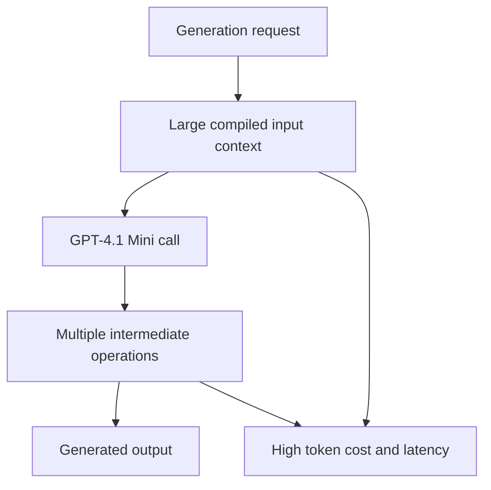

# AI Cost Optimization Challenges, Limitations, and Pending Workstreams

## Purpose

This document captures the current open challenges around AI generation cost, token usage, latency, evaluation overhead, trace logging, dashboard visibility, and output balance across Static, Infographic, and Carousel generation.

The main goal is to make generation more cost-effective by reducing input tokens, limiting unnecessary intermediate processing, and improving visibility into where time and tokens are being consumed.

## Current generation cost and time baseline

| Format | Previous time | Current time after optimization | Previous cost | Current cost after optimization | Current status |
| --- | --- | --- | --- | --- | --- |
| Static | More than 7 minutes | Around 4.5 minutes | Around $0.60-$0.70 | Around $0.28-$0.35 | Improved, but still above the intended cost target. |
| Infographic | More than 7 minutes | Around 4.5-5 minutes | Around $0.70 | Around $0.28-$0.35 | Improved, but still needs token reduction. |
| Carousel | Around 20+ minutes | Around 17 minutes depending on page count | Around $1.00 | Around $0.70 | Improved, but still the highest-cost format. |

## Main root cause

The biggest issue is the amount of input being sent to the model. Even though GPT-4.1 Mini is being used, the model still receives a very large context during generation. Because input tokens are high, the total cost remains high even with a smaller model.

Carousel generation is affected the most because the number of pages increases the amount of content, context, and intermediate processing required. The pipeline also performs multiple intermediate operations, and each operation adds more model calls, token usage, and execution time.

## Current limitations

| Limitation | What is happening | Why it matters |
| --- | --- | --- |
| Large input context | The model receives too much information for each generation request. | Input tokens are high, which increases cost even when using GPT-4.1 Mini. |
| Too many intermediate operations | The generation pipeline performs several processing steps before the final output is ready. | Each step adds execution time and token usage. |
| Carousel is expensive | Carousel generation depends on the number of pages and requires more repeated processing. | It remains the highest-cost workflow after optimization. |
| Brand evaluation metrics are disabled | Brand evaluation consumed a large number of tokens, so it was disabled. | The system currently avoids that cost, but output analysis still needs a cheaper approach. |
| Generated traces are disabled | Trace writing was consuming extra time because the backend was writing logs. | Debugging visibility is reduced until trace logging is optimized. |
| Dashboard does not calculate token consumption | The dashboard currently does not show token usage or cost details. | The team cannot easily track whether optimization work is improving cost. |
| Content and visual balance is inconsistent | More content makes outputs text-heavy, while stronger visuals can reduce message clarity. | Outputs need to communicate well without becoming visually cluttered. |
| Visual/content counting needs improvement | The system needs better counting or measurement of visual and text balance. | Developers need a clear signal when an output has too much copy or too little message depth. |

## Content and visual balance problem

The second major issue is not only cost; it is also output quality. When content was improved for Static, Infographic, or Carousel generation, the generated output became too content-heavy. In some samples, the content quality was good, but the design had too much text.

When the visual emphasis was increased, the output looked better visually, but the message became weaker. For carousel outputs, this also affected the intended slide role and structure. Reducing content too much made the output cleaner, but it no longer carried enough information to explain the intended message properly.

The system needs a better way to balance:

| Balance area | Needed improvement |
| --- | --- |
| Content amount | Keep enough detail to explain the message clearly. |
| Visual emphasis | Preserve strong visuals without weakening the content structure. |
| Carousel slide role | Make sure each slide still performs its intended role. |
| Infographic density | Keep data and explanation readable without overcrowding the design. |
| Static output clarity | Avoid both empty-looking visuals and text-heavy layouts. |

## Pending workstreams

### 1. Reduce input tokens

The highest-priority workstream is reducing the amount of input sent to the model. Each generation stage should receive only the context it actually needs, instead of passing large compiled context everywhere.

Expected outcome:

| Work item | Expected result |
| --- | --- |
| Reduce unnecessary context | Lower input token usage per generation. |
| Compress repeated context | Avoid sending the same brand or planning information multiple times. |
| Send stage-specific context | Each model call receives only the data required for that stage. |

### 2. Reduce intermediate model operations

The pipeline should be reviewed to identify intermediate operations that increase cost and time without improving the generated output enough to justify the expense.

Expected outcome:

| Work item | Expected result |
| --- | --- |
| Combine related operations | Fewer model calls during generation. |
| Remove low-value steps | Reduced latency and token usage. |
| Track per-stage cost | Clear visibility into which steps are expensive. |

### 3. Rebuild brand evaluation metrics in a cost-effective way

Brand evaluation metrics consumed a large number of tokens, so they were disabled. The next version should analyze generated outputs with a cheaper approach.

Expected outcome:

| Work item | Expected result |
| --- | --- |
| Reduce token usage for evaluation | Generated outputs can be analyzed without large LLM cost. |
| Use lightweight checks where possible | Basic quality and brand checks do not require expensive model calls. |
| Re-enable evaluation safely | Brand evaluation can return without making every generation too expensive. |

### 4. Optimize generated trace logging

Generated traces were disabled because backend log writing increased execution time. Trace logging still matters for debugging, but it needs to be lighter and faster.

Expected outcome:

| Work item | Expected result |
| --- | --- |
| Reduce trace-writing overhead | Backend logging does not slow down generation heavily. |
| Store only useful trace data | Debugging remains possible without writing excessive logs. |
| Add trace controls | Developers can enable deeper traces only when needed. |

### 5. Add token consumption visibility to the dashboard

The dashboard does not currently calculate token consumption. This makes it difficult to measure whether cost optimization is actually working.

Expected outcome:

| Work item | Expected result |
| --- | --- |
| Show token usage per generation | Developers can see how many tokens each output consumed. |
| Show cost by format | Static, Infographic, and Carousel costs can be compared. |
| Track improvement over time | Optimization progress becomes visible. |

### 6. Improve content and visual counting

The system needs better measurement of content density and visual balance. This should help identify whether an output is too text-heavy, too empty, or not carrying enough message structure.

Expected outcome:

| Work item | Expected result |
| --- | --- |
| Count text density | Detect when content is too heavy for the design. |
| Count visual usage | Detect whether enough visual space is being used. |
| Compare content and visual balance | Help maintain the right balance for each output format. |

## Summary

The current system has already improved generation time and cost, but the main challenge remains token efficiency. Static and Infographic generation are faster and cheaper than before, and Carousel generation has also improved, but all formats still need more optimization.

The next work should focus on reducing input tokens, reducing intermediate model operations, rebuilding brand evaluation in a cheaper way, optimizing trace logging, adding dashboard token visibility, and improving content-versus-visual balance.
