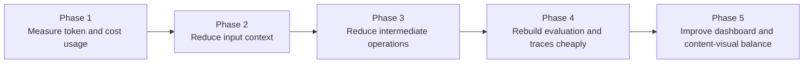

# AI Cost Optimization Roadmap and Milestone Plan

## Purpose

This roadmap focuses only on the current cost, latency, token usage, brand evaluation, trace logging, dashboard visibility, and content-versus-visual balance issues described for Static, Infographic, and Carousel generation.

The goal is to make the AI generation pipeline more cost-effective by reducing input tokens, reducing unnecessary intermediate operations, improving measurement, and keeping generated outputs balanced between content and visuals.

## Current baseline

| Format | Previous state | Current state | Remaining gap |
| --- | --- | --- | --- |
| Static | More than 7 minutes and around $0.60-$0.70 per generation. | Around 4.5 minutes and around $0.28-$0.35 per generation. | Still needs lower input tokens and lower cost. |
| Infographic | More than 7 minutes and around $0.70 per generation. | Around 4.5-5 minutes and around $0.28-$0.35 per generation. | Still needs lower input tokens and better content/visual balance. |
| Carousel | Around 20+ minutes and around $1.00 per generation. | Around 17 minutes depending on page count and around $0.70 per generation. | Still the highest-cost flow because page count increases context and processing. |

## Roadmap at a glance

## Milestone 1: Measure token usage and cost clearly

### Goal

Create clear visibility into token consumption, cost, and time for Static, Infographic, and Carousel generation.

### Why this comes first

The main issue is high input-token usage. Before reducing it further, the system needs better visibility into where tokens are consumed, which stages are expensive, and how cost differs by output type.

| Work item | Expected outcome |
| --- | --- |
| Calculate token consumption per generation | Each generated output shows token usage. |
| Break token usage down by format | Static, Infographic, and Carousel can be compared clearly. |
| Track generation time by format | Time improvements can be measured after each optimization. |
| Add dashboard visibility for token usage | The dashboard can show token consumption and cost trends. |

### Success criteria

| Check | Expected result |
| --- | --- |
| Token count is visible | Developers can see token usage for each generation. |
| Cost is visible | Cost can be compared across Static, Infographic, and Carousel. |
| Improvements are trackable | Optimization work can be measured over time. |

## Milestone 2: Reduce input tokens

### Goal

Reduce the amount of input context sent to GPT-4.1 Mini for each generation request.

### Why this matters

Even though GPT-4.1 Mini is being used, the model still receives large input context. That large input is the main reason token cost remains high.

| Work item | Expected outcome |
| --- | --- |
| Remove unnecessary input context | Model calls become smaller and cheaper. |
| Compress repeated context | The same context is not sent again and again across stages. |
| Use stage-specific context | Each generation step receives only what it needs. |
| Optimize carousel input handling | Page-based generation sends less repeated context per page. |

### Success criteria

| Check | Expected result |
| --- | --- |
| Input tokens reduce | Token usage drops for Static, Infographic, and Carousel. |
| Carousel cost improves | Carousel cost moves down from the current around $0.70 baseline. |
| Output quality remains usable | Reduced context does not remove important message or brand details. |

## Milestone 3: Reduce intermediate operations

### Goal

Reduce the number of intermediate LLM operations that increase execution time and token usage.

### Why this matters

The generation pipeline performs multiple intermediate operations. These steps add model calls, latency, and cost. Some may be necessary, but others should be combined, simplified, or removed if they do not improve the output enough.

| Work item | Expected outcome |
| --- | --- |
| Review intermediate generation steps | Expensive steps are identified clearly. |
| Combine related operations | Fewer model calls are needed. |
| Remove low-value operations | Generation becomes faster and cheaper. |
| Track time saved per format | The team can see whether Static, Infographic, and Carousel improve. |

### Success criteria

| Check | Expected result |
| --- | --- |
| Fewer model calls | The pipeline performs fewer intermediate LLM operations. |
| Generation time improves | Static and Infographic move below the current 4.5-5 minute range, and Carousel improves from the current around 17 minutes. |
| Cost decreases | Reduced operations lower total token consumption. |

## Milestone 4: Rebuild brand evaluation metrics with lower cost

### Goal

Bring back generated-output analysis in a cost-effective way after brand evaluation metrics were disabled due to high token usage.

### Why this matters

Brand evaluation metrics consumed most of the tokens, so they were disabled. The system still needs a way to analyze generated outputs, but the new approach must avoid sending large output/context payloads into expensive evaluation steps.

| Work item | Expected outcome |
| --- | --- |
| Redesign evaluation payloads | Evaluation receives smaller input. |
| Use lightweight checks first | Basic analysis does not require expensive model calls. |
| Use model-based evaluation selectively | LLM evaluation is used only where it adds clear value. |
| Track evaluation cost separately | Evaluation cost does not get hidden inside generation cost. |

### Success criteria

| Check | Expected result |
| --- | --- |
| Evaluation can be re-enabled | Generated outputs can be analyzed again. |
| Evaluation cost is lower | Brand evaluation no longer consumes most of the token budget. |
| Evaluation is measurable | The dashboard or logs can show how much evaluation costs. |

## Milestone 5: Optimize generated traces

### Goal

Fix generated trace logging so it provides useful debugging information without slowing down generation.

### Why this matters

Generated traces were disabled because backend log writing was taking extra time. Trace data is still useful, but the logging process needs to be lighter.

| Work item | Expected outcome |
| --- | --- |
| Reduce trace-writing overhead | Backend logging does not add significant delay. |
| Store compact trace data | Only useful generation details are written by default. |
| Add optional detailed trace mode | Deep traces can be enabled only when debugging is needed. |
| Track trace impact on latency | The team can see whether traces slow generation. |

### Success criteria

| Check | Expected result |
| --- | --- |
| Traces can be enabled safely | Basic traces do not create major performance issues. |
| Logs stay useful | Developers still get enough information to debug generation. |
| Trace overhead is measurable | The system can show how much time logging adds. |

## Milestone 6: Improve content and visual balance

### Goal

Improve how the system balances content amount and visual emphasis in generated Static, Infographic, and Carousel outputs.

### Why this matters

When content quality improves, outputs can become too text-heavy. When visual emphasis increases, the content can lose message depth, slide role, or structure. The system needs a better way to count and balance both.

| Work item | Expected outcome |
| --- | --- |
| Count content density | The system can detect text-heavy outputs. |
| Count visual usage | The system can detect outputs with too little visual presence. |
| Balance content and visuals by format | Static, Infographic, and Carousel each follow their own balance rules. |
| Preserve carousel slide roles | Reducing content does not break the purpose of each carousel slide. |

### Success criteria

| Check | Expected result |
| --- | --- |
| Outputs are not too text-heavy | Improved content does not overcrowd the design. |
| Outputs are not too shallow | Strong visuals do not remove the intended message. |
| Carousel structure remains clear | Each carousel slide still has a clear role. |
| Infographics stay readable | Infographic content remains informative without becoming crowded. |

## Execution order

| Order | Milestone | Reason |
| --- | --- | --- |
| 1 | Measure token usage and cost clearly | The team needs visibility before more optimization work. |
| 2 | Reduce input tokens | Large input context is the main cost driver. |
| 3 | Reduce intermediate operations | Multiple model steps increase both cost and time. |
| 4 | Rebuild brand evaluation metrics with lower cost | Evaluation was disabled because it consumed too many tokens. |
| 5 | Optimize generated traces | Traces were disabled because backend logging added time. |
| 6 | Improve content and visual balance | Output quality needs better balance between message depth and visual clarity. |

## Target direction

The next development direction should focus on making generation cheaper, faster, and easier to measure.

The key target is not only to use a smaller model. The larger improvement must come from reducing what is sent into the model, reducing repeated context, removing unnecessary intermediate operations, and measuring token consumption directly in the dashboard.

Once cost visibility improves, the team can safely reintroduce brand evaluation metrics and generated traces in a more controlled way. After that, content and visual balance should be improved so the outputs remain meaningful without becoming text-heavy or visually empty.
