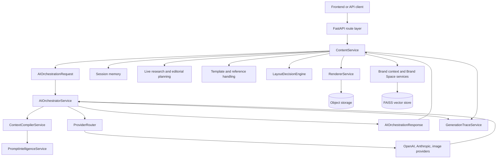
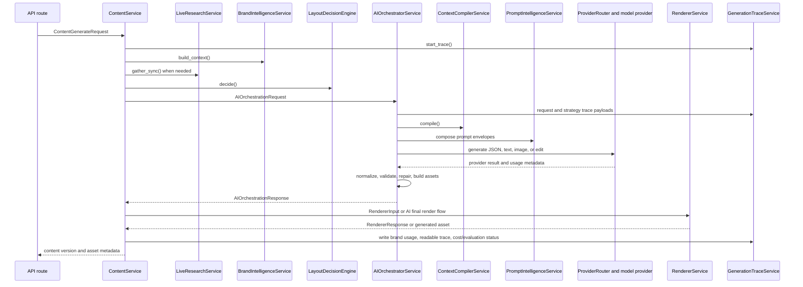

# AI Development Overview and Technical Implementation Guide

## Purpose of this document

This guide explains how the AI implementation is organized, how the main workflows execute, which modules matter most, and how a new AI developer should maintain, extend, debug, and deploy the system safely.

The system is not a thin wrapper around a single model call. It is a multi-stage AI pipeline that combines Brand Space data, uploaded assets, OCR, vector search, live research, prompt compilation, provider routing, structured generation, image generation, renderer handoff, scoring, and traces.

## AI implementation at a glance

The important development habit is to think in handoffs. Each layer prepares a bounded object for the next layer. The code is easier to maintain when those boundaries stay stable.

## Project structure relevant to AI

| Path | Purpose |
| --- | --- |
| `app/ai` | Core AI contracts, orchestration, prompt intelligence, context compilation, providers, RAG helpers, vision analysis, tone scoring, and partial visual helpers. |
| `app/services` | Business workflows that call AI modules, repositories, renderers, trace writers, live research, brand scoring, and jobs. |
| `app/api/routes` | HTTP endpoints. Routes should stay thin and call services instead of building AI logic directly. |
| `app/repositories` | Database access layer. AI services should generally receive structured data through services, not query repositories directly unless that is the established service pattern. |
| `app/models` | SQLAlchemy models for content, Brand Space, assets, jobs, users, and related entities. |
| `app/schemas` | API request and response schemas. These are separate from AI internal contracts. |
| `app/integrations` | Storage and vector-store adapters. This hides file/object storage and FAISS details behind project-facing interfaces. |
| `app/core` | Runtime settings, enums, exceptions, dependencies, security, and studio defaults. |
| `app/workers` | Background job execution. Worker flows call service classes rather than AI modules directly. |
| `scripts` | Operational and debugging scripts, including worker runner, generation stub demo, RAGAS evaluation, trace cost backfill, and local reset helpers. |
| `storage` | Local object storage, generation traces, template vision cache, generated assets, and other persisted artifacts in local/dev environments. |
| `vector_store` | Local FAISS indexes mounted by Docker and used by RAG workflows. |
| `ai_docs` | Architecture and AI documentation generated for development handoff. |

## Main AI modules

| Module | Role in development |
| --- | --- |
| `app/ai/contracts.py` | Shared Pydantic contracts for requests, responses, text payloads, scene graphs, blueprints, renderer input/output, and generation traces. Treat this file as the AI API boundary. |
| `app/ai/orchestrator.py` | Central generation coordinator. It owns strategy routing, provider calls, repair loops, image prompts, final render logic, carousel contracts, and response assembly. |
| `app/ai/context_compiler.py` | Converts raw brand, RAG, research, template, memory, and reference data into compact prompt-safe context. |
| `app/ai/prompt_intelligence.py` | Builds provider-ready `PromptEnvelope` objects for generation, planning, rewrites, image-led output, and repairs. |
| `app/ai/providers` | Provider interfaces and implementations for OpenAI, Anthropic, OpenAI image generation, and mock image fallback. |
| `app/ai/brand_asset_analysis.py` | Ingestion intelligence for uploaded brand assets, including OCR cleanup, visual DNA, reusable assets, audience evidence, CTA/legal/template copy, and quality signals. |
| `app/ai/rag/ocr.py` | OCR extraction for images, PDFs, and supported document-like assets. |
| `app/ai/rag/retrieval.py` | FAISS indexing, search, and source deletion by tenant/brand/channel namespace. |
| `app/ai/template_vision.py` | OpenAI vision-based template/reference design analysis with cache support. |
| `app/ai/brand_intelligence.py` | Builds resolved Brand Space context from saved sections and ORM records. |
| `app/ai/layout_decision.py` | Chooses exact template, adapted template, or synthesized layout mode. |
| `app/ai/blueprint.py` | Builds deterministic placement blueprints for rendering and trace/export context. |
| `app/ai/tone_intelligence.py` | Scores generated copy and supports rewrite decisions. |
| `app/ai/session_memory.py` | Classifies conversation continuation/edit/variant behavior and builds memory payloads. |
| `app/ai/guardrails.py` | Lightweight keyword and regex guardrails. |
| `app/ai/context_resolution.py` | Orders retrieved knowledge and creates conflict instructions. |
| `app/ai/structured_prompt_parser.py` | Extracts structured prompt sections for research/editorial planning. |
| `app/ai/carousel_planner.py` | Standalone deterministic carousel planner. Currently partial and not clearly the primary carousel source of truth. |
| `app/ai/data_visualization.py` | Chart parsing and matplotlib/PIL chart rendering helper. Implemented, but not clearly wired into the main generation path. |
| `app/ai/visual_asset_intelligence.py` | Prompt visual requirement parser and image prompt enrichment helper. Implemented, but lightly integrated. |
| `app/ai/icon_matching.py` | Prototype icon matching service with TODOs for real asset loading, color compliance, and recoloring. |

## Service modules that drive AI behavior

| Service | How it interacts with AI |
| --- | --- |
| `ContentService` | Main generation, rewrite, tone check, export, render, trace, live research, content planning, layout decisions, and orchestrator calls. |
| `BrandAssetService` | Uploads and processes brand assets, calls `BrandAssetAnalyzer`, and indexes extracted knowledge. |
| `TemplateService` | Handles template/reference processing with OCR, brand asset analysis, and template vision. |
| `KnowledgeService` | Handles knowledge asset OCR and vector indexing. |
| `LiveResearchService` | Plans and executes live research, then synthesizes verified facts and source summaries. |
| `ResearchEditorialPlanningService` | Converts prompts, live research, and knowledge into editorial planning metadata. |
| `ContentPlanningService` | Builds format-family and carousel/infographic planning structures. |
| `VisualPlanningService` | Creates visual plan metadata from prompt, research, and format context. |
| `BrandScoringService` | Scores generated outputs against prompt, format, brand, and image relevance. |
| `GenerationTraceService` | Writes trace payloads, readable trace bundles, brand usage reports, and cost estimates. |
| `RendererService` | Converts AI/renderer input into final image/PDF/doc assets. |

## Runtime configuration

Runtime configuration is centralized in `app/core/config.py` through `Settings`. Values are loaded from `.env` with case-insensitive names and ignored empty environment values.

| Setting group | Important fields | Development note |
| --- | --- | --- |
| API/runtime | `api_v1_prefix`, `environment`, `debug`, `cors_origins` | API routes mount under `/api/v1` by default. |
| Database | `database_url`, `alembic_database_url` | Async app code uses `postgresql+asyncpg`; migrations use `psycopg`. |
| Storage | `object_storage_provider`, `object_storage_base_path`, `generated_assets_base_url`, `asset_download_base_url` | Local development stores generated and uploaded files under `storage`. |
| Vector store | `vector_store_provider`, `vector_store_base_path`, `embedding_model` | Current RAG storage is local FAISS under `vector_store`. |
| Text models | `llm_model`, `tone_model`, `anthropic_model`, `text_provider`, `research_provider`, `fallback_text_provider` | Do not hardcode model names in code. Use settings. |
| Image models | `image_model`, `image_provider`, `fallback_image_provider`, `image_generation_quality`, `image_edit_input_fidelity` | Default fallback image provider is `mock`. |
| Live research | `live_research_enabled`, query limits, timeout, backend, search model | Prompts should avoid inventing current facts when live research is unavailable. |
| Tracing | `generation_trace_enabled`, `generation_trace_base_path`, `generation_trace_full_payloads`, readable trace flags | Compact traces are default; full traces can be enabled for deeper debugging. |
| Evaluation | `automatic_ragas_evaluation_enabled`, cost estimation settings | RAGAS is present but disabled by default. |
| OCR and upload | OCR retry settings, upload size/page limits | OCR retry logic handles transient failures and optional image auth skips. |
| Image quality | `image_retry_attempts`, `image_quality_retry_attempts`, `image_quality_min_score` | Final render and image quality behavior should stay configurable. |

In Docker, the API and worker mount `./storage` and `./vector_store`, and both receive the same storage/vector/trace paths. This keeps generated assets, traces, and FAISS indexes visible outside the container.

## End-to-end generation flow

The generation path begins in `ContentService.generate()`. That service is responsible for collecting all project-level context before it calls the orchestrator. The orchestrator should receive structured inputs and return structured outputs; it should not need to know about HTTP payloads.

## Ingestion and RAG flow

```mermaid
flowchart LR
    Upload["Uploaded brand or knowledge asset"]
    Service["BrandAssetService, TemplateService, or KnowledgeService"]
    OCR["OCRService"]
    Vision["TemplateVisionAnalyzer"]
    Analyzer["BrandAssetAnalyzer"]
    Metadata["Normalized asset metadata"]
    Retrieval["KnowledgeRetrievalService"]
    FAISS[("FAISS vector store")]
    Compiler["ContextCompilerService"]
    Prompt["PromptIntelligenceService"]

    Upload --> Service
    Service --> OCR
    Service --> Vision
    OCR --> Analyzer
    Vision --> Analyzer
    Analyzer --> Metadata
    Metadata --> Retrieval
    Retrieval --> FAISS
    FAISS --> Compiler
    Metadata --> Compiler
    Compiler --> Prompt
```

Asset ingestion is where brand evidence enters the AI system. If OCR, template vision, or asset classification is weak, prompt grounding becomes weaker later. Developers should debug generation quality by checking ingestion evidence first, not only final prompts.

## Coding conventions in the AI layer

| Convention | How it appears in the codebase |
| --- | --- |
| Pydantic contracts for AI boundaries | `AIOrchestrationRequest`, `AIOrchestrationResponse`, scene graph models, blueprints, and renderer contracts are defined in `app/ai/contracts.py`. |
| Service classes own workflows | API routes call services; services call AI modules, repositories, integrations, and renderers. |
| Provider-specific code stays in adapters | OpenAI, Anthropic, and image provider SDK calls live in `app/ai/providers`. |
| Settings are centralized | Models, provider names, storage paths, trace paths, retry counts, and quality thresholds come from `get_settings()`. |
| Fallbacks are shaped like normal results | Many providers and services return deterministic fallback payloads so downstream contracts stay valid. |
| Metadata is additive | Shared payloads usually gain new metadata instead of renaming or removing existing fields. |
| Tracing is part of development | Generation trace payloads are written throughout the flow and should be used for debugging. |
| Deterministic helpers surround model calls | Layout decisions, context compilation, tone scoring, parsers, and repair rules reduce model unpredictability. |
| Local adapters hide infrastructure | `LocalObjectStorage` and `FaissVectorStoreProvider` keep storage/vector behavior behind simple project interfaces. |
| Format-specific behavior is explicit | Static, carousel, and infographic flows carry different contracts and repair rules. |

## Important design decisions

### AI work is split into deterministic and model-driven stages

The code intentionally does not ask the model to do everything. Deterministic services build context, select layouts, compile evidence, normalize metadata, enforce copy budgets, validate outputs, and build renderer contracts. Model calls are used where language, creative planning, vision analysis, or image generation is needed.

This design makes the pipeline easier to debug. If a result is wrong, the developer can inspect whether the issue came from source evidence, compiled context, prompt construction, model output, repair logic, or rendering.

### The orchestrator is central by design, but high-risk

`AIOrchestratorService` is currently the main coordination point. This keeps the active generation behavior in one place, but it also makes the file sensitive. A helper in this file may affect static, carousel, infographic, image, and final render flows.

The safe development approach is to make small targeted changes. Broad extraction should wait until trace comparison and golden scenarios exist.

### Provider routing supports degraded runs

Provider fallback behavior allows local and degraded execution to complete with shaped outputs. For example, missing image provider access can route to mock image generation.

This is useful, but developers should treat fallback output as a quality state. A successful response does not always mean the intended provider produced the output.

### Brand evidence is treated as source material, not decorative context

Brand Space data, uploaded assets, templates, mood boards, reference creatives, and knowledge assets are used as evidence. The context compiler ranks and gates that evidence before prompt construction.

This is why ingestion quality matters. A weak asset analysis can produce weak prompt context, and weak prompt context can lead to generic visuals.

### Renderer contracts should stay explicit

`BlueprintPayload`, scene graph metadata, generated image metadata, and renderer input objects are explicit because renderers should not re-infer AI intent. When render output is wrong, inspect the renderer contract before changing prompts.

## Development workflow for AI changes

Use this practical workflow before changing AI behavior:

| Step | What to check |
| --- | --- |
| 1. Identify the format family | Is the change for static, carousel, infographic, rewrite, text-only, ingestion, or all formats? |
| 2. Locate the owner | Is the behavior owned by service preparation, context compilation, prompt intelligence, orchestration, provider, renderer, or scoring? |
| 3. Inspect shared fields | Check whether the change touches `sample_page_blueprint`, `module_counts`, `visual_permissions`, `carousel_slide_specs`, `visual_focus`, `image_zones`, or `blueprint_payload`. |
| 4. Confirm source evidence | If visual or copy output is wrong, inspect Brand Space context, retrieved knowledge, live research, template context, and reference assets. |
| 5. Check provider path | Verify preferred provider, selected provider, fallback provider, and provider usage. |
| 6. Check trace payloads | Review request, compiled context, prompt, response, image generation, final render, validation, and readable traces. |
| 7. Make the smallest safe change | Prefer additive metadata, local repair, or scoped prompt adjustment over broad restructuring. |
| 8. Verify impacted flows | Test at least the affected format family and any shared helper consumers. |

## Safe extension points

### Adding a new text provider

1. Implement `TextGenerationProvider` from `app/ai/providers/base.py`.
2. Support `generate_structured_json()` and `generate_text()`.
3. Return fallback data when the provider is unavailable or output cannot be parsed.
4. Add the provider to `ProviderRouter.text_providers`.
5. Add settings for provider selection instead of hardcoding.
6. Capture usage metadata if the provider returns token counts.

### Adding a new image provider

1. Implement `ImageGenerationBackend`.
2. Support `generate()` and `edit()` with the same metadata shape used by existing image providers.
3. Store generated bytes through the storage adapter.
4. Return `mime_type`, `storage_path`, dimensions, provider, model, size, and usage where available.
5. Add the provider to `ProviderRouter.image_providers`.
6. Make fallback behavior explicit in traces.

### Adding new Brand Space evidence

1. Add or extend ingestion metadata in `BrandAssetAnalyzer` or the relevant service.
2. Store confidence and source metadata with the extracted signal.
3. Index searchable text through `KnowledgeRetrievalService` when it should influence retrieval.
4. Add compact handling in `ContextCompilerService`.
5. Add prompt payload handling in `PromptIntelligenceService` only if the LLM needs to see it.
6. Keep existing brand context fields stable and add new fields rather than reshaping old ones.

### Adding a new generation format

1. Add or normalize the format in service-level studio panel handling.
2. Decide whether it uses static, carousel, infographic, or a new format family.
3. Extend layout decisions and content planning only where necessary.
4. Add context compiler handling for format-specific constraints.
5. Add prompt rules in `PromptIntelligenceService`.
6. Add orchestrator validation/repair only after the contract is clear.
7. Add renderer/export support.
8. Add trace output and scoring coverage.

### Adding new prompt metadata

1. Add the field to the relevant metadata payload, not as loose hidden state.
2. Keep it optional and backwards-compatible.
3. Make the context compiler compact it.
4. Make prompt intelligence include it only when it has real value.
5. Make the orchestrator normalize/repair it if downstream rendering depends on it.
6. Add trace visibility for debugging.

### Adding deterministic chart rendering

The code already has `DataVisualizationService`, but active integration is limited. To promote it safely:

1. Decide whether chart rendering is prompt-led, deterministic, or hybrid.
2. Fix and test currency/numeric parsing.
3. Produce chart assets through storage.
4. Add chart asset metadata to generated asset or renderer input payloads.
5. Ensure infographic/static prompts do not ask the image model to redraw deterministic charts incorrectly.
6. Add scoring checks for numeric preservation.

### Adding real icon matching

`IconMatchingService` is currently prototype-level. To finish it:

1. Load candidate icons from reusable brand assets or asset repositories.
2. Match semantic needs against real metadata, tags, labels, and keywords.
3. Use the LLM only as a ranking fallback, not as the only matching method.
4. Check palette and style compliance.
5. Recolor only when asset format and brand policy allow it.
6. Return `None` when no safe match exists instead of returning a misleading placeholder.

## Debugging approach

### Start with the trace

Generation traces are the most important debugging tool. The trace service writes request payloads, compact context, provider usage, image/final render payloads, validation data, brand usage, readable visual generation bundles, and cost estimates.

Default trace behavior is compact. If a bug needs deeper inspection, enable full trace payloads through settings for a controlled run.

| Debug question | Where to look |
| --- | --- |
| What request entered the AI pipeline? | Generation trace request payload and `AIOrchestrationRequest`. |
| Which generation strategy was selected? | Strategy router trace in `AIOrchestratorService.generate()`. |
| Which brand context was used? | Brand usage report and compiled context payload. |
| Did live research run? | Live research trace payload and compiled research/editorial brief. |
| Did RAG evidence influence the prompt? | Ordered knowledge, context compiler visual/copy briefs, brand usage report. |
| Which provider was used? | Provider usage payloads and generated asset metadata. |
| Did the model output fail validation? | Validation report, repair attempts, quality retry traces. |
| Why is a carousel slide wrong? | `carousel_slide_specs`, story contracts, continuity contracts, slide render prompt, slide trace. |
| Why is an image generic? | Visual grounding mode, template/sample context, image prompt sections, final render prompt. |
| Why is render layout wrong? | `BlueprintPayload`, scene graph, renderer input, final render merge metadata. |

### Debug by stage, not by symptom

For example, if a final image is off-brand, do not immediately edit the image prompt. Check this order:

1. Did Brand Space contain the right visual identity?
2. Did asset ingestion extract usable visual DNA?
3. Did FAISS/RAG return relevant evidence?
4. Did the context compiler accept or reject that evidence?
5. Did prompt intelligence include the right visual brief?
6. Did the provider return a structured plan aligned with that brief?
7. Did the orchestrator sanitize or repair the plan?
8. Did the renderer use the intended blueprint/final render asset?

This stage-by-stage approach prevents prompt patches from hiding upstream data issues.

### Common debugging commands

These are local examples. Adjust command names and environment variables to the actual runtime setup.

| Task | Command or file |
| --- | --- |
| Start API and worker in Docker | `docker compose up --build` |
| Run worker directly | `python scripts/run_worker.py` |
| Run stub generation demo | `python scripts/run_generation_stub_demo.py` |
| Evaluate traces with RAGAS script | `python scripts/ragas_evaluation.py` |
| Backfill cost estimates | `python scripts/backfill_generation_cost_estimates.py` |
| Inspect generated traces | `storage/generation_traces` |
| Inspect readable visual traces | `storage/readable_generation_traces` |
| Inspect local generated assets | `storage` |
| Inspect local FAISS files | `vector_store` |

## Troubleshooting guide

| Symptom | Likely area | First checks |
| --- | --- | --- |
| Output is too generic | Visual grounding, template vision, RAG, image prompt | Check grounding mode, accepted visual knowledge, template context, image prompt. |
| Output ignores brand colors | Brand visual brief, renderer defaults, image prompt | Check resolved brand context, compiled brand visual brief, renderer payload. |
| Carousel story repeats itself | Carousel contracts, content planning, slide specs | Check `carousel_slide_specs`, story roles, continuity profile, mobile copy budget. |
| Infographic misses data | Research/editorial brief, data-surface prompts, chart handling | Check live research, verified facts, requested structure report, data surface report. |
| Static post copies sample text | Template/sample authority rules | Check template surface policy, sample copy authority, sanitization/repair traces. |
| Logo is missing or wrong | Brand context, logo asset resolution, image prompt, renderer overlay | Check identity logo fields, reference assets, logo policy, final overlay output. |
| Provider output falls back | Provider router, API keys, settings | Check selected provider, configured provider, fallback provider, provider client availability. |
| RAG returns nothing | FAISS namespace, indexing, query, source channel | Check vector store files, indexed source IDs, channel namespace, knowledge asset state. |
| OCR has no text | Google credentials, file type, OCR retry logs | Check OCR warnings, authentication skip, extracted images, source format. |
| Trace is too small for debugging | Trace settings | Enable full payload/readable trace settings for a controlled run. |
| RAGAS report is heuristic | RAGAS deps/API key | Check script warning and `evaluator` field. |

## Deployment considerations

### Docker services

The Docker Compose setup runs:

| Service | Role |
| --- | --- |
| `api` | Runs migrations and starts FastAPI with Uvicorn. |
| `worker` | Runs `scripts/run_worker.py` for background jobs. |
| `violyt-frontend` | Builds and runs the frontend from the sibling frontend project. |
| `postgres` | PostgreSQL 16 database. |

The API and worker share these mounted directories:

| Mount | Purpose |
| --- | --- |
| `./storage:/app/storage` | Uploaded files, generated files, traces, cache artifacts. |
| `./vector_store:/app/vector_store` | FAISS indexes. |

This shared mounting is important. If the API writes an asset or trace and the worker needs to read it, both containers must see the same path.

### Required external services

| Service | Used for | Degraded behavior |
| --- | --- | --- |
| OpenAI API | Main text generation, vision analysis, image generation/editing, embeddings, live research search backend. | Text can return fallbacks; image can route to mock provider if configured. |
| Anthropic API | Research/text provider when configured. | Falls back when key/client/call/JSON parse fails. |
| Google Vision OCR | OCR extraction through `GoogleVisionOCRProcessor`. | Some image uploads can skip text OCR on auth failure; PDF/text quality may degrade. |
| Brave Search API | Optional live research backend when configured. | Live research can use OpenAI backend or unavailable/fallback states depending on settings. |
| PostgreSQL | Application data. | Required. |
| Local/S3-like object storage | Uploaded and generated assets. | Local storage is default. |
| FAISS vector store | RAG search. | Local files must be preserved or rebuilt. |

### Environment and operational notes

1. Do not hardcode model names, file paths, tenant IDs, brand IDs, asset IDs, or URLs in code.
2. Keep API and worker environment values aligned.
3. Preserve `storage` and `vector_store` volumes in local/dev environments unless intentionally resetting state.
4. Treat mock image generation as development/degraded behavior.
5. Enable full traces only when needed because trace payloads can grow quickly.
6. When changing providers or models, test structured JSON parsing, usage capture, image generation/editing, and fallback behavior.
7. When changing OCR or vector behavior, verify both ingestion and generation, because the failure may only show up later in prompt grounding.

## Best practices for maintaining the AI codebase

### Keep contracts stable

The AI pipeline depends on shared fields across services, prompts, renderer logic, traces, and stored content metadata. Preserve existing fields and add new fields when needed. Avoid renaming or removing shared fields without updating every consumer.

High-sensitivity fields include:

| Field | Why it matters |
| --- | --- |
| `sample_page_blueprint` | Carries sample layout structure into template-aware generation. |
| `module_counts` | Helps preserve module/card/panel counts in sample/reference adaptation. |
| `visual_permissions` | Controls what visual systems or reference assets the model may use. |
| `carousel_slide_specs` | Drives carousel slide content, story roles, and render prompts. |
| `visual_focus` | Keeps slide or static visual intent specific. |
| `image_zones` | Helps renderer/prompt logic know where visuals belong. |
| `blueprint_payload` | Renderer-facing placement contract. |

### Make additive changes first

If a feature needs more information, add a new metadata field instead of changing the meaning of an existing one. This is especially important in `orchestrator.py`, `context_compiler.py`, `prompt_intelligence.py`, `contracts.py`, and `ContentService`.

### Keep model behavior bounded

Prefer structured provider outputs, explicit prompt schemas, validation reports, and repair loops. Avoid free-form model output when downstream code needs reliable fields.

### Prefer source evidence over prompt wording

When a prompt asks for brand-specific output, use Brand Space context, retrieved knowledge, templates, reference assets, and live research evidence. Do not invent details when verified facts or brand evidence are missing.

### Trace every meaningful new stage

If a new AI stage changes generation behavior, add trace payloads that explain its inputs, outputs, and reason for decisions. Debuggability is part of the system design.

### Keep provider SDK details out of orchestration

The orchestrator should ask provider interfaces for text/image output. Provider classes should handle SDK-specific request shapes, response parsing, usage capture, and fallback behavior.

### Do not let helper modules drift

Partial modules such as chart rendering, visual asset intelligence, composition planning, carousel planning, and icon matching should either become official active paths or remain clearly inactive/fallback. Avoid duplicate logic that produces competing contracts.

## Practical extension examples

### Example: improving carousel slide quality

Work through these components in order:

1. Check `ContentPlanningService` for format-family and carousel grammar.
2. Check `ContentService` for request preparation and selected template/reference handling.
3. Check `AIOrchestratorService` for `carousel_slide_specs`, story roles, continuity contracts, mobile copy budgets, and slide render prompts.
4. Check `PromptIntelligenceService` if the model needs a clearer structured output contract.
5. Check trace files to verify slide contracts before changing image prompts.

### Example: improving brand visual fidelity

Work through these components in order:

1. Confirm uploaded assets have good OCR and template vision metadata.
2. Check `BrandAssetAnalyzer` output and stored metadata.
3. Confirm relevant assets are indexed and retrievable.
4. Inspect `ContextCompilerService` visual grounding mode and rejection reasons.
5. Inspect image/final render prompts from the orchestrator.
6. Check renderer output and logo/footer overlay behavior.

### Example: adding a new chart feature

Work through these components in order:

1. Parse the prompt with `StructuredPromptParser` or `DataVisualizationService`.
2. Decide whether chart rendering is deterministic or model-led.
3. If deterministic, generate a chart asset and store it.
4. Add chart asset metadata to the AI response or renderer input.
5. Add prompt rules so the image model does not redraw or contradict deterministic chart data.
6. Add scoring checks for numeric preservation.

### Example: adding another provider

Work through these components in order:

1. Implement the provider interface.
2. Add settings for selection.
3. Register it in `ProviderRouter`.
4. Capture provider usage.
5. Return fallbacks in the same shape as existing providers.
6. Add trace visibility for preferred/selected/fallback provider.

## Recommended verification approach

The safest verification approach is layered:

| Layer | What to verify |
| --- | --- |
| Contract validation | Pydantic models still validate requests, responses, scene graphs, blueprints, and renderer inputs. |
| Unit-level helpers | Deterministic helpers return expected values for edge cases. |
| Stubbed generation | `scripts/run_generation_stub_demo.py` can exercise orchestration without live providers. |
| Live provider smoke | One controlled request verifies provider routing, JSON parsing, image generation, and storage. |
| Trace review | Trace payloads explain the decision path. |
| Render/export review | Final assets match renderer input and AI contracts. |
| Scoring/evaluation | Brand scoring and optional RAGAS/heuristic reports are readable and labeled. |

## Best files to read first

For a new AI developer, this is the recommended reading order:

| Order | File or document | Why |
| --- | --- | --- |
| 1 | `ai_docs/Current System Architecture Overview.md` | Understand the whole backend and service layout. |
| 2 | `ai_docs/AI Architecture and Workflow Documentation.md` | Understand the AI system end to end. |
| 3 | `app/services/content.py` | See how generation requests are prepared and persisted. |
| 4 | `app/ai/contracts.py` | Learn the AI handoff objects. |
| 5 | `app/ai/orchestrator.py` | Understand the central generation flow. |
| 6 | `app/ai/context_compiler.py` | Learn how raw evidence becomes prompt context. |
| 7 | `app/ai/prompt_intelligence.py` | Learn how prompts are constructed. |
| 8 | `app/ai/providers/router.py` and provider files | Understand model/provider execution. |
| 9 | `app/ai/brand_asset_analysis.py` | Understand how Brand Space evidence is created. |
| 10 | `app/services/generation_trace.py` | Learn how to debug real runs. |

## Current implementation cautions

| Caution | Practical meaning |
| --- | --- |
| `orchestrator.py` is high-risk | Inspect call sites and affected formats before changing shared helpers. |
| Some strategy branches are wrappers | Template adaptance, content intelligence, and without-reference still return to the main pipeline. |
| Some helper modules are partial | Do not treat chart rendering, icon matching, visual asset intelligence, or carousel planner as fully production-owned without verification. |
| Provider fallback can hide missing credentials | Always check provider usage and fallback metadata in traces. |
| OCR and template vision quality affect generation | Debug Brand Space evidence before patching prompts. |
| RAGAS is optional | Reports may be heuristic fallback unless dependencies and API keys are configured. |
| Full traces are off by default | Enable full payload/readable trace settings only for controlled debug runs. |
| Shared fields must be preserved | Prefer additive metadata over contract reshaping. |

## Summary for new AI developers

The AI codebase is best understood as a contract-driven pipeline. Services collect and normalize product data. The AI layer compiles that data into prompt-safe context, asks providers for structured outputs, repairs and validates those outputs, generates or edits images, and returns renderer-ready metadata. The renderer and trace systems then turn that structured response into final assets and debuggable records.

To maintain the system confidently, start from traces, respect shared contracts, keep provider code isolated, avoid broad orchestrator rewrites, and always verify the full path from source evidence to final render. Most future AI improvements should strengthen observability, evidence quality, and regression coverage before expanding or refactoring the generation pipeline.

