# API Documentation and Integration Points

## Purpose of this document

This document explains the current API surface that connects the frontend, backend services, AI pipeline, storage layer, worker jobs, and external integrations. It is written for backend developers who need to continue the project, add new integrations, or build a client against the current implementation.

The API is exposed through FastAPI. All route modules are registered in `app/api/router.py`, and the complete API is mounted under `settings.api_v1_prefix`, which defaults to:

```text
/api/v1
```

The routes are thin by design. They validate request payloads with Pydantic schemas, resolve authentication and Brand Space scope through dependencies, call a service class, and serialize the service result into response schemas.

## API architecture overview

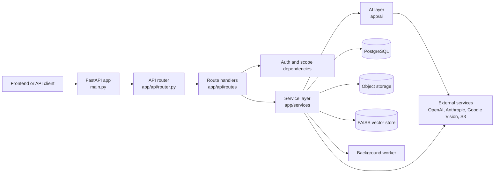

The API route layer does not build prompts, run OCR, call image generation, or manipulate FAISS directly. Those responsibilities live in services and integrations. This keeps HTTP behavior separate from business workflow behavior.

## Global request conventions

### Base URL and route prefix

All API endpoints in this document are shown relative to:

```text
/api/v1
```

For example, the content generation endpoint is:

```text
POST /api/v1/content/generate
```

### Content type

Most endpoints expect JSON request bodies. File upload endpoints currently accept base64 content inside JSON payloads rather than multipart uploads. The important upload fields are usually:

```json
{
  "name": "Brand guide",
  "filename": "brand-guide.pdf",
  "mime_type": "application/pdf",
  "content_base64": "...",
  "metadata": {}
}
```

### Authentication

Authenticated endpoints use OAuth2 bearer tokens through `OAuth2PasswordBearer(tokenUrl="/api/v1/auth/login")`.

Clients should send:

```text
Authorization: Bearer <access_token>
```

`get_current_principal()` decodes the JWT, loads the user, verifies the user is active, reads assigned roles, and reads allowed Brand Space IDs from both `user_roles` and `brand_space_members`.

The dependency returns a `CurrentPrincipal` with:

| Field | Meaning |
| --- | --- |
| `user_id` | Authenticated user ID from the JWT subject. |
| `tenant_id` | Tenant attached to the user. |
| `email` | User email. |
| `role_codes` | Role codes loaded from role assignments. |
| `brand_space_ids` | Brand Spaces assigned to the user through roles or membership. |

### Brand Space scope header

Most AI execution endpoints are Brand Space scoped and require:

```text
X-Brand-Space-Id: <brand_space_uuid>
```

The helper `get_brand_scope_header()` parses this header into a UUID. `require_brand_scope()` raises a `400` when a required Brand Space header is missing.

Endpoints that already include `{brand_id}` in the path do not use this header for scope; they validate access against the path value.

### Access rules

| Rule | Implementation |
| --- | --- |
| Invalid or missing bearer token | `get_current_principal()` returns `401 Invalid token`. |
| Inactive user | `get_current_principal()` returns `401 Inactive user`. |
| Missing Brand Space header on scoped endpoints | `require_brand_scope()` returns `400 X-Brand-Space-Id header is required`. |
| Tenant mismatch | `assert_tenant_access()` returns `403 Forbidden`. |
| Brand mismatch | `assert_brand_access()` returns `403 Forbidden`. |
| Super admin accessing Brand Space content | `forbid_super_admin_brand_access()` returns `403 Super Admin cannot access Brand Space content`. |
| Tenant admin access | Tenant admins can access Brand Space content for their tenant. |
| Brand user access | Brand users are restricted to assigned Brand Spaces when assignments exist. |

The super admin restriction is important. Super admin can access platform analytics and tenant management, but Brand Space content APIs intentionally reject super admin access.

## Global error handling

`main.py` registers central handlers for domain errors.

| Error type | HTTP status | Response shape |
| --- | --- | --- |
| `NotFoundError` | `404` | `{"detail": "<message>"}` |
| `DuplicateResourceError` | `409` | `{"detail": "<message>"}` |
| `GenerationFailureError` | `400` | `{"detail": "<reason_summary>", "failure": {...}}` |
| `AuthorizationError` | `400` | `{"detail": "<message>"}` |
| `GuardrailViolationError` | `400` | `{"detail": "<message>"}` |
| `LifecycleError` | `400` | `{"detail": "<message>"}` |
| `UploadValidationError` | `400` | `{"detail": "<message>"}` |
| `UsageLimitExceededError` | `400` | `{"detail": "<message>"}` |

Some route handlers raise `HTTPException` directly for local cases such as missing content, missing jobs, role restrictions, invalid Brand Space scope, or cancelled chat generation.

Pydantic request validation failures are returned by FastAPI as standard `422` validation responses.

## Router map

`app/api/router.py` registers these route groups:

| Route prefix | Module | Purpose |
| --- | --- | --- |
| `/auth` | `app/api/routes/auth.py` | Login, token refresh, profile, activation, 2FA. |
| `/tenants` | `app/api/routes/tenant.py` | Tenant and user administration. Only lightly related to AI through ownership and usage. |
| `/brands` | `app/api/routes/brand.py` | Brand Space lifecycle, sections, validation, resolved context. |
| `/brands` | `app/api/routes/brand_assets.py` | Brand attachment upload, status, reprocess, unsync, delete. |
| `/knowledge` | `app/api/routes/knowledge.py` | General knowledge upload, list, status, reprocess, delete. |
| `/content` | `app/api/routes/content.py` | AI content generation, rewrite, tone check, history, export, archive, delete. |
| `/chat` | `app/api/routes/chat.py` | Chat sessions, messages, follow-up generation, cancellation. |
| `/folders` | `app/api/routes/folder.py` | Organizes generated content versions. |
| `/templates` | `app/api/routes/template.py` | Template upload, metadata, apply, recommendation, delete. |
| `/render` | `app/api/routes/render.py` | Blueprint resolution, preview, export, render status. |
| `/review` | `app/api/routes/review.py` | Share generated content for public review and comments. |
| `/social` | `app/api/routes/social.py` | Store social connections and build publish payloads. |
| `/analytics` | `app/api/routes/analytics.py` | Platform, tenant, brand, and usage analytics. |
| `/jobs` | `app/api/routes/jobs.py` | Background job list and job status. |
| `/storage` | `app/api/routes/storage.py` | Signed file download. |

The sections below focus on AI-related and AI-adjacent routes. Authentication is included because every protected AI route depends on it.

## Authentication APIs

Authentication routes are mounted under:

```text
/api/v1/auth
```

### Endpoint summary

| Method | Endpoint | Auth required | Request | Response | Notes |
| --- | --- | --- | --- | --- | --- |
| `POST` | `/auth/login` | No | `LoginRequest` | `TokenPairResponse` or `TwoFactorChallengeResponse` | Returns tokens unless 2FA is required. |
| `POST` | `/auth/activate` | No | `ActivationRequest` | `TokenPairResponse` | Activates an invited user and sets password. |
| `POST` | `/auth/forgot-password` | No | `ForgotPasswordRequest` | `PasswordResetResponse` | Returns reset information from `AuthService`. |
| `POST` | `/auth/reset-password` | No | `ResetPasswordRequest` | `TokenPairResponse` | Resets password using token. |
| `POST` | `/auth/refresh` | No | `RefreshTokenRequest` | `TokenPairResponse` | Issues a new access token from refresh token. |
| `GET` | `/auth/me` | Yes | None | `CurrentUserResponse` | Returns user, roles, and assigned Brand Spaces. |
| `GET` | `/auth/profile` | Yes | None | `CurrentUserResponse` | Same current-user shape. |
| `PUT` | `/auth/profile` | Yes | `ProfileUpdateRequest` | `CurrentUserResponse` | Updates profile fields and notification preference. |
| `POST` | `/auth/change-password` | Yes | `ChangePasswordRequest` | `PasswordResetResponse` | Requires current password. |
| `DELETE` | `/auth/profile` | Yes | None | `MessageResponse` | Deletes/deactivates current profile through service. |
| `GET` | `/auth/2fa/status` | Yes | None | `TwoFactorSetupResponse` | Returns current 2FA state. |
| `POST` | `/auth/2fa/setup` | Yes | None | `TwoFactorSetupResponse` | Creates pending authenticator setup. |
| `POST` | `/auth/2fa/enable` | Yes | `TwoFactorCodeRequest` | `TwoFactorSetupResponse` | Verifies code and enables 2FA. |
| `POST` | `/auth/2fa/disable` | Yes | `TwoFactorCodeRequest` | `TwoFactorSetupResponse` | Verifies code and disables 2FA. |
| `POST` | `/auth/2fa/verify` | No | `TwoFactorVerifyRequest` | `TokenPairResponse` | Completes login after 2FA challenge. |

### Authentication payloads

| Schema | Important fields |
| --- | --- |
| `LoginRequest` | `email`, `password` with minimum length 8. |
| `TokenPairResponse` | `access_token`, `refresh_token`, `token_type="bearer"`. |
| `CurrentUserResponse` | `user_id`, `tenant_id`, `email`, `full_name`, `role_codes`, `assigned_brand_space_ids`, `extra`. |
| `TwoFactorChallengeResponse` | `requires_two_factor`, `two_factor_ticket`, `delivery`, `email`. |

The client should cache `access_token` for API calls and use `assigned_brand_space_ids` to decide which Brand Space IDs are valid for `X-Brand-Space-Id`.

## Brand Space APIs

Brand routes are mounted under:

```text
/api/v1/brands
```

These endpoints operate on Brand Space setup and validation. They are the primary API entry point for AI context because generation reads the Brand Space sections, personas, guardrails, objectives, resolved context, and processed assets.

### Endpoint summary

| Method | Endpoint | Auth | Scope | Request | Response | What it does |
| --- | --- | --- | --- | --- | --- | --- |
| `POST` | `/brands` | Yes | Tenant | `BrandCreateRequest` | `BrandResponse` | Creates a Brand Space from identity, optional foundations, and optional voice/tone. |
| `GET` | `/brands` | Yes | Tenant | None | `list[BrandResponse]` | Lists brands visible to the current user. |
| `GET` | `/brands/{brand_id}` | Yes | Path brand | None | `BrandResponse` | Returns one Brand Space after access check. |
| `GET` | `/brands/{brand_id}/usage` | Yes | Path brand | None | `BrandUsageResponse` | Returns usage allocation and usage percentage for the brand. |
| `PUT` | `/brands/{brand_id}` | Yes | Path brand | `BrandUpdateRequest` | `BrandResponse` | Updates description, lifecycle state, or overview snapshot. |
| `PUT` | `/brands/{brand_id}/sections/{section_code}` | Yes | Path brand | `BrandSectionUpsertRequest` body | `BrandResponse` | Upserts one section; path `section_code` overrides body section code. |
| `PUT` | `/brands/{brand_id}/sections` | Yes | Path brand | `BrandSectionsUpsertRequest` | `BrandResponse` | Upserts multiple sections in one call. |
| `POST` | `/brands/{brand_id}/finalize` | Yes | Path brand | `BrandFinalizeRequest` | `BrandResponse` | Finalizes the brand setup. |
| `POST` | `/brands/{brand_id}/publish` | Yes | Path brand | None | `BrandResponse` | Moves brand to published/active lifecycle through service. |
| `POST` | `/brands/{brand_id}/unpublish` | Yes | Path brand | None | `BrandResponse` | Unpublishes the brand. |
| `POST` | `/brands/{brand_id}/archive` | Yes | Path brand | None | `BrandResponse` | Archives the brand. |
| `POST` | `/brands/{brand_id}/restore` | Yes | Path brand | None | `BrandResponse` | Restores an archived brand. |
| `DELETE` | `/brands/{brand_id}` | Yes | Path brand | None | `MessageResponse` | Deletes the Brand Space through service. |
| `GET` | `/brands/{brand_id}/overview` | Yes | Path brand | None | `BrandOverviewResponse` | Returns brand, sections, personas, guardrails, and objectives. |
| `GET` | `/brands/{brand_id}/validation` | Yes | Path brand | None | `ValidationSummaryResponse` | Returns warnings, conflicts, excluded assets, validation results, and latest snapshot. |
| `GET` | `/brands/{brand_id}/resolved-context` | Yes | Path brand | None | `ResolvedBrandContextResponse` | Returns latest resolved context snapshot, or `brand.resolved_brand_context` as fallback. |

### Important Brand Space request fields

| Schema | Fields |
| --- | --- |
| `BrandCreateRequest` | `identity`, optional `foundations`, optional `voice_tone`. |
| `BrandSectionUpsertRequest` | `section_code`, `payload`, `completion_percent` from 0 to 100. |
| `BrandSectionsUpsertRequest` | `sections`, a list of section upsert requests. |
| `BrandUpdateRequest` | Optional `description`, `lifecycle_state`, `overview_snapshot`. |
| `BrandFinalizeRequest` | Optional `review_notes`. The current route passes the request but service finalization uses the brand ID. |

When the section code is `visual_identity`, the schema normalizes `logo_placement` into the expected `LogoPlacementPayload` shape before the service sees it.

### Important Brand Space response fields

| Schema | Fields |
| --- | --- |
| `BrandResponse` | `id`, `tenant_id`, `name`, `slug`, `description`, `lifecycle_state`, `is_finalized`, `resolved_brand_context`, timestamps. |
| `BrandOverviewResponse` | `brand`, `sections`, `personas`, `guardrails`, `objectives`. |
| `ValidationSummaryResponse` | `warnings`, `conflicts`, `excluded_assets`, `validation_results`, `latest_snapshot`. |
| `ResolvedBrandContextResponse` | `snapshot_id`, `snapshot_kind`, `status`, `warnings`, `excluded_asset_ids`, `context_json`. |

### Brand Space flow

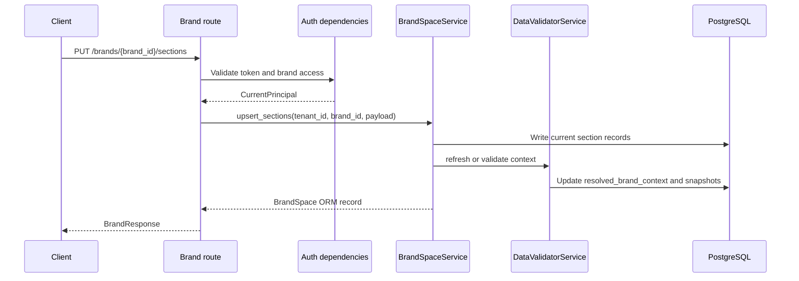

## Brand attachment APIs

Brand attachment routes are also mounted under:

```text
/api/v1/brands
```

These endpoints are specifically for Brand Space configuration assets: logos, audience insight documents, visual references, mood boards, color palettes, font guides, word banks, and other brand knowledge. The upload route stores the file and usually queues processing.

### Endpoint summary

| Method | Endpoint | Auth | Scope | Request | Response | What it does |
| --- | --- | --- | --- | --- | --- | --- |
| `POST` | `/brands/{brand_id}/attachments/{field_key}` | Yes | Path brand | `BrandAttachmentUploadRequest` | `BrandAttachmentResponse` | Uploads a brand attachment for a specific field and queues processing unless skipped. |
| `GET` | `/brands/{brand_id}/attachments` | Yes | Path brand | None | `list[BrandAttachmentListResponse]` | Lists all brand attachments grouped by `field_key`. |
| `GET` | `/brands/{brand_id}/attachments/fields/{field_key}` | Yes | Path brand | None | `BrandAttachmentListResponse` | Lists attachments for one field. |
| `GET` | `/brands/{brand_id}/attachments/assets/{asset_id}` | Yes | Path brand | None | `BrandAttachmentResponse` | Returns one attachment with status, validation, routing, and reusable assets. |
| `POST` | `/brands/{brand_id}/attachments/assets/{asset_id}/reprocess` | Yes | Path brand | None | `BrandAttachmentStatusUpdateResponse` | Queues the attachment for processing again. |
| `POST` | `/brands/{brand_id}/attachments/assets/{asset_id}/unsync` | Yes | Path brand | None | `BrandAttachmentStatusUpdateResponse` | Removes the asset from active brand context without fully deleting the source record. |
| `DELETE` | `/brands/{brand_id}/attachments/assets/{asset_id}` | Yes | Path brand | None | `BrandAttachmentStatusUpdateResponse` | Deletes or marks the attachment deleted through the service. |

### Brand attachment upload payload

```json
{
  "name": "Primary logo",
  "filename": "logo.png",
  "mime_type": "image/png",
  "content_base64": "...",
  "metadata": {},
  "desired_category": "logo",
  "skip_processing": false
}
```

`field_key` comes from the URL. The current enum includes values such as `logo`, `audience_insights`, `reference_creatives`, `mood_board`, `color_palette`, `font_guide`, `positive_word_bank`, `negative_word_bank`, `replaceable_word_bank`, `brand_knowledge_templates`, and `brand_knowledge_other`.

### Brand attachment response enrichment

The route uses `serialize_attachment()` to enrich the raw `KnowledgeAsset` with:

| Enriched field | Source |
| --- | --- |
| `asset_url` | Signed URL from `AssetDeliveryService`. |
| `processing_status` | `AssetProcessingStatus` row. |
| `validation_result` | `AssetValidationResult` row with derived `trust_level`. |
| `routing` | `AssetCategoryRouting` row. |
| `reusable_assets` | Extracted reusable assets, each with its own signed URL and review metadata. |

`trust_level` is derived from `validation_state`:

| `validation_state` | `trust_level` |
| --- | --- |
| `clean` | `trusted` |
| `warning` | `usable_with_warning` |
| `excluded` | `excluded` |
| anything else | `reference_only` |

### Brand attachment processing flow

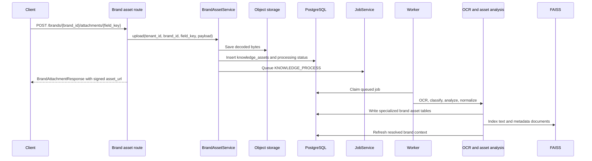

## Knowledge APIs

Knowledge routes are mounted under:

```text
/api/v1/knowledge
```

These APIs are similar to brand attachments but less tied to a fixed Brand Space section field. They still require `X-Brand-Space-Id`.

### Endpoint summary

| Method | Endpoint | Auth | Scope | Request | Response | What it does |
| --- | --- | --- | --- | --- | --- | --- |
| `POST` | `/knowledge/upload` | Yes | Header brand | `KnowledgeUploadRequest` | `KnowledgeAssetResponse` | Uploads a knowledge file and queues processing unless skipped. |
| `GET` | `/knowledge/list` | Yes | Header brand | None | `list[KnowledgeAssetResponse]` | Lists knowledge assets for the Brand Space. |
| `GET` | `/knowledge/{knowledge_id}/status` | Yes | Header brand | None | `KnowledgeAssetResponse` | Returns one asset status. |
| `DELETE` | `/knowledge/{knowledge_id}` | Yes | Header brand | None | `KnowledgeAssetResponse` | Deletes or deactivates one knowledge asset. |
| `POST` | `/knowledge/{knowledge_id}/reprocess` | Yes | Header brand | `KnowledgeReprocessRequest` | `KnowledgeAssetResponse` | Requeues asset processing. |

### Knowledge upload payload

```json
{
  "name": "Campaign reference",
  "filename": "campaign.pdf",
  "mime_type": "application/pdf",
  "content_base64": "...",
  "channel": "brand",
  "metadata": {},
  "skip_processing": false
}
```

`KnowledgeReprocessRequest` includes optional `channel`, but the current route calls `reprocess_scoped()` with the asset identity and does not pass the channel into the service.

### Knowledge response fields

`KnowledgeAssetResponse` returns file identity, storage path, signed asset URL, lifecycle state, channel, field/category info, page count, metadata JSON, structured and normalized JSON, validation state, activity flag, and processing error.

## Template APIs

Template routes are mounted under:

```text
/api/v1/templates
```

Templates are uploaded files that can be analyzed, matched, recommended, and used as layout or prompt scaffolding.

### Endpoint summary

| Method | Endpoint | Auth | Scope | Request | Response | What it does |
| --- | --- | --- | --- | --- | --- | --- |
| `POST` | `/templates/upload` | Yes | Header brand | `TemplateUploadRequest` | `TemplateResponse` | Uploads a template file and stores it. |
| `GET` | `/templates/list` | Yes | Header brand | None | `list[TemplateResponse]` | Lists templates for the Brand Space. |
| `GET` | `/templates/{template_id}` | Yes | Header brand | None | `{template, metadata}` | Returns template plus serialized template metadata. |
| `PUT` | `/templates/{template_id}/metadata` | Yes | Header brand | `TemplateMetadataUpsertRequest` | Metadata dict | Upserts template layout/export metadata. |
| `POST` | `/templates/apply` | Yes | Header brand | `TemplateApplyRequest` | `{template, metadata, prompt, studio_panel}` | Returns selected template context for a client-side apply flow. |
| `POST` | `/templates/recommend` | Yes | Header brand | `TemplateRecommendRequest` | `list[TemplateRecommendationResponse]` | Scores templates against prompt and studio panel. |
| `DELETE` | `/templates/{template_id}` | Yes | Header brand | None | `MessageResponse` | Deletes the template. |

### Template request fields

| Schema | Fields |
| --- | --- |
| `TemplateUploadRequest` | `name`, optional `description`, `kind`, `filename`, `mime_type`, `content_base64`, `tags`. |
| `TemplateMetadataUpsertRequest` | `zone_map`, `sizing_rules`, `platform_rules`, `editable_fields`, `export_rules`. |
| `TemplateApplyRequest` | `template_id`, `prompt`, `studio_panel`. |
| `TemplateRecommendRequest` | `prompt`, `studio_panel`, `limit` from 1 to 20. |

### Template recommendation response

`TemplateRecommendationResponse` includes scoring and adaptation data:

| Field | Meaning |
| --- | --- |
| `template_id`, `name`, `display_name`, `asset_url` | Identifies the template and downloadable source. |
| `score`, `decision_confidence`, `score_breakdown` | Matching score and explanation data. |
| `match_type`, `format_family`, `is_primary_adaptation` | Tells the client how the template fits the request. |
| `selection_reason`, `recommendation_group_key`, `reasons` | Human-readable recommendation context. |
| `adaptation_plan`, `metadata` | Instructions and metadata used later by generation or rendering. |

### Template recommendation flow

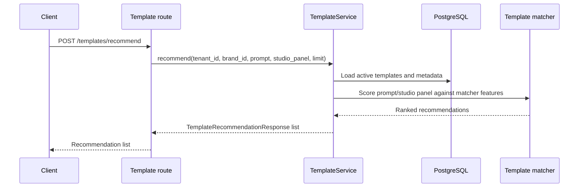

## Content generation APIs

Content routes are mounted under:

```text
/api/v1/content
```

These are the main direct AI generation APIs. They require `X-Brand-Space-Id`.

### Endpoint summary

| Method | Endpoint | Auth | Scope | Request | Response | What it does |
| --- | --- | --- | --- | --- | --- | --- |
| `POST` | `/content/generate` | Yes | Header brand | `ContentGenerateRequest` | `ContentVersionResponse` | Runs the full AI generation pipeline and returns persisted content with assets. |
| `POST` | `/content/rewrite` | Yes | Header brand | `ContentRewriteRequest` | `ContentVersionResponse` | Rewrites an existing content version. |
| `POST` | `/content/tone-check` | Yes | Header brand | `ToneCheckRequest` | `ToneEvaluationResponse` | Evaluates tone against brand/persona/objective context. |
| `GET` | `/content/history` | Yes | Header brand | None | `list[ContentVersionResponse]` | Lists generated content versions for the Brand Space. |
| `GET` | `/content/{content_id}` | Yes | Header brand | None | `ContentVersionResponse` | Returns one content version with generated assets. |
| `POST` | `/content/export` | Yes | Header brand | `ContentExportRequest` | `RenderResponse` | Exports content by calling `ContentService.export()`. |
| `POST` | `/content/copy` | Yes | Header brand | `ContentCopyRequest` | dict | Copies a content version. |
| `POST` | `/content/{content_id}/archive` | Yes | Header brand | None | `ContentVersionResponse` | Archives a content version. |
| `DELETE` | `/content/{content_id}` | Yes | Header brand | None | dict | Deletes a content version through service. |

### Content generation payload

```json
{
  "prompt": "Create an Instagram carousel about the new product launch.",
  "raw_user_prompt": "optional raw user text",
  "rewrite_instruction": null,
  "source_prompt_snapshot": null,
  "session_id": null,
  "persona_id": null,
  "objective_id": null,
  "template_id": null,
  "request_mode": null,
  "source_content_version_id": null,
  "inheritance_policy": {
    "inherit_persona": null,
    "inherit_objective": null,
    "inherit_template": null,
    "inherit_reference_assets": null,
    "inherit_copy_context": null,
    "inherit_layout_context": null
  },
  "studio_panel": {
    "format": "carousel",
    "platform_preset": "instagram",
    "file_type": "png",
    "size": null,
    "pinned_template_id": null
  },
  "generate_image": true,
  "reference_asset_ids": []
}
```

`studio_panel` is normalized by `StudioPanelSelection.apply_defaults()`, which calls `resolve_studio_panel_defaults()`. That means clients can send a partial studio selection as long as required fields are present, and the backend will resolve canonical `format`, `platform_preset`, `file_type`, and `size`.

### Content response fields

`ContentVersionResponse` returns the saved `content_history` record plus route-enriched fields:

| Field | Source |
| --- | --- |
| `generated_payload` | Persisted AI output. |
| `blueprint_payload` | Persisted render/layout blueprint. |
| `explainability_metadata` | Persisted trace, token, decision, and validation metadata. |
| `generation_decision` | `explainability_metadata.layout_decision`. |
| `scene_graph` | `explainability_metadata.scene_graph`. |
| `creative_decision` | `explainability_metadata.creative_decision`, falling back to generation decision. |
| `validation_report` | `explainability_metadata.validation_report`. |
| `repair_attempts` | Numeric value from explainability metadata. |
| `assets` | `GeneratedAsset` rows converted into `AssetReference`. |

### Direct generation flow

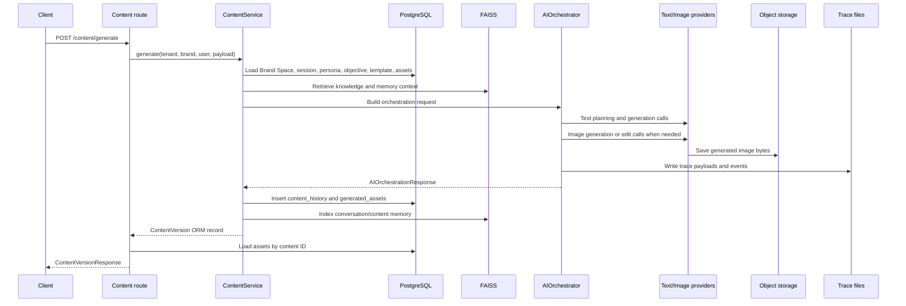

### Rewrite and tone check behavior

`POST /content/rewrite` uses an existing `content_version_id`, a `rewrite_instruction`, the current `studio_panel`, and optional `revision_scope`. The service creates a new or revised content version while preserving the relevant generation context.

`POST /content/tone-check` accepts either direct `content`, `content_payload`, or `content_version_id`. The Pydantic validator rejects the request if none of those are present. It can also receive persona, objective, message strategy, and objective context hints.

## Chat APIs

Chat routes are mounted under:

```text
/api/v1/chat
```

Chat is a session-based wrapper around the same generation system. It stores user messages, assistant messages, session context, generated content, and visual memory for follow-up requests.

### Endpoint summary

| Method | Endpoint | Auth | Scope | Request | Response | What it does |
| --- | --- | --- | --- | --- | --- | --- |
| `POST` | `/chat/sessions` | Yes | Header brand | `ChatSessionCreateRequest` | `ChatSessionResponse` | Creates a chat session with studio panel context. |
| `GET` | `/chat/sessions` | Yes | Header brand | None | `list[ChatSessionResponse]` | Lists sessions for the Brand Space. |
| `PATCH` | `/chat/sessions/{session_id}` | Yes | Header brand | `ChatSessionUpdateRequest` | `ChatSessionResponse` | Updates the chat session title. |
| `DELETE` | `/chat/sessions/{session_id}` | Yes | Header brand | None | dict | Deletes/deactivates the chat session. |
| `POST` | `/chat/sessions/{session_id}/cancel` | Yes | Header brand | None | dict | Cancels an in-flight chat generation. |
| `GET` | `/chat/sessions/{session_id}/messages` | Yes | Header brand | Query params | `list[ChatMessageResponse]` | Lists messages with pagination filters. |
| `POST` | `/chat/sessions/{session_id}/messages` | Yes | Header brand | `ChatMessageCreateRequest` | `ChatSendResponse` | Saves user message, generates assistant response, and returns both. |
| `DELETE` | `/chat/messages/{message_id}` | Yes | Header brand | None | dict | Deletes one chat message. |

### Chat request fields

| Schema | Fields |
| --- | --- |
| `ChatSessionCreateRequest` | Optional `title`, required `studio_panel`. |
| `ChatSessionUpdateRequest` | Optional `title` up to 255 chars. |
| `ChatMessageCreateRequest` | `message`, optional `studio_panel`, optional `persona_id`, `objective_id`, `template_id`, `reference_asset_ids`, `generate_image`. |

### Chat message listing query params

| Query param | Validation | Meaning |
| --- | --- | --- |
| `limit` | default 150, min 1, max 150 | Number of messages to return. |
| `before_created_at` | optional datetime | Cursor timestamp for older messages. |
| `before_id` | optional UUID | Cursor ID for stable pagination. |

### Chat generation flow

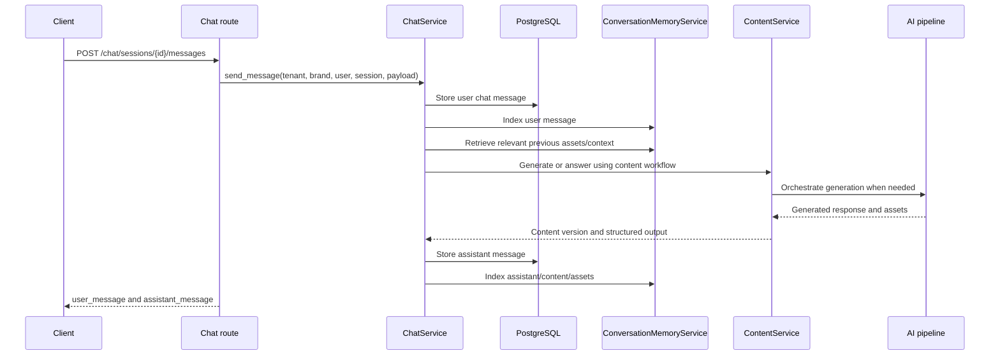

If a user cancels generation while the chat request is running, `ChatGenerationCancelledError` is caught in the route, the database session is rolled back, and the route returns HTTP `499`.

## Folder APIs

Folder routes are mounted under:

```text
/api/v1/folders
```

Folders are AI-adjacent because they organize generated `content_history` records.

| Method | Endpoint | Auth | Scope | Request | Response | What it does |
| --- | --- | --- | --- | --- | --- | --- |
| `POST` | `/folders` | Yes | Header brand | `FolderCreateRequest` | dict | Creates a content folder. |
| `GET` | `/folders` | Yes | Header brand | None | `list[dict]` | Lists folders for a Brand Space. |
| `PUT` | `/folders/{folder_id}` | Yes | Header brand | `FolderRenameRequest` | dict | Renames a folder. |
| `DELETE` | `/folders/{folder_id}` | Yes | Header brand | None | `MessageResponse` | Deletes a folder. |
| `POST` | `/folders/move` | Yes | Header brand | `FolderMoveRequest` | `MessageResponse` | Moves a content version into a folder. |

`FolderMoveRequest` contains `content_version_id` and `folder_id`.

## Render APIs

Render routes are mounted under:

```text
/api/v1/render
```

These endpoints are used after generation when a client wants to inspect the resolved blueprint, produce a preview, or export files.

### Endpoint summary

| Method | Endpoint | Auth | Scope | Request | Response | What it does |
| --- | --- | --- | --- | --- | --- | --- |
| `POST` | `/render/layout` | Yes | Header brand | `RenderLayoutRequest` | dict | Resolves the blueprint and merged studio panel without exporting files. |
| `POST` | `/render/preview` | Yes | Header brand | `RenderPreviewRequest` | `RenderResponse` | Calls export flow for preview-style output. |
| `POST` | `/render/export` | Yes | Header brand | `RenderExportRequest` | `RenderResponse` | Calls export flow with requested file type. |
| `GET` | `/render/{content_id}/status` | Yes | Header brand | None | dict | Returns whether content has a blueprint and can be rendered. |

### Render request fields

| Schema | Fields |
| --- | --- |
| `RenderLayoutRequest` | `content_version_id`, optional `blueprint_payload`, `studio_panel`, optional `template_id`. |
| `RenderPreviewRequest` | Same as layout request. |
| `RenderExportRequest` | `content_version_id`, `studio_panel`, `export_format`, optional `blueprint_payload`, optional `template_id`. |

### Render response fields

`RenderResponse` returns:

| Field | Meaning |
| --- | --- |
| `content_version_id` | The source generated content. |
| `preview_asset` | Optional single preview asset reference. |
| `export_assets` | List of exported files as `AssetReference`. |
| `renderer_metadata` | Renderer-specific metadata returned by `ContentService.export()`. |

### Render layout flow

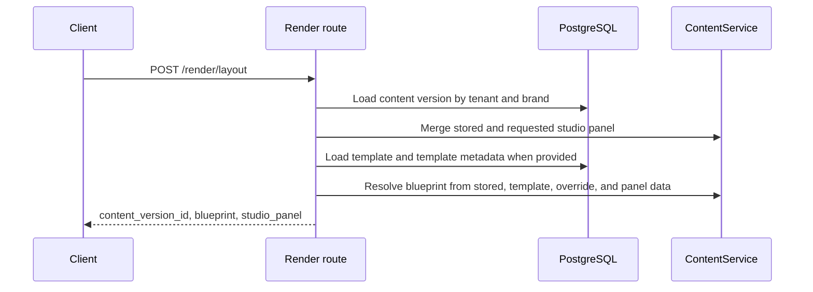

`POST /content/export` and `POST /render/export` both call `ContentService.export()`. The difference is mostly route naming and payload shape; `/content/export` accepts `ContentExportRequest`, while `/render/export` accepts `RenderExportRequest`.

## Job APIs

Job routes are mounted under:

```text
/api/v1/jobs
```

Jobs are tenant scoped, not Brand Space header scoped. They are used for background asset processing, template analysis, and RAGAS evaluation.

| Method | Endpoint | Auth | Scope | Request | Response | What it does |
| --- | --- | --- | --- | --- | --- | --- |
| `GET` | `/jobs/list` | Yes | Tenant | None | `list[JobResponse]` | Lists jobs for the current tenant. |
| `GET` | `/jobs/{job_id}/status` | Yes | Tenant | None | `JobResponse` | Returns one job if it belongs to the current tenant; otherwise 404. |

`JobResponse` includes `job_type`, `status`, `payload`, `result_payload`, `error_message`, lease fields, heartbeat, and timestamps.

Clients normally get job IDs indirectly from upload or processing workflows. Polling `/jobs/{job_id}/status` is useful for long-running worker activity.

## Storage API

Storage routes are mounted under:

```text
/api/v1/storage
```

### Signed download endpoint

| Method | Endpoint | Auth | Query | Response | What it does |
| --- | --- | --- | --- | --- | --- |
| `GET` | `/storage/download` | No bearer token | `token` required | `FileResponse` | Verifies signed asset token and streams the file. |

The token is generated by `AssetDeliveryService`. It includes storage path, filename, download mode, and expiry. The route verifies the HMAC signature and expiry, resolves the object through local storage, checks the file exists, infers the media type, and returns inline or attachment response based on the token.

Possible direct errors:

| Status | Cause |
| --- | --- |
| `403` | Malformed token, invalid signature, expired token, or unsafe storage path. |
| `404` | File does not exist. |

This route is how uploaded and generated assets are exposed to clients in normal API responses. Database records store `storage_path`; routes convert that path into temporary signed URLs where needed.

## Review APIs

Review routes are mounted under:

```text
/api/v1/review
```

Review link creation is authenticated and Brand Space scoped. Token-based review detail, comment, and status routes are public in the current implementation.

### Endpoint summary

| Method | Endpoint | Auth | Scope | Request | Response | What it does |
| --- | --- | --- | --- | --- | --- | --- |
| `POST` | `/review/share-link` | Yes | Header brand | `ShareLinkCreateRequest` | `ReviewLinkResponse` | Creates a tokenized review link for a content version. |
| `GET` | `/review/{token}` | No | Review token | None | `ReviewDetailResponse` | Returns link, content payload/blueprint, generation decision, assets, and comments. |
| `POST` | `/review/{token}/comment` | No | Review token | `ReviewCommentCreateRequest` | `ReviewCommentResponse` | Adds an external comment. |
| `POST` | `/review/{token}/status` | No | Review token | `ReviewStatusUpdateRequest` | `ReviewLinkResponse` | Updates review status. |

### Review payloads

| Schema | Fields |
| --- | --- |
| `ShareLinkCreateRequest` | `content_version_id`, optional `title`, `allow_external_comments`. |
| `ReviewCommentCreateRequest` | `body`, optional `external_author_name`. |
| `ReviewStatusUpdateRequest` | `status`. |

### Review flow

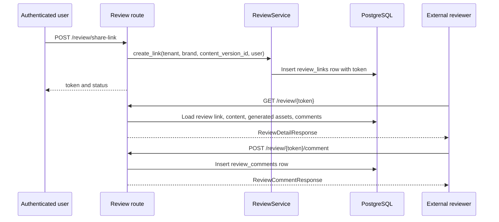

## Social APIs

Social routes are mounted under:

```text
/api/v1/social
```

The current social service stores encrypted connection tokens and builds a publish payload. It does not currently dispatch to an external social network API. The returned `dispatch_metadata.provider_ready` indicates the connection has enough token data for a provider integration to be added.

| Method | Endpoint | Auth | Scope | Request | Response | What it does |
| --- | --- | --- | --- | --- | --- | --- |
| `GET` | `/social/list` | Yes | Header brand | None | `list[SocialConnectionResponse]` | Lists connected platforms for the Brand Space. |
| `POST` | `/social/connect` | Yes | Header brand | `SocialConnectRequest` | `SocialConnectionResponse` | Creates or updates an encrypted platform connection. |
| `POST` | `/social/publish` | Yes | Header brand | `SocialPublishRequest` | dict | Builds accepted or scheduled publish payload from content and selected assets. |
| `POST` | `/social/disconnect` | Yes | Header brand | `SocialConnectRequest` | `MessageResponse` | Marks a platform connection disconnected. |

### Social payloads

| Schema | Fields |
| --- | --- |
| `SocialConnectRequest` | `platform`, optional `account_name`, `account_identifier`, `access_token`, `refresh_token`, `scopes`. |
| `SocialPublishRequest` | `content_version_id`, `platform`, optional `caption_override`, `media_asset_ids`, `publish_now`. |

`SocialService.publish()` loads the content version, selects generated assets with roles `render_export`, `render_preview`, or `ai_image`, builds a caption from generated headline/body/CTA if no override is supplied, decrypts the stored access token, and returns a publish payload.

## Analytics APIs

Analytics routes are mounted under:

```text
/api/v1/analytics
```

| Method | Endpoint | Auth | Role/scope | Response | What it does |
| --- | --- | --- | --- | --- | --- |
| `GET` | `/analytics/platform` | Yes | `super_admin` only | `AnalyticsResponse` | Returns platform summary metrics. |
| `GET` | `/analytics/tenant` | Yes | Not `tenant_user` or `brand_user` | `AnalyticsResponse` | Returns tenant-level metrics. |
| `GET` | `/analytics/brand/{brand_id}` | Yes | Brand access, not `brand_user` | `AnalyticsResponse` | Returns brand-level metrics. |
| `GET` | `/analytics/usage-summary` | Yes | Not `tenant_user` or `brand_user` | `AnalyticsResponse` | Returns usage metrics from tenant summary. |

`AnalyticsResponse` contains `scope`, optional tenant and Brand Space IDs, and `metrics`.

## Internal integration points

The API layer integrates with internal services rather than directly reaching into AI modules. The table below maps route groups to service classes and their downstream dependencies.

| Route group | Primary service | Main downstream dependencies |
| --- | --- | --- |
| `/brands` | `BrandSpaceService`, `DataValidatorService` | Brand repositories, validation, resolved context snapshots, usage summary. |
| `/brands/.../attachments` | `BrandAssetService` | Object storage, upload preflight, OCR, asset analyzer, specialized asset repositories, FAISS, jobs, usage, validation. |
| `/knowledge` | `KnowledgeService` | Object storage, OCR, FAISS indexing, jobs, usage. |
| `/templates` | `TemplateService` | Object storage, OCR, template analysis, template metadata, recommendation scoring. |
| `/content` | `ContentService` | Brand context, RAG, memory, orchestrator, providers, renderer, object storage, traces, generated assets, usage, optional RAGAS job. |
| `/chat` | `ChatService` | Sessions, messages, conversation memory, content generation, object storage, signed URLs. |
| `/render` | `ContentService.export()` | Stored content, blueprint resolver, renderer, object storage, generated asset records. |
| `/jobs` | `JobService` | Job repository and worker lease state. |
| `/storage` | `AssetDeliveryService`, `LocalObjectStorage` | Signed token verification and file serving. |
| `/review` | `ReviewService` | Content repository, asset repository, review link/comment repositories. |
| `/social` | `SocialService` | Social connection repository, encrypted token storage, content/assets. |

## External integration points

### OpenAI

The AI pipeline uses OpenAI through `OpenAITextProvider`, `OpenAIImageProvider`, `TemplateVisionAnalyzer`, `BrandScoringService`, and the FAISS embedding provider.

| Use case | Code path | Config |
| --- | --- | --- |
| Structured JSON/text generation | `OpenAITextProvider` | `openai_api_key`, `llm_model`, `tone_model` |
| Image generation/editing | `OpenAIImageProvider` | `openai_api_key`, `image_model`, image quality settings |
| Vision analysis of templates | `TemplateVisionAnalyzer` | `openai_api_key`, `vision_model`, template vision cache settings |
| Embeddings for FAISS | `FaissVectorStoreProvider` | `openai_api_key`, `embedding_model` |
| Live research backend when configured | Research-related services | `live_research_search_backend`, `live_research_search_model` |

When no OpenAI key is present, text providers return fallbacks where implemented, image routing can fall back to the mock image provider, and vector storage uses deterministic hash embeddings.

### Anthropic

`AnthropicTextProvider` is available behind `ProviderRouter`. It is selected for research when `settings.research_provider` is `anthropic` and `anthropic_api_key` is configured. If the client is unavailable or returns invalid JSON, the provider returns deterministic fallback data.

### Google Vision OCR

`OCRService` wraps `GoogleVisionOCRProcessor` from `ocr_processor`. It supports retries for transient OCR errors and can skip authentication failures in specific optional image-upload paths. OCR is used by knowledge, brand asset, template, renderer, and scoring workflows.

### S3

`S3ObjectStorage` is available when `object_storage_provider` is `s3`. It uses `boto3`, `aws_s3_bucket`, optional region, optional prefix, and a local object cache. Most current service constructors use `LocalObjectStorage` directly, while some paths use `get_object_storage()`. If production storage is moved fully to S3, the direct `LocalObjectStorage` usages should be reviewed.

### FAISS and LangChain

`FaissVectorStoreProvider` stores vector indexes on disk and uses LangChain FAISS wrappers. It uses `OpenAIEmbeddings` when an OpenAI key is available and `HashEmbeddings` otherwise.

### RAGAS evaluation

If automatic RAGAS evaluation is enabled, content generation can queue a `RAGAS_EVALUATION` job. The worker reads traces from `generation_trace_base_path`, writes evaluation output under object storage `ragas_evaluation/<trace_id>`, and stores output paths in `jobs.result_payload`.

### Social platform integration

The social API stores encrypted access/refresh tokens and builds publish payloads, but the current `SocialService.publish()` does not call a provider SDK or external social API. It returns an accepted or scheduled payload and dispatch metadata for a future provider implementation.

## Validation rules that matter to API clients

| Area | Validation |
| --- | --- |
| Bearer token | Must decode with configured JWT secret and user must be active. |
| Brand header | Required on content, chat, knowledge, template, render, folder, and social routes. |
| Brand access | Checked with `assert_brand_access()` before service calls. |
| Super admin | Blocked from Brand Space content routes. |
| `content_base64` uploads | Required and must be non-empty. Further preflight validation happens in upload services. |
| `studio_panel` | Required for generation/session/render paths and normalized by `StudioPanelSelection` where that schema is used. |
| `ToneCheckRequest` | Must include at least one of `content`, `content_payload`, or `content_version_id`. |
| Template recommendation limit | Must be between 1 and 20. |
| Chat message list limit | Must be between 1 and 150. |
| Review comment body | Must be non-empty. |
| Folder name | Must be non-empty. |
| 2FA codes | Must be exactly six characters. |

## Common client integration flows

### Brand onboarding and first generation

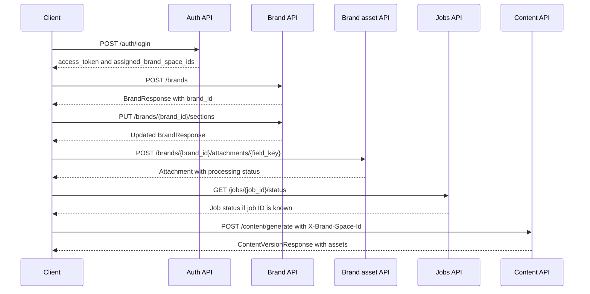

### Template-assisted generation

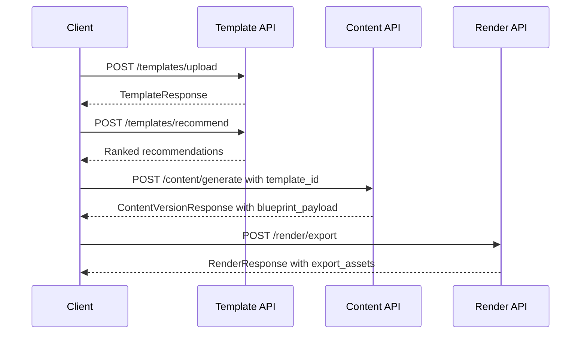

### Chat follow-up generation

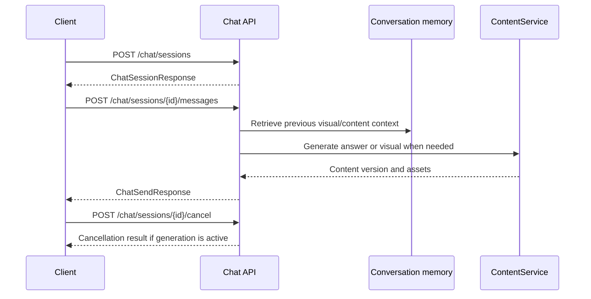

## Notes for backend developers extending the API

1. Keep route handlers thin. Add business behavior in services, not in route functions.
2. Keep Brand Space scope explicit. New Brand Space APIs should require either `{brand_id}` in the path or `X-Brand-Space-Id`, then call `assert_brand_access()`.
3. Return signed URLs at the API boundary, but keep `storage_path` as the durable internal reference.
4. When adding new generation output fields, persist them in `content_history.generated_payload`, `blueprint_payload`, or `explainability_metadata` only after checking current readers.
5. When adding new asset roles, update generated asset serialization, conversation memory, and social publish selection if the role should be visible to clients.
6. For new long-running work, use the database-backed `jobs` table and worker lease flow instead of blocking API requests.
7. If a new endpoint exposes public token-based access, follow the review/storage pattern deliberately and document whether bearer auth is required.
8. If an endpoint calls an external provider, keep the provider behind an adapter or service method so local fallback behavior remains possible.

## Summary

The API layer is a structured facade over the AI system. Brand APIs build and validate the context, asset and knowledge APIs ingest source material, template APIs prepare reusable layouts, content and chat APIs execute generation, render APIs produce preview/export files, jobs expose background processing state, and storage/review/social endpoints handle downstream delivery and collaboration.

For client integrations, the most important rules are to authenticate with bearer tokens, send `X-Brand-Space-Id` on scoped AI endpoints, treat `storage_path` as an internal reference, use signed URLs for file access, and expect longer AI-supporting workflows such as asset processing or evaluation to happen asynchronously through jobs.
