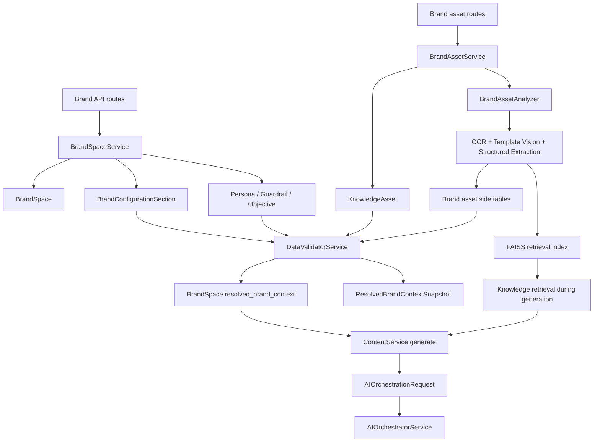
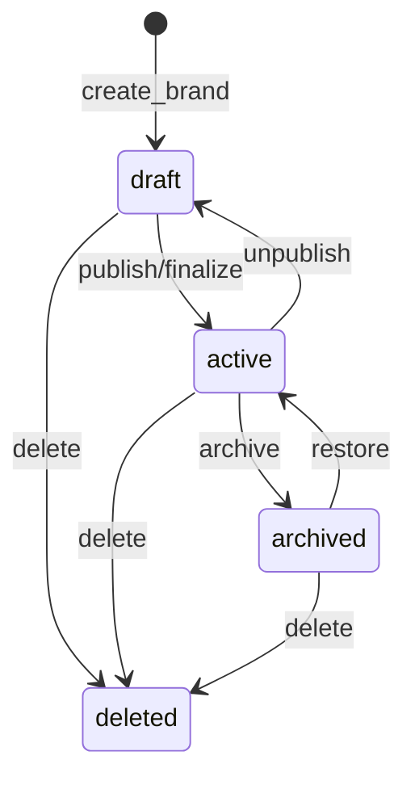
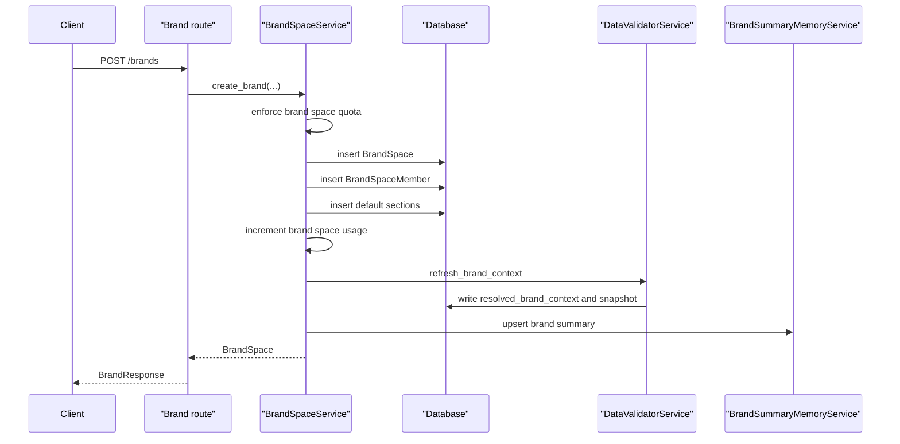
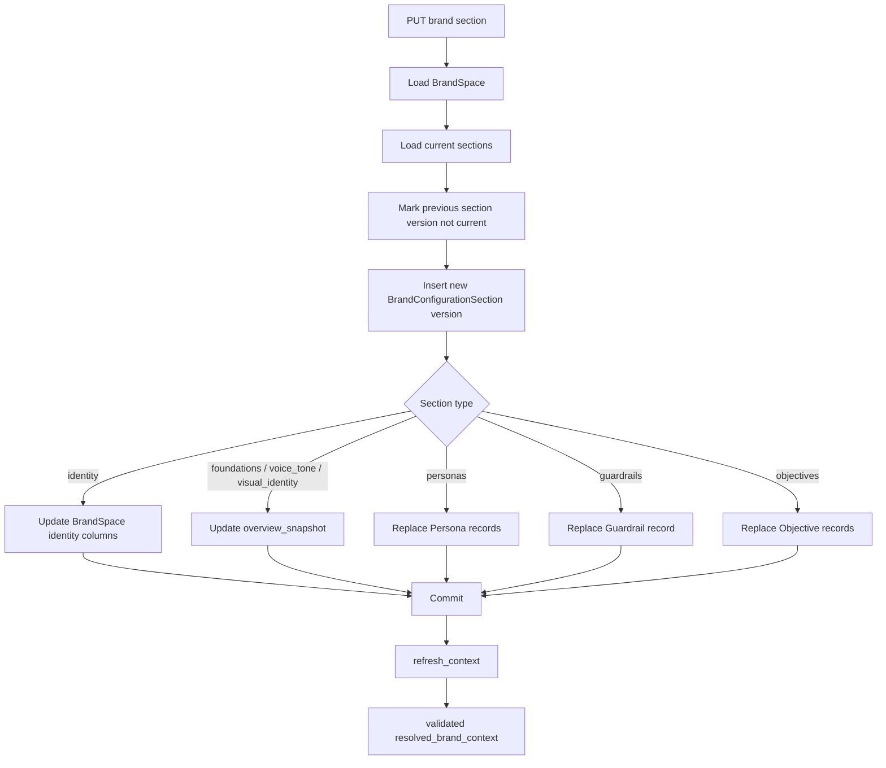
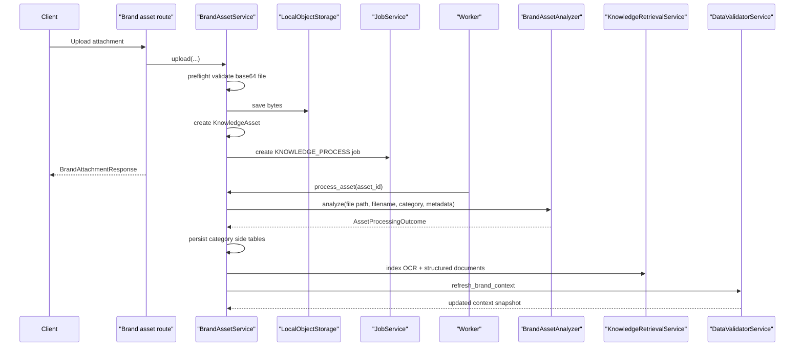
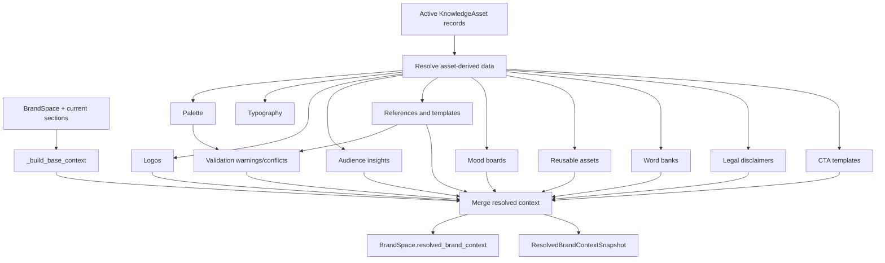
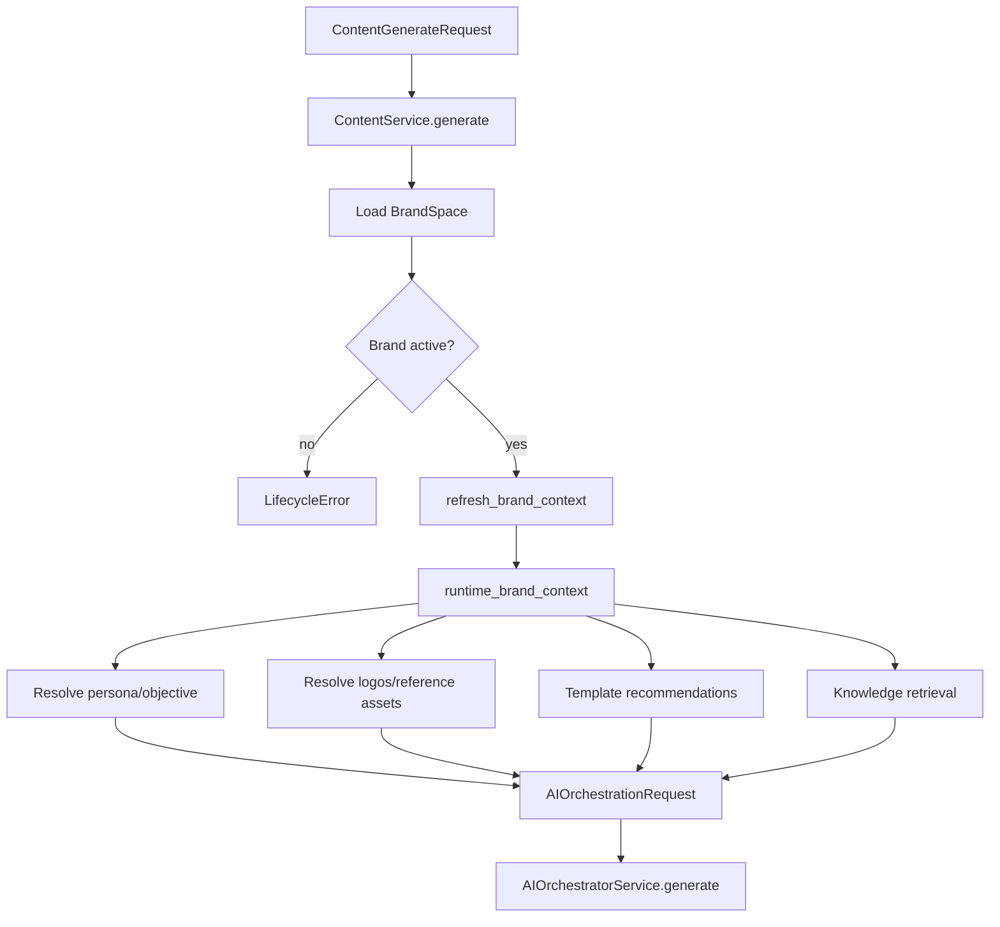
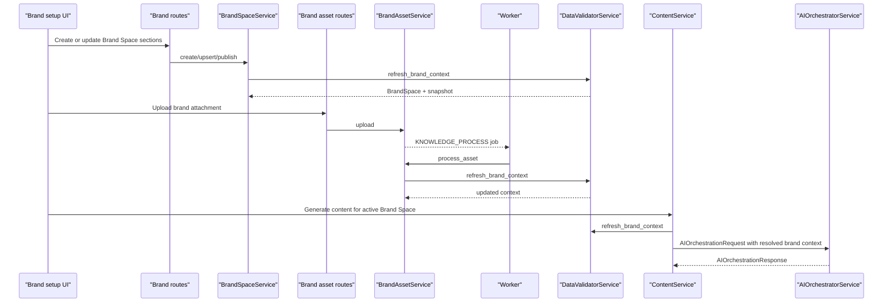

# Brand Space Architecture

## Purpose of Brand Space

Brand Space is the project's brand source of truth. It is the boundary that connects business identity, brand rules, audience knowledge, visual identity, uploaded brand assets, reusable design material, and AI generation. Every content generation request is scoped to one Brand Space, and generation is blocked unless that Brand Space is active.

In practical terms, Brand Space answers these questions for the AI system:

- What brand is this content for?
- What voice, tone, positioning, and guardrails should the AI follow?
- Which audience/persona and objective should guide the message?
- Which logos, colors, fonts, layouts, references, templates, CTAs, and legal disclaimers can be used?
- Which uploaded assets are trusted, warning-level, excluded, or still processing?
- What validated context should the orchestrator receive at generation time?

The important implementation detail is that Brand Space is not just one database row. It is a cluster of records and derived context:

- `BrandSpace` stores the top-level brand identity and lifecycle.
- `BrandConfigurationSection` stores versioned form sections.
- `Persona`, `Guardrail`, and `Objective` store normalized relational records for core AI behavior.
- `KnowledgeAsset` stores uploaded files.
- Brand asset side tables store extracted logos, palette entries, typography, audience insights, visual references, templates, mood boards, reusable assets, word banks, legal disclaimers, and CTA templates.
- `ResolvedBrandContextSnapshot` stores the validated AI-ready context.

## High-level architecture



The validated context produced by `DataValidatorService` is the main object consumed by the AI generation pipeline. The raw sections and raw uploaded assets remain available for inspection and reprocessing, but generation reads the resolved context as the compact brand truth.

## Main data model

### Top-level Brand Space

`BrandSpace` lives in `app/models/brand.py` and maps to the `brand_spaces` table.

| Field | Purpose |
|---|---|
| `id` | Brand Space identifier used across routes, assets, content, templates, and generated outputs. |
| `tenant_id` | Tenant boundary. All Brand Space access is tenant-scoped. |
| `name`, `slug`, `description` | Primary brand identity fields. |
| `industry_category`, `sub_industry` | Industry metadata used by brand context and generation. |
| `geography_country`, `geography_city` | Target geography metadata. |
| `audience_type` | Broad audience category. |
| `lifecycle_state` | Current state: `draft`, `active`, `archived`, or `deleted`. |
| `is_finalized` | Marks whether the brand has been finalized/published. |
| `overview_snapshot` | Lightweight summary of key sections such as foundations, voice, and visual identity. |
| `resolved_brand_context` | Current AI-ready brand context JSON. |
| `default_persona_id` | Optional pointer to the default persona. |

`BrandSpace` owns relationships to:

- `BrandConfigurationSection`
- `Persona`
- `Guardrail`
- `Objective`
- `BrandSpaceMember`

### Brand configuration sections

`BrandConfigurationSection` stores versioned section payloads in the `brand_configuration_sections` table. Each section has:

- `section_code`
- `version`
- `is_current`
- `completion_percent`
- `payload`

The service marks older versions as `is_current = False` when a section is updated. This keeps section history available while making the latest version easy to query.

The default section set created with a brand includes:

| Section | What it stores |
|---|---|
| `identity` | Brand name, description, industry, geography, audience type, website/social metadata, logo references. |
| `foundations` | Mission, vision, promise, positioning, business challenges, brand advantage, industry context. |
| `voice_tone` | Tone attributes, emotional direction, complexity, perspective, sentence style. |
| `personas` | User-facing persona payloads before they are mirrored into `Persona` records. |
| `guardrails` | Positive/negative word banks, restricted claims/topics, blocked words, custom rules. |
| `knowledge` | General brand knowledge section payload. |
| `objectives` | Campaign/content objective payloads before they are mirrored into `Objective` records. |
| `visual_identity` | Mood, visual style, logo placement, palette, typography, and visual asset references. |
| `prompt_intelligence` | Prompt starter patterns and platform rules used by prompt construction. |
| `review` | Review or finalization metadata. |

### Persona, guardrail, and objective records

Some sections are mirrored into relational records because they are used frequently and need clean query behavior.

| Model | Table | Purpose |
|---|---|---|
| `Persona` | `personas` | Stores audience goals, motivations, pain points, objections, demographics, psychographics, content behavior, language preference, and default flag. |
| `Guardrail` | `guardrails` | Stores positive/negative word banks, replaceable words, dos/donts, forbidden prompt patterns, restricted topics, restricted claims, blocked words, and custom rules. |
| `Objective` | `objectives` | Stores content objective name, description, content type, platform scope, default flag, and configuration JSON. |

`BrandIntelligenceService` can convert these records into dictionaries for the AI layer. In the final generation flow, `ContentService.generate` uses selected/default persona and objective records to build `persona_context` and `objective_context`.

### Brand membership

`BrandSpaceMember` maps users to Brand Spaces and stores `can_manage`. Listing behavior depends on role:

- Brand users only see Brand Spaces where they are members.
- Higher-level roles can list all Brand Spaces for the tenant.

Route-level access checks use `assert_brand_access` before allowing Brand Space reads, updates, attachment operations, or generation.

## Brand asset model

Brand attachments are stored as `KnowledgeAsset` records. The same table is used for general knowledge and brand-specific assets, with category/channel fields deciding how the asset participates in Brand Space context.

### KnowledgeAsset

`KnowledgeAsset` lives in `app/models/knowledge.py`.

| Field | Purpose |
|---|---|
| `tenant_id`, `brand_space_id` | Scope the asset to the tenant and Brand Space. |
| `name`, `original_filename`, `mime_type`, `storage_path` | Basic file identity and object storage path. |
| `lifecycle_state` | Upload/processing/indexed/failed/deleted state. |
| `channel` | Retrieval/context channel such as `brand`, `visual_identity`, `template`, `reference_creative`, `mood_board`, `audience_insights`, or `guardrail_support`. |
| `field_key` | UI/form field where the file was uploaded. |
| `asset_category` | Analyzer category such as logo, template, mood board, palette, typography guide, word bank, audience insight, and others. |
| `classification_confidence` | Confidence from routing/classification. |
| `structured_data_json` | Extracted structured data. |
| `normalized_data_json` | Normalized data used by validators and generation. |
| `validation_state` | `pending`, `clean`, `warning`, `excluded`, etc. |
| `extracted_text`, `extracted_summary` | OCR/text extraction result. |
| `last_indexed_at` | Timestamp string for retrieval indexing. |

### Brand asset side tables

Processed assets create specialized records in `app/models/brand_assets.py`.

| Table/model | What it stores |
|---|---|
| `BrandLogoAsset` + `BrandLogoMetadata` | Logo variants, compatibility, usage metadata, colors, size rules, extracted text, font details, tagline. |
| `AudienceInsightAsset` + `AudienceInsightStructuredData` | Audience segments, behaviors, motivations, pain points, objections, outcomes, preferences, trust signals, proof cues, research quality. |
| `VisualReferenceAsset` | Layout structure, style characteristics, reusable zones, brand score, optional linked template. |
| `MoodBoardAsset` | Style summary, icons, micro design elements, decorative assets, enhancement components. |
| `ReusableBrandAsset` | Cropped or derived reusable icons, decorative assets, logo variants, image elements, and their review metadata. |
| `ColorPaletteEntry` | Palette role, color name, hex code, RGB value, confidence. |
| `TypographyGuide` | Font families, hierarchy, usage patterns, confidence. |
| `WordBankUpload`, `PositiveWord`, `NegativeWord`, `ReplaceableWord` | Uploaded word banks and normalized term lists. |
| `BrandLegalAsset` | Extracted disclaimers/copyright/terms, supported formats, placement, font size, color, confidence. |
| `BrandCTATemplate` | Brand-specific CTA templates for generated outputs. |
| `AssetProcessingStatus` | Processing lifecycle, progress, processor name, status message, raw status JSON. |
| `AssetValidationResult` | Trust state, warnings, exclusion reason, resolved payload, confidence. |
| `AssetCategoryRouting` | Requested category, routed category, classifier, confidence, routing reason, decision JSON. |
| `DataConflict` | Conflicts detected during validation, such as template color conflicts against palette. |
| `ResolvedBrandContextSnapshot` | Versioned validated context JSON with warnings, conflicts, and excluded assets. |

## Brand Space API surface

### Brand routes

Brand routes are defined in `app/api/routes/brand.py`.

| Endpoint | Service method | Purpose |
|---|---|---|
| `POST /brands` | `BrandSpaceService.create_brand` | Creates Brand Space, default sections, owner membership, and initial context. |
| `GET /brands` | `BrandSpaceService.list_brands` | Lists Brand Spaces available to the current user. |
| `GET /brands/{brand_id}` | Repository lookup | Returns one Brand Space. |
| `GET /brands/{brand_id}/usage` | `BrandSpaceService.get_usage_summary` | Returns content/image/OCR usage for the Brand Space. |
| `PUT /brands/{brand_id}` | `BrandSpaceService.update_brand` | Updates basic brand fields and overview snapshot. |
| `PUT /brands/{brand_id}/sections/{section_code}` | `BrandSpaceService.upsert_section` | Writes one versioned section and refreshes context. |
| `PUT /brands/{brand_id}/sections` | `BrandSpaceService.upsert_sections` | Writes multiple sections and refreshes context. |
| `POST /brands/{brand_id}/finalize` | `BrandSpaceService.finalize_brand` | Publishes/finalizes the Brand Space. |
| `POST /brands/{brand_id}/publish` | `BrandSpaceService.publish_brand` | Refreshes context and sets lifecycle to active. |
| `POST /brands/{brand_id}/unpublish` | `BrandSpaceService.unpublish_brand` | Moves Brand Space back to draft. |
| `POST /brands/{brand_id}/archive` | `BrandSpaceService.archive_brand` | Marks Brand Space archived. |
| `POST /brands/{brand_id}/restore` | `BrandSpaceService.restore_brand` | Restores Brand Space to active. |
| `DELETE /brands/{brand_id}` | `BrandSpaceService.delete_brand` | Marks Brand Space deleted. |
| `GET /brands/{brand_id}/overview` | Brand/service repositories | Returns brand, current sections, personas, guardrails, objectives. |
| `GET /brands/{brand_id}/validation` | `DataValidatorService.get_validation_summary` | Returns warnings, conflicts, validation results, latest snapshot. |
| `GET /brands/{brand_id}/resolved-context` | `DataValidatorService.get_latest_snapshot` | Returns latest validated context snapshot, falling back to `brand.resolved_brand_context`. |

### Brand asset routes

Brand attachment routes are defined in `app/api/routes/brand_assets.py`.

| Endpoint | Service method | Purpose |
|---|---|---|
| `POST /brands/{brand_id}/attachments/{field_key}` | `BrandAssetService.upload` | Uploads a file, stores it, creates `KnowledgeAsset`, and queues processing. |
| `GET /brands/{brand_id}/attachments` | `BrandAssetService.list` | Lists active attachments grouped by field key. |
| `GET /brands/{brand_id}/attachments/fields/{field_key}` | `BrandAssetService.list` | Lists active attachments for one field. |
| `GET /brands/{brand_id}/attachments/assets/{asset_id}` | `BrandAssetService.get_scoped` | Returns one attachment with status, validation, routing, reusable assets, and signed URLs. |
| `POST /brands/{brand_id}/attachments/assets/{asset_id}/reprocess` | `BrandAssetService.reprocess` | Resets an asset and queues processing again. |
| `POST /brands/{brand_id}/attachments/assets/{asset_id}/unsync` | `BrandAssetService.unsync` | Removes the asset from active brand context without deleting the file record. |
| `DELETE /brands/{brand_id}/attachments/assets/{asset_id}` | `BrandAssetService.delete` | Deletes/cleans up the attachment from active use. |

## Brand Space lifecycle



Lifecycle values are defined in `BrandSpaceLifecycle`:

- `draft`
- `active`
- `archived`
- `deleted`

The lifecycle directly affects generation:

- `ContentService.generate` requires `brand.lifecycle_state == active`.
- `TextContentService.generate` also checks the active state.
- `ChatService.send_message` checks active state before using the Brand Space.

Publishing/finalizing requires at least an identity section with `brand_name`. `publish_brand` refreshes context, sets `lifecycle_state` to `active`, and sets `is_finalized` to true.

## Brand creation workflow



`create_brand` creates the brand in draft state. It creates the identity section from the request, optionally creates foundations and voice/tone sections, and creates empty placeholder sections for personas, guardrails, knowledge, objectives, visual identity, prompt intelligence, and review.

After saving the records, it calls `refresh_context`, which delegates to `DataValidatorService.refresh_brand_context` and updates brand summary memory.

## Section update workflow



The section payload remains the user-facing source. For sections that need fast relational access, the service also mirrors data into dedicated tables.

Important section side effects:

- `identity` updates `BrandSpace.name`, description, industry, geography, and audience type.
- `foundations`, `voice_tone`, and `visual_identity` update `overview_snapshot`.
- `personas` deletes existing personas and recreates them from payload.
- `guardrails` deletes existing guardrails and recreates the main guardrail record.
- `objectives` deletes existing objectives and recreates them from payload.

Every section update refreshes the resolved context after commit.

## Attachment ingestion workflow



`BrandAssetService.upload` stores the file and creates a `KnowledgeAsset`. Unless `skip_processing` is set, it creates a `KNOWLEDGE_PROCESS` job. The worker later calls `BrandAssetService.process_asset`.

`process_asset` runs the file through `BrandAssetAnalyzer`. The analyzer uses OCR, file inspection, routing logic, and template vision where appropriate. Its `AssetProcessingOutcome` tells the service:

- which category the asset belongs to
- which retrieval channel it should use
- extracted text
- structured data
- normalized data
- warnings
- confidence
- template analysis
- reusable asset candidates
- source format

The service persists the right side-table records, indexes retrieval documents, updates usage for OCR pages, refreshes validated brand context, and marks the asset indexed.

## Resolved brand context workflow

`DataValidatorService.refresh_brand_context` is the core context builder. It takes raw Brand Space data and processed assets, resolves conflicts/warnings, and writes the AI-ready context.



The context builder resolves:

- base context from sections/personas/guardrails/objectives
- palettes and palette role maps
- typography guide summaries
- logo assets and logo rules
- audience insight summaries
- visual references and template intelligence
- mood board summaries
- reusable design asset summaries and review status
- positive/negative/replaceable word banks
- legal disclaimers
- CTA templates
- validation warnings and excluded asset IDs
- context priority metadata

The final `context_json` is written into:

- `BrandSpace.resolved_brand_context`
- a new `ResolvedBrandContextSnapshot`

Older snapshots are trimmed based on `validation_snapshot_retention_count`.

## Shape of resolved brand context

The resolved context is a JSON object built for AI consumption. Its major sections are:

| Key | What it contains |
|---|---|
| `brand_id`, `brand_name`, `brand_description`, `industry_category` | Basic identity fields used by prompts and traces. |
| `identity` | Identity section plus resolved logo asset fields when available. |
| `foundations` | Mission, promise, positioning, business problems, human insight, brand advantage. |
| `voice_tone` | Tone rules and writing behavior. |
| `visual_identity` | Palette, typography, reference creatives, template intelligence, mood boards, reusable assets, design system synthesis. |
| `prompt_intelligence` | Prompt starters and platform rules. |
| `personas`, `default_persona` | Persona data from sections and relational records. |
| `guardrails` | Guardrail section plus uploaded word bank terms. |
| `objectives`, `default_objective` | Objective section and default objective record. |
| `audience_insights` | Structured audience evidence extracted from uploads. |
| `brand_assets` | Legal disclaimers and CTA templates. |
| `validation` | Warnings, excluded asset IDs, conflict count. |
| `context_priority` | Priority guidance used by context resolution and prompt compilation. |

This is the object passed to `AIOrchestrationRequest.resolved_brand_context`.

## Relationship with AI generation

Brand Space enters AI generation in `ContentService.generate`.



Before orchestration, the content service:

1. Loads the Brand Space.
2. Blocks generation if lifecycle is not active.
3. Refreshes `resolved_brand_context`.
4. Resolves persona and objective records.
5. Prepares runtime brand context and logo candidates.
6. Resolves brand reference assets from the visual identity and reusable asset data.
7. Recommends templates using brand context and prompt.
8. Retrieves knowledge from Brand Space RAG channels.
9. Passes all of that into `AIOrchestrationRequest`.

Inside the orchestrator, Brand Space context affects:

- prompt guardrail validation
- context resolution priority
- compiled prompt context
- message strategy
- final copy and CTA direction
- layout and visual decision-making
- template/reference adaptation
- logo selection and exact overlay behavior
- legal disclaimer behavior
- tone evaluation
- blueprint brand rules
- final explainability metadata

## Brand Space and RAG

Brand assets are indexed into FAISS through `KnowledgeRetrievalService`. Namespaces are built from tenant ID, brand space ID, and channel:

```text
{tenant_id}/{brand_space_id}/{channel}
```

This keeps each Brand Space isolated. A prompt for one Brand Space only searches that Brand Space's indexed evidence.

Channels let the system keep different kinds of evidence separate:

- `brand`
- `visual_identity`
- `audience_insights`
- `guardrail_support`
- `reference_creative`
- `mood_board`
- `template`
- `metadata`
- `user_upload`

During generation, retrieved matches are passed into `ContextResolutionService` and `ContextCompilerService`, where they become prompt-ready evidence.

## Brand Space and templates

Templates are related to Brand Space through `Template` and `TemplateMetadata` records. Template-like uploads can be routed through `BrandAssetAnalyzer`, analyzed by `TemplateVisionAnalyzer`, and persisted as templates/reference intelligence.

The generation flow uses Brand Space template data in three places:

1. `TemplateService.recommend` uses brand context, prompt, and studio panel to suggest candidate templates.
2. `LayoutDecisionEngine.decide` converts template candidates into planning hints.
3. `ContentService._build_template_context_payload` builds the template context passed to the orchestrator.

Template metadata can provide:

- zone maps
- sizing rules
- platform rules
- editable fields
- export rules
- visual design DNA
- sequence packs for carousel behavior
- sample page blueprints

For template-adaptance flows, templates can become visual/layout authority while content authority still comes from the user prompt, brand context, and verified evidence.

## Brand Space storage layout

Brand Space data spans several storage layers.

| Storage layer | What Brand Space stores there |
|---|---|
| PostgreSQL tables | Brand Space rows, sections, personas, guardrails, objectives, members, knowledge assets, templates, side-table analysis records, snapshots, validation/conflict records, generated content. |
| JSONB columns | Section payloads, overview snapshots, resolved brand context, asset structured/normalized data, analysis metadata, validation results, template metadata. |
| Object storage | Uploaded files, extracted/cropped reusable assets, generated images, final renders, OCR-derived images. |
| FAISS vector store | OCR text and structured retrieval documents, scoped by tenant/brand/channel. |
| Template vision cache | Cached visual audits of templates/reference images. |
| Generation traces | Brand usage reports, compiled context, prompts, responses, provider usage, validation reports, final render metadata. |

## Brand validation and trust model

Brand Space does not blindly trust every uploaded asset. Validation states are used to decide how assets should influence generation.

The route helper maps validation states to frontend trust levels:

| Validation state | Trust level |
|---|---|
| `clean` | `trusted` |
| `warning` | `usable_with_warning` |
| `excluded` | `excluded` |
| anything else | `reference_only` |

`DataValidatorService` can create warnings and `DataConflict` records. For example, template colors can be compared against the palette using a distance tolerance. Excluded assets are listed in the snapshot and should not be treated as trusted generation inputs.

The validated context includes a `validation` block with warnings, excluded asset IDs, and conflict count so the AI and UI can explain why some evidence was used cautiously or ignored.

## Usage and limits

Brand Space creation and generation are usage-controlled.

`BrandSpaceService.create_brand` enforces and increments `UsageMetricCode.BRAND_SPACES`.

`BrandAssetService.process_asset` enforces and increments `UsageMetricCode.OCR_PAGES` based on processed page count, with typography guides treated specially.

`ContentService.generate` enforces and increments content/image generation metrics after successful generation.

`BrandSpaceService.get_usage_summary` calculates Brand Space usage from:

- `ContentVersion` count for content generations
- `GeneratedAsset` count for image generations
- `KnowledgeAsset.page_count` sum for OCR pages

It combines tenant-level usage limits with optional per-brand capacity percentages stored in tenant metadata.

## Execution flow in the overall AI system



This is the complete loop: user-entered brand sections and uploaded assets become validated context; validated context becomes prompt grounding; generated outputs are persisted back under the same Brand Space.

## Important implementation boundaries

Brand Space changes can affect generation very quickly because `ContentService.generate` refreshes context before every generation request. That is useful, but it also means section and asset changes should preserve the shape of `resolved_brand_context`.

The highest-risk fields to change are:

- `resolved_brand_context`
- `visual_identity`
- `guardrails`
- `audience_insights`
- `brand_assets`
- `context_priority`
- `template_intelligence`
- `reusable_design_assets`
- `logo_assets`
- `brand_color_palette`
- `reference_creatives`

If new Brand Space metadata is needed, prefer adding a new key rather than changing or removing existing keys. The AI context compiler, template recommendation, layout decision, prompt builders, renderer, and final render logic all read from this context.

## Practical reading order for developers

To understand Brand Space in code, read in this order:

1. `app/models/brand.py` for the core Brand Space, sections, personas, guardrails, objectives, and membership tables.
2. `app/schemas/brand.py` for the request/response contracts used by the frontend.
3. `app/services/brand.py` for creation, section upserts, lifecycle transitions, usage summary, and context refresh.
4. `app/api/routes/brand.py` for the route surface.
5. `app/models/knowledge.py` and `app/models/brand_assets.py` for uploaded asset and side-table storage.
6. `app/services/brand_assets.py` for upload, process, reprocess, unsync, delete, side-table persistence, indexing, and context refresh.
7. `app/services/data_validation.py` for the resolved context builder.
8. `app/ai/brand_intelligence.py` for the base brand context shape.
9. `app/services/content.py`, starting at `ContentService.generate`, for how Brand Space enters AI generation.

The simplest mental model is: Brand Space stores the brand, brand sections describe it, uploaded assets deepen it, validation resolves it, and the AI orchestrator consumes the resolved context to generate brand-safe content.
