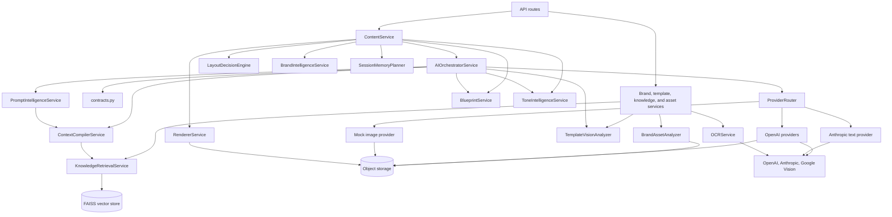
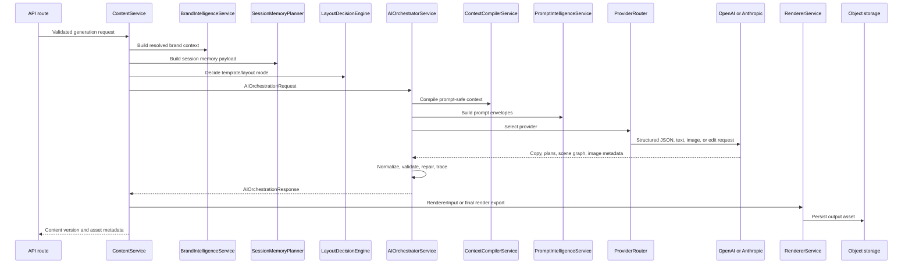
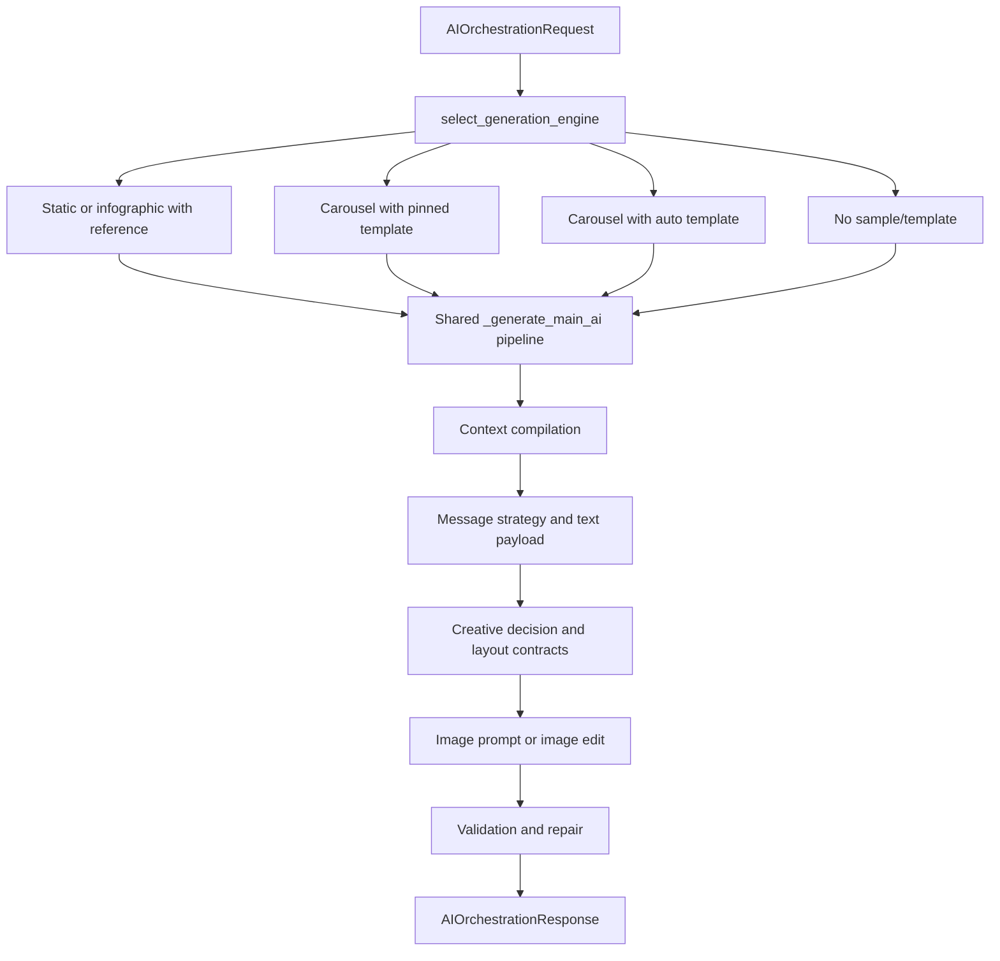

# Current AI Modules and Their Status

## Purpose of this document

This document explains the current state of every AI module under `app/ai`. It is meant for the next development team that has to continue the AI work without first reading the entire codebase line by line.

The status here is based on the current implementation and import paths in the project. The AI folder currently contains 29 Python source files. The heaviest modules are `orchestrator.py`, `context_compiler.py`, `brand_asset_analysis.py`, and `prompt_intelligence.py`; those four files carry most of the active AI behavior.

## Status labels used here

| Status | Meaning |
| --- | --- |
| Active core | Used in the main generation, context, ingestion, or provider path. Changes here can affect normal product behavior. |
| Active support | Used by services or the orchestrator, but usually as a helper around the main path. |
| Contract | Defines shared data shape and handoff objects. It has little or no runtime behavior but is important for compatibility. |
| Partial | The module is implemented enough to be useful in some cases, but it has TODOs, placeholders, limited integration, or known gaps. |
| Development fallback | Exists to keep local or degraded runs working, not to produce final production-quality output. |
| Compatibility | Kept so older imports still work while the real implementation lives elsewhere. |

## AI module map

## Current status summary

| Module | Status | Responsibility | Main consumers | Current notes |
| --- | --- | --- | --- | --- |
| `app/ai/orchestrator.py` | Active core | Owns the generation pipeline, strategy routing, prompt calls, repair loops, image prompts, final render prompts, and response assembly. | `ContentService`, generation demo script | Very mature but very large. It is the highest merge-risk AI file. |
| `app/ai/contracts.py` | Contract | Defines Pydantic request, response, blueprint, scene graph, renderer, and trace contracts. | Content service, renderer, orchestrator | Stable shared boundary. Existing shared fields should be extended additively. |
| `app/ai/context_compiler.py` | Active core | Compresses brand, RAG, memory, research, template, and reference evidence into prompt-safe briefs. | Orchestrator, PromptIntelligenceService | Mature and central. Visual grounding gates strongly affect final image quality. |
| `app/ai/prompt_intelligence.py` | Active core | Builds structured prompt envelopes for copy, creative planning, scene graph repair, image-led social generation, and rewrites. | Orchestrator, provider layer | Mature, highly contract-sensitive, and tightly coupled to compiled context shape. |
| `app/ai/brand_asset_analysis.py` | Active core | Converts uploaded brand assets into OCR text, visual DNA, reusable brand signals, and normalized metadata. | Brand asset and template services | Mature but complex. It is the main ingestion intelligence module. |
| `app/ai/rag/ocr.py` | Active core | Extracts text and visual candidates from PDFs, images, and supported office-like files. | Knowledge, template, brand asset, scoring, text content services | Mature with retry handling. Depends on Google Vision credentials for full OCR behavior. |
| `app/ai/rag/retrieval.py` | Active core | Indexes and searches brand knowledge chunks in FAISS namespaces. | Knowledge and brand asset services | Small and stable. Search returns plain dictionaries for compiler/orchestrator use. |
| `app/ai/providers/router.py` | Active core | Selects configured text and image providers with fallbacks. | Orchestrator, tone, conversation, research services | Stable. Missing API clients silently route to configured fallbacks. |
| `app/ai/providers/openai_provider.py` | Active core | Implements OpenAI text JSON/text calls and OpenAI image generation/editing. | ProviderRouter | Mature. Stores generated image bytes in local object storage. |
| `app/ai/providers/anthropic_provider.py` | Active support | Provides Anthropic text generation behind the shared provider interface. | ProviderRouter | Text-only alternative provider. JSON parsing falls back when Anthropic returns prose. |
| `app/ai/providers/image_generation.py` | Development fallback | Produces deterministic placeholder images and supports local image edit helpers. | ProviderRouter fallback image provider | Useful for local/dev continuity, not final visual quality. |
| `app/ai/providers/base.py` | Contract | Defines `PromptEnvelope`, `TextGenerationProvider`, and `ImageGenerationBackend`. | Provider implementations | Stable provider interface. |
| `app/ai/providers/llm.py` | Compatibility | Keeps old `LLMProvider` imports pointed at `OpenAITextProvider`. | Older imports | No logic beyond re-exporting. |
| `app/ai/blueprint.py` | Active core | Builds renderer placement blueprints from text, scene graphs, template metadata, and studio settings. | ContentService, Orchestrator | Stable placement contract for static/infographic and trace context for AI final render flows. |
| `app/ai/layout_decision.py` | Active core | Decides whether to use exact template, adapted template, or synthesized layout. | ContentService | Mature heuristic routing. Important for template and carousel behavior. |
| `app/ai/brand_intelligence.py` | Active core | Builds the resolved brand context from saved brand sections and ORM records. | Brand, content, scoring, validation, evaluation services | Stable. Saved Brand Space sections take priority over older records. |
| `app/ai/session_memory.py` | Active support | Classifies prompts as new content, edits, variants, or continuations and builds memory payloads. | ContentService | Deterministic and stable. Keeps previous-output inheritance under control. |
| `app/ai/tone_intelligence.py` | Active core | Scores copy quality and can request provider-backed tone evaluation. | Content, scoring, text content, orchestrator | Mature. Combines heuristic checks with provider output and rewrite guidance. |
| `app/ai/template_vision.py` | Active core | Uses OpenAI vision to analyze template/reference images and cache design DNA. | Orchestrator, BrandAssetAnalyzer, TemplateService | Mature but provider-dependent. Falls back to caller-supplied fallback when vision is unavailable. |
| `app/ai/context_resolution.py` | Active support | Orders retrieved knowledge and produces conflict instructions by priority. | Orchestrator | Small deterministic helper. Helps avoid prompt conflicts when sources disagree. |
| `app/ai/guardrails.py` | Active support | Performs keyword and regex validation for prompts and output. | Orchestrator | Basic safety layer. It is rule-based, not semantic policy enforcement. |
| `app/ai/structured_prompt_parser.py` | Active support | Parses structured prompt sections such as title, subtitle, tables, charts, story beats, and disclaimers. | ResearchEditorialPlanningService | Useful deterministic parser. It supports research/editorial planning before generation. |
| `app/ai/composition_planner.py` | Active support | Builds compact composition policy from blueprint, text payload, and compiled context. | No direct service import found in the current scan | Implemented helper for scene graph prompt planning, but not clearly wired into the primary service path. |
| `app/ai/carousel_planner.py` | Partial | Creates deterministic slide blueprints for cover/detail/data/closing carousel slides. | No direct service import found in the current scan | Has useful planning logic, but also has TODOs and an undefined `logger` reference. |
| `app/ai/data_visualization.py` | Partial | Parses chart requests and renders matplotlib/PIL chart images. | Imported by `carousel_planner.py`; no direct service import found | Implemented but lightly integrated. Currency-symbol parsing should be verified because the source contains encoding noise. |
| `app/ai/visual_asset_intelligence.py` | Partial | Parses prompt visual requirements and enriches image prompts with chart/style/asset guidance. | No direct service import found in the current scan | Implemented helper, but it does not appear to be part of the active service path right now. |
| `app/ai/icon_matching.py` | Partial | Intended to match semantic icon needs to brand icon assets. | No direct service import found in the current scan | Prototype-level. Main matching, color compliance, and recoloring are marked TODO. |
| `app/ai/providers/__init__.py` | Package marker | Marks provider package. | Python import system | Empty. |
| `app/ai/rag/__init__.py` | Package marker | Marks RAG package. | Python import system | Empty. |

## Primary AI execution path

The important point is that the AI layer is not a single model call. The service layer prepares brand, memory, template, research, and retrieval inputs. The orchestrator then compiles those inputs, builds multiple prompt envelopes, validates the results, repairs weak outputs, creates or edits images when needed, and returns a structured response that the content service can persist and render.

## Core generation modules

### `app/ai/orchestrator.py`

`AIOrchestratorService` is the central AI coordinator. `ContentService.generate()` constructs an `AIOrchestrationRequest` and calls `AIOrchestratorService.generate()`. The orchestrator selects a coarse generation strategy, traces the request, compiles context, asks providers for structured outputs, applies validation and repair logic, builds image prompts, calls image providers, and returns `AIOrchestrationResponse`.

The file defines `GenerationStrategy` and `select_generation_engine()` for routing. The current routes are standard generation, static/infographic reference generation, template adaptance, content intelligence, and without-reference generation. In practice, the static/infographic route and without-reference route go through `_generate_main_ai()`. The pinned-template carousel and auto-template carousel routes enrich the request with strategy metadata and then also return to the main AI pipeline.

Completed behavior includes context compilation, message strategy generation, creative decision payloads, text normalization, tone/semantic repairs, carousel slide contract enforcement, static and infographic metadata repair, image prompt construction, logo-safe-zone handling, topic-fit checks, data-surface checks, provider usage tracing, and final response assembly.

The main limitation is size and coupling. The module has hundreds of helper functions and owns several feature boundaries at once: sample layout adaptation, dynamic visual treatment, frozen prompt/RAG output structures, carousel contracts, static/infographic prompts, image repair, and final render quality checks. Any change here needs to be small and local because many shared fields are consumed downstream.

Known pending items in the file include TODOs around full template-adaptance carousel integration, content-intelligence carousel integration, without-reference fallback integration, and extraction of renderer policy from platform constraints. Those TODOs do not mean the pipeline is broken; they mean those named strategy branches still lean on the shared main pipeline instead of being fully separated.

### `app/ai/contracts.py`

This file defines the shared AI data contracts. `AIOrchestrationRequest` is the entry contract from `ContentService` into the AI layer. It includes tenant and brand identifiers, prompt text, studio panel settings, conversation and session memory, resolved brand context, persona/objective context, retrieved knowledge, template context, content format guides, live research, research editorial briefs, visual plans, template candidates, layout decisions, reference assets, platform constraints, validation reports, trace IDs, and image generation flags.

The response side is built around `AIOrchestrationResponse`, `StructuredTextPayload`, `MessageStrategyPayload`, `CreativeDecisionPayload`, `GenerationSceneGraph`, `GeneratedImageAsset`, `BlueprintPayload`, and `GenerationTrace`. These contracts allow the orchestrator, renderer, content service, and trace service to exchange structured data without passing raw provider responses around.

The implementation status is stable. The main development rule is to avoid reshaping or removing shared fields. Fields such as `sample_page_blueprint`, `module_counts`, `visual_permissions`, `carousel_slide_specs`, `visual_focus`, `image_zones`, and `blueprint_payload` should be preserved and extended additively.

### `app/ai/context_compiler.py`

`ContextCompilerService` is the narrowing step before prompt generation. It takes raw brand context, persona data, objective data, ordered knowledge, studio settings, conversation context, session memory, template context, layout decisions, reference assets, asset catalog, content guides, research briefs, format family plans, content plans, visual plans, live research, and resolution instructions. It returns a compact dictionary that `PromptIntelligenceService` can safely include in provider prompts.

This module is responsible for brand copy briefs, brand visual briefs, audience briefs, objective briefs, template fit briefs, visual knowledge briefs, reference asset briefs, render constraints, research summaries, and prompt context metrics. It also has strong visual grounding rules that decide whether visual knowledge is primary, supporting, fallback, fallback-only, or unavailable.

Completed behavior includes evidence ranking, visual channel gating, low-quality exclusion, encoding repair, palette role derivation, template DNA compaction, reference asset compaction, audience research prioritization, format family context, content planning context, and prompt token measurement.

The main risk is that this module controls what evidence the LLM is allowed to see. If it filters too aggressively, generated visuals become generic. If it admits weak OCR or template evidence as authoritative, the final image can copy wrong layout or topic signals. That is why the visual grounding thresholds and fallback modes matter.

### `app/ai/prompt_intelligence.py`

`PromptIntelligenceService` turns compiled context into provider-ready `PromptEnvelope` objects. It does not call the model itself. Instead, it assembles system and user prompts for the provider layer.

The module builds envelopes for generation, creative planning, message strategy, image-led social output, scene graph repair, and rewrites. It also formats compact prompt payloads for visual knowledge, prompt intelligence, template fit, brand visuals, reference assets, content format guides, research editorial briefs, format family plans, content plans, visual plans, and repair summaries.

Completed behavior includes prompt blocks for template sample authority, persona depth, audience research, client-quality signals, mistake carousel structure, persuasion metadata, strategic content quality, data visualization, logo overlay, and visual grounding. The prompt contracts are very explicit because the orchestrator expects structured fields back.

The main limitation is sensitivity. This file depends on the compiled context shape and the response schemas expected by the orchestrator. Small wording or schema changes can affect static, carousel, and infographic flows. Future work should keep schema additions additive and should not rename frozen output fields unless all consumers are updated.

## Brand ingestion and knowledge modules

### `app/ai/brand_asset_analysis.py`

`BrandAssetAnalyzer` is the largest ingestion intelligence module. It receives uploaded brand assets through services such as `BrandAssetService` and `TemplateService`, uses OCR and vision analysis where available, classifies extracted text, extracts visual signals, identifies reusable design assets, and produces normalized metadata that later becomes brand evidence.

The module recognizes palette information, typography, logo-like candidates, visual systems, template copy, CTA copy, legal copy, audience evidence, mood board signals, reusable motifs, and visual quality metadata. It calls `OCRService` for text/page extraction and `TemplateVisionAnalyzer` for deeper design analysis.

Completed behavior includes category-specific routing, OCR cleanup, audience research extraction, color and typography extraction, legal/CTA/template copy classification, visual asset quality checks, layout DNA extraction, reusable asset analysis, and confidence scoring.

The module is active and important because generation quality depends heavily on the quality of stored brand evidence. The main risk is complexity. It has many heuristic branches and field-specific classifiers, so new asset categories should be added carefully and tested against existing Brand Space flows.

### `app/ai/brand_intelligence.py`

`BrandIntelligenceService` builds the resolved brand context used by the content workflow. It merges saved Brand Space sections with older ORM records for personas, objectives, and guardrails. Saved form sections have priority, while database records fill defaults and backwards-compatible fields.

The output contains identity, foundations, voice and tone, visual identity, prompt intelligence, personas, knowledge, objectives, review data, default persona, guardrails, default objective, and context priority. `ContentService`, brand validation, scoring, and evaluation workflows consume this context before generation begins.

This module is stable. It is not a model-calling component; its value is in keeping Brand Space data normalized for the rest of the AI pipeline.

### `app/ai/rag/ocr.py`

`OCRService` extracts text and visual candidates from source files. It supports PDF extraction, image OCR, page image extraction, and source-format handling. It wraps calls to `GoogleVisionOCRProcessor` with retry behavior for transient provider failures.

For image uploads, the service can skip text OCR when Google credentials are missing and still allow the visual asset to be accepted. For PDFs, it uses `pdfplumber` to count pages and expects the OCR processor to extract text and page images.

The module is active and stable, but full behavior depends on Google Vision credentials and external OCR reliability. Retry and authentication handling are already implemented.

### `app/ai/rag/retrieval.py`

`KnowledgeRetrievalService` indexes and searches brand knowledge in FAISS. It chunks text with `RecursiveCharacterTextSplitter` using 900-character chunks and 120-character overlap, stores metadata with source/channel/document type, and searches by tenant, brand space, and channel namespace.

The service is small and stable. It is used during knowledge and asset workflows so retrieved evidence can later be ordered, compiled, and added to prompts.

### `app/ai/context_resolution.py`

`ContextResolutionService` orders retrieved knowledge by priority and builds conflict instructions. It knows the priority order across user prompt, persona, objective, brand foundations, voice, visual identity, knowledge, templates, conversation, and default system rules.

The output is a `ResolutionPlan` with ordered knowledge, conflict instructions, and source priority. The orchestrator uses it before context compilation so prompt construction receives the strongest source first.

This is active support code. It is deterministic and low risk.

## Provider modules

### `app/ai/providers/base.py`

This file defines the provider interfaces. `PromptEnvelope` carries system and user prompt text. `TextGenerationProvider` requires structured JSON and plain text methods. `ImageGenerationBackend` requires generate and edit methods.

The module is contract-level and stable. Provider classes should conform to these interfaces so the orchestrator can switch providers without knowing provider-specific SDK details.

### `app/ai/providers/router.py`

`ProviderRouter` creates provider instances and returns the correct provider for text, research, and image tasks. It reads provider choices from settings and falls back when the preferred provider is missing or has no usable client.

Completed behavior includes OpenAI and Anthropic text provider registration, OpenAI and mock image provider registration, research-specific text provider choice, and fallback routing.

The main operational note is that fallbacks can hide missing credentials during local runs. That is useful for development, but production monitoring should still check whether the intended provider is actually being used.

### `app/ai/providers/openai_provider.py`

`OpenAITextProvider` handles structured JSON and plain text generation through OpenAI. It supports the newer Responses API when available and falls back to Chat Completions for older SDK/client combinations. It also records token usage metadata for trace diagnostics.

`OpenAIImageProvider` handles image generation and image editing. It prepares configured image options, extracts returned image bytes from base64 or provider URLs, saves those bytes through `LocalObjectStorage`, and returns generated asset metadata.

This is the main active provider implementation. It is mature, but unavailable API keys cause text calls to return fallback values and image calls to raise provider-unavailable errors unless routed to the mock image backend.

### `app/ai/providers/anthropic_provider.py`

`AnthropicTextProvider` provides an alternate text provider behind the same interface. It creates an Anthropic client only when an API key is configured. Structured JSON generation asks Anthropic for JSON-only output, then parses the response.

This module is active support. It is text-only and has conservative fallback behavior when the client is missing, the SDK import fails, the provider call fails, or the response is not valid JSON.

### `app/ai/providers/image_generation.py`

`ImageGenerationProvider` is the mock image backend. It creates deterministic placeholder images based on a prompt hash, stores them through `LocalObjectStorage`, and returns metadata shaped like the real image provider.

It also includes logo cleanup helpers for safe background stripping and transparent margin trimming. The mock provider is useful for local development and fallback continuity, but it should not be considered final creative output.

### `app/ai/providers/llm.py`

This is a compatibility shim. It exports `PromptEnvelope` and maps `LLMProvider` to `OpenAITextProvider` so older imports do not break.

There is no AI logic here.

## Vision, template, and planning modules

### `app/ai/template_vision.py`

`TemplateVisionAnalyzer` sends template or reference images to OpenAI vision and asks for a structured design audit. The requested audit includes background style, layout type, editable zones, typography DNA, component motifs, visual mood, design style, infographic elements, composition rhythm, logo anchor, visual hierarchy, content structure, image treatment, and brand cues.

The analyzer caches results by model, image hash, and schema key. If the provider is unavailable, the image path is missing, or analysis fails, it returns the fallback payload passed by the caller.

This module is active and important for sample/template-aware generation. Its limitation is that thin or missing analysis can weaken downstream sample layout adaptation, so callers need sensible fallbacks.

### `app/ai/layout_decision.py`

`LayoutDecisionEngine` chooses whether the system should use an exact template, adapt a template, or synthesize a fresh layout. It considers studio format, selected template IDs, template recommendations, template scores, topic fit, overlay safety, brand validation warnings, reference assets, platform type, palette depth, typography depth, persona context, and objective context.

The output is a `LayoutDecision` payload consumed by context compilation, blueprint generation, prompt construction, and renderer planning. It is active in `ContentService`.

Completed behavior includes carousel-compatible template filtering, explicit template priority, weak-topic-fit handling, overlay-risk handling, adaptation hints, brand rule hints, asset strategy, and review flags.

### `app/ai/blueprint.py`

`BlueprintService` converts copy, studio settings, layout decisions, scene graph geometry, and template zone metadata into `BlueprintPayload`. Backend renderers use it as the placement contract for text, image, logo, CTA, platform size, export format, overflow behavior, and source layout mode.

For standard static surfaces it creates default zones based on platform dimensions. For template-based flows it can adapt template zones. For scene graph flows it can translate model-planned geometry into blueprint zones and fall back to default zones for missing parts.

This module is active and stable. It is especially important for static and infographic backend rendering, while carousel AI-final-render flows keep blueprint data mostly as trace/export context.

### `app/ai/composition_planner.py`

`CompositionPlannerService` builds a compact composition plan from prompt intent, blueprint zones, text payload, studio settings, and compiled context. It chooses layout archetypes, background policy, brand element policy, decorative policy, primary visual policy, text style policy, text content policy, and QA checks.

The module is implemented, but a direct service or orchestrator import was not found in the current scan. That means it is best treated as an available planning helper rather than a confirmed primary-path component.

### `app/ai/carousel_planner.py`

`CarouselPlannerService` creates deterministic `SlideBlueprint` objects for multi-slide carousels. It plans a cover slide, chooses one of several distribution strategies, creates detail/data/simple slides, and adds a closing CTA slide. It can use reference images, chart specs, proof points, stat highlights, brand assets, and brand CTA templates.

The module is partial. It has useful logic, but current scans did not find a direct service import. It also has TODOs for loading default CTA text from the brand profile. A concrete bug risk exists in the image-driven branch because it calls `logger.warning()` and `logger.info()` without defining or importing `logger` in the file.

### `app/ai/data_visualization.py`

`DataVisualizationService` parses chart requests and can render chart images with matplotlib/PIL. It supports chart specs, chart data points, chart type detection, title/subtitle extraction, numeric value parsing, axis labels, annotations, and rendering for bar, line, pie, area, comparison, and timeline-style charts.

The module is partial from an integration standpoint. It is imported by `carousel_planner.py`, but no direct service import was found in the current scan. Several currency regex strings contain visible encoding noise, so rupee/euro/pound symbol parsing should be verified before relying on it for financial chart prompts.

### `app/ai/visual_asset_intelligence.py`

`VisualAssetIntelligenceService` parses visual requirements from prompt text and metadata. It detects chart types, illustration style preferences, visual elements, data points, and structured data from stat highlights or proof points. It can then enrich an image prompt with style, data visualization, required visual element, and reusable brand asset guidance.

This module is implemented but appears lightly integrated. No direct service import was found in the current scan. It is useful as a future support module for clearer image prompts, but the current orchestrator has its own large image prompt builder.

### `app/ai/icon_matching.py`

`IconMatchingService` is intended to map a semantic icon need, such as "chart" or "person", to brand-consistent icon assets. It can infer a preferred icon style from visual identity and includes keyword/LLM-assisted semantic matching helpers.

The current status is prototype-level. The main `match_icon()` path returns the first icon asset ID with inferred style metadata, while actual icon loading, style filtering, semantic matching against real icon assets, color compliance checks, and recoloring are marked TODO.

## Copy, tone, and parsing modules

### `app/ai/tone_intelligence.py`

`ToneIntelligenceService` evaluates generated copy for brand alignment, proof strength, objection handling, distinctiveness, clarity, and CTA strength. It uses many local patterns and marker sets for CTA language, claim verbs, proof numbers, promotional wording, trust cues, objection cues, and response cues.

The service also uses `ProviderRouter` when provider-backed evaluation or rewrite guidance is needed. `ContentService`, brand scoring, text content workflows, and the orchestrator use it.

This module is active and mature. Its strengths are deterministic baseline scoring and targeted guidance. Its limitation is that any heuristic scoring system can miss subtle brand nuance, so high-risk copy should still be reviewed when brand or compliance stakes are high.

### `app/ai/structured_prompt_parser.py`

`StructuredPromptParser` extracts structured metadata from user prompts. It can parse title, subtitle, data tables, visual elements, chart type, special instructions, ordered story beats, disclaimer requests, body content, and raw prompt sections.

`ResearchEditorialPlanningService` uses this parser before later planning steps. It is active support code and is useful when the prompt itself carries structured content that should not be lost during generation.

### `app/ai/session_memory.py`

`SessionMemoryPlanner` decides whether the current prompt should use previous session output. It classifies prompts into modes such as new content, modify previous, variant of previous, continue previous, reuse template, change audience, change format, and compare previous.

The output includes recent messages, recent content, whether previous output should be used, and inherited persona/objective/template IDs when appropriate. `ContentService` consumes this payload while building the `AIOrchestrationRequest`.

The module is active support and intentionally deterministic. It keeps conversational continuity from becoming accidental hidden state.

### `app/ai/guardrails.py`

`GuardrailService` validates prompt and output text against blocked terms, restricted topics, claim markers, and forbidden regex patterns. It raises `GuardrailViolationError` when a rule fails.

This module is active support inside the orchestrator. It is useful as a lightweight rule layer, but it is not a full semantic safety or compliance system.

## Static, carousel, and infographic flow status

The common flow is `_generate_main_ai()`. Static, carousel, and infographic requests all rely on the same core steps: compile context, build prompt envelopes, call providers, normalize structured fields, validate output, repair weak or invalid sections, build image prompts, optionally generate/edit images, and return a structured response.

Static and infographic formats have many dedicated helpers inside the orchestrator for final render grounding, topic fit, visible claim hallucination, requested structure, data surface checks, content/visual balance, visual metaphor checks, and static/infographic metadata repair.

Carousel has its own large set of helpers inside the orchestrator for slide counts, story roles, sequence contracts, mobile copy budgets, continuity contracts, semantic progression, visual execution contracts, pinned-template storytelling, and slide render prompts. The standalone `carousel_planner.py` module exists, but the active carousel behavior appears to live mainly in `orchestrator.py`.

The current strategy wrappers for pinned-template carousel and auto-template carousel are not fully independent engines. They annotate or enrich the request and return to `_generate_main_ai()`. That is important for future developers because changes to the shared main pipeline can affect all three format families.

## Completed AI capabilities

| Capability | Current implementation |
| --- | --- |
| Brand context resolution | `BrandIntelligenceService` merges section data and ORM defaults into a single brand context. |
| Knowledge ingestion | `OCRService`, `BrandAssetAnalyzer`, and `KnowledgeRetrievalService` extract and index brand evidence. |
| Prompt-safe context compilation | `ContextCompilerService` reduces raw evidence into bounded briefs for provider prompts. |
| Provider abstraction | `ProviderRouter` hides OpenAI, Anthropic, and mock image backend choices. |
| Structured copy generation | `PromptIntelligenceService` and provider adapters generate schema-driven copy payloads. |
| Message strategy generation | Orchestrator and prompt intelligence produce campaign/message strategy payloads. |
| Template/sample awareness | `TemplateVisionAnalyzer`, `LayoutDecisionEngine`, context compiler, and orchestrator carry template DNA into generation. |
| Blueprint generation | `BlueprintService` produces deterministic renderer placement contracts. |
| Tone evaluation | `ToneIntelligenceService` scores copy and supports rewrite decisions. |
| Static/infographic final render prompting | Orchestrator has dedicated grounding, quality, structure, topic, and data-surface checks. |
| Carousel semantic contracts | Orchestrator manages slide roles, continuity, visual execution contracts, and mobile copy budgets. |
| Image generation/editing | OpenAI image provider stores generated/edited assets and returns metadata. |
| Trace and diagnostics | Orchestrator and providers record trace payloads, latency, usage, and prompt/token metrics. |

## Partially implemented or risky areas

| Area | Current gap | Impact |
| --- | --- | --- |
| Strategy separation | Template adaptance, content intelligence, and without-reference branches still route back to `_generate_main_ai()` after enrichment. | Future branch-specific work must account for shared pipeline side effects. |
| Icon matching | Actual asset loading, style filtering, color compliance, and recoloring are TODO. | Brand-aware icon selection is not production-ready. |
| Carousel planner module | Standalone planner is not clearly wired into the primary service path and has undefined `logger` references. | Using it directly can fail in image-driven paths unless fixed. |
| Chart rendering integration | `DataVisualizationService` exists but is not clearly used by active services. | Chart-specific generation may rely more on prompt/image model behavior than deterministic chart rendering. |
| Visual asset intelligence integration | Prompt visual parsing/enrichment module exists but is not clearly wired into active services. | Some visual requirement parsing is duplicated or handled inside the orchestrator instead. |
| Encoding noise | Currency regex strings in some helper modules show mojibake for non-ASCII currency symbols. | Financial prompts using rupee/euro/pound symbols should be tested and cleaned carefully. |
| Provider fallbacks | Missing clients can fall back silently for text and mock image generation. | Local runs keep working, but production quality may degrade without obvious API failure. |
| Guardrails | Guardrail checks are keyword/regex based. | They catch obvious blocked terms but do not replace semantic compliance review. |
| Orchestrator size | Many feature concerns live in one file. | High merge risk and high regression risk for shared fields. |

## Module dependency view by responsibility

| Responsibility | Main modules | Notes for future work |
| --- | --- | --- |
| Request and response shape | `contracts.py` | Treat as shared API. Extend fields additively. |
| Generation coordination | `orchestrator.py` | Keep changes narrow. Inspect static, carousel, and infographic helpers before editing shared functions. |
| Prompt construction | `prompt_intelligence.py` | Preserve expected JSON schemas and frozen output fields. |
| Context shaping | `context_compiler.py`, `context_resolution.py` | Verify visual grounding behavior when changing RAG or brand asset scoring. |
| Brand context | `brand_intelligence.py` | Saved sections are the strongest Brand Space source. |
| Asset ingestion | `brand_asset_analysis.py`, `rag/ocr.py`, `template_vision.py` | Changes here affect future generation quality by changing stored evidence. |
| Retrieval | `rag/retrieval.py` | Namespaces are tenant/brand/channel scoped. |
| Provider calls | `providers/router.py`, `providers/openai_provider.py`, `providers/anthropic_provider.py`, `providers/image_generation.py` | Keep provider-specific SDK behavior inside adapters. |
| Layout and rendering contracts | `layout_decision.py`, `blueprint.py`, `composition_planner.py` | Layout decisions feed compiled context, prompts, blueprints, and renderer behavior. |
| Carousel logic | `orchestrator.py`, `carousel_planner.py` | Active carousel logic appears concentrated in the orchestrator. |
| Charts and visual hints | `data_visualization.py`, `visual_asset_intelligence.py` | Implemented helpers, but current service integration is limited. |
| Tone and rewrites | `tone_intelligence.py`, `prompt_intelligence.py`, `orchestrator.py` | Tone scoring and targeted rewrites are already active. |
| Safety checks | `guardrails.py`, orchestrator validation helpers | Rule-based guardrails plus generation-specific validation. |

## Handoff notes for each maturity level

Active core modules should be treated as production path code. They are connected to normal API workflows and can affect saved content, generated assets, traces, and exports.

Active support modules are safe to improve, but their input and output shape still matters because services or orchestrator helpers consume them.

Partial modules should not be treated as complete just because they contain detailed implementation. Before building on them, confirm whether the service path actually imports them and fix the known TODOs or integration gaps.

Development fallback modules are useful for local continuity but should not be judged against final creative quality. They exist so the system can still return a shaped response when external image generation is unavailable.

Compatibility and package marker files should remain boring. Their purpose is to prevent import breakage, not to hold new behavior.

## Recommended next work

1. Keep `orchestrator.py` changes scoped and feature-specific. It is the main shared surface for static, carousel, and infographic generation.
2. Decide whether `carousel_planner.py`, `composition_planner.py`, `data_visualization.py`, and `visual_asset_intelligence.py` should become active pipeline modules or remain helper/prototype modules.
3. Fix the standalone carousel planner `logger` issue before calling that module directly in production paths.
4. Replace placeholder icon matching with real asset loading, semantic matching, color compliance, and recoloring before exposing icon-aware generation as a finished feature.
5. Verify and clean currency-symbol parsing in the chart and visual parsing helpers before relying on them for finance-heavy prompts.
6. Add provider observability around fallback usage so production runs do not silently use mock or fallback providers.
7. Preserve existing contract field names and add metadata instead of reshaping shared payloads.
