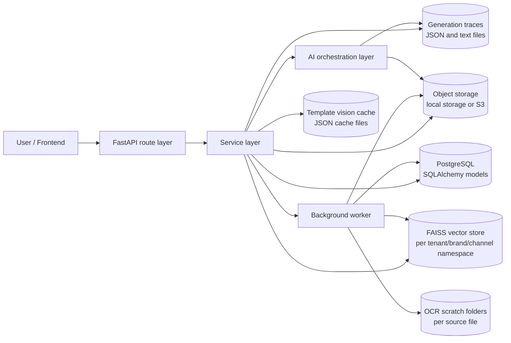
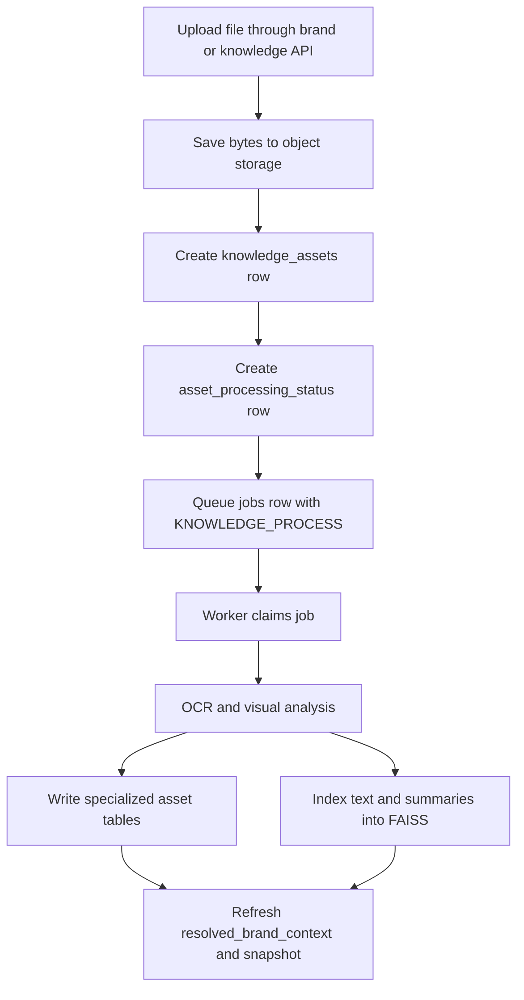
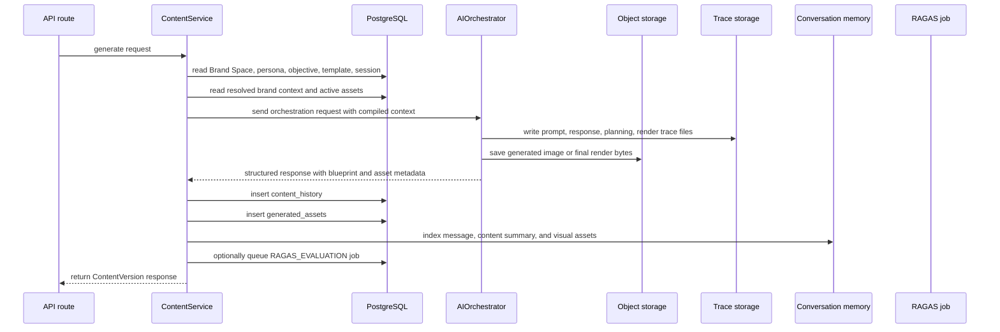
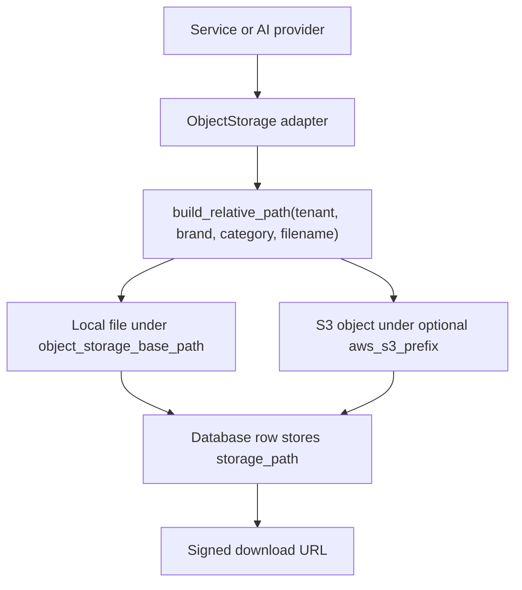
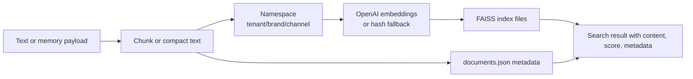
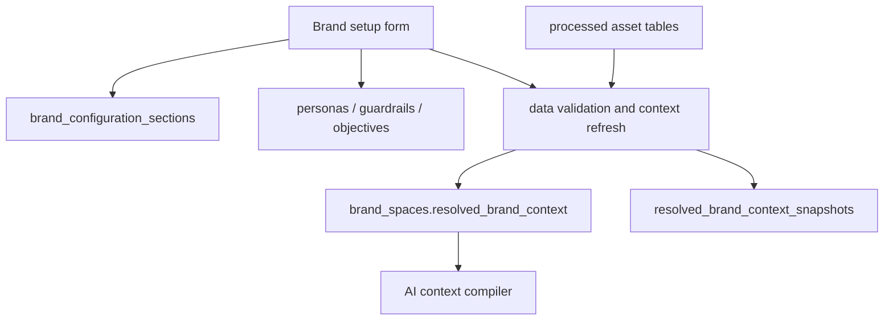
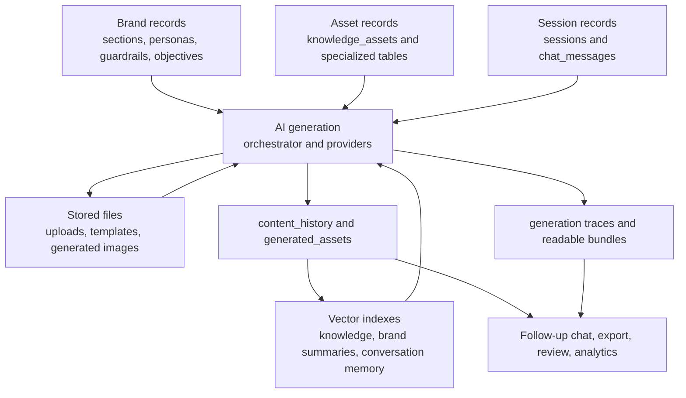

# Database and Storage Structure Relevant to AI Workflows

## Purpose of this document

This document explains how the current system stores, reads, updates, indexes, and serves the data used by the AI workflows. The AI layer does not depend on one storage system only. PostgreSQL stores the durable business state, local or S3 object storage stores uploaded and generated files, FAISS stores searchable vector indexes, and a few filesystem folders hold trace, cache, OCR, and evaluation artifacts.

The important point for the next team is this: the database records are the source of truth for workflow state and metadata, while file storage and vector storage hold supporting artifacts that are referenced by database fields such as `storage_path`, `source_id`, `chunk_id`, `trace_id`, and `content_version_id`.

## Storage architecture at a glance



The route layer receives requests and delegates to services. Services own database transactions, object storage operations, vector indexing, and workflow coordination. The AI layer consumes compiled context and returns structured outputs. Workers pick up queued jobs from the database and perform longer-running asset processing, template analysis, or RAGAS evaluation outside the request lifecycle.

## Main storage responsibilities

| Storage layer | Implementation | What it stores | Main code owners | Used by AI for |
| --- | --- | --- | --- | --- |
| Relational database | PostgreSQL through async SQLAlchemy | Tenants, users, brand spaces, brand sections, assets, templates, sessions, messages, memory entries, jobs, content history, generated asset metadata, usage | `app/models`, `app/repositories`, `app/services` | Durable workflow state, generation inputs, output records, audit metadata |
| Object storage | `LocalObjectStorage` or `S3ObjectStorage` | Uploaded brand files, template files, reusable extracted assets, generated images, final renders, cached S3 files | `app/integrations/object_storage.py` | File-backed source material and generated visual output |
| Vector store | `FaissVectorStoreProvider` | Chunked OCR/knowledge text, brand summary memory, conversation memory search documents | `app/integrations/vector_store.py`, `app/ai/rag/retrieval.py`, memory services | Retrieval grounding and semantic lookup |
| Trace storage | `GenerationTraceService` | Prompt payloads, model responses, orchestration stages, render input/output, cost estimation, readable visual trace bundles | `app/services/generation_trace.py` | Debugging, auditability, cost estimation, post-run evaluation |
| Template vision cache | Files under `template_vision_cache_base_path` | Cached vision analysis of sample/template images keyed by model, image hash, and schema | `app/ai/template_vision.py` | Avoids repeating expensive template visual audits |
| OCR scratch files | `_ocr` folders beside source files | Temporary OCR text, page images, cropped visual candidates, intermediate OCR artifacts | `app/services/brand_assets.py`, `app/services/renderer.py`, `app/ai/rag/ocr.py` | Extraction and cleanup support, not primary durable state |
| Evaluation output | Files under object storage `ragas_evaluation` | RAGAS evaluation result JSON per generation trace | `app/workers/runner.py`, `scripts/ragas_evaluation.py` | Offline quality checks after generation |

## Database setup and model conventions

The application uses async SQLAlchemy. `app/db/session.py` creates the engine from `settings.database_url`, enables `pool_pre_ping`, and provides `AsyncSessionLocal` for services and workers. `get_db_session()` yields request-scoped sessions to FastAPI dependencies.

All ORM models inherit from the shared SQLAlchemy `Base` in `app/db/base.py`. Common fields are added through mixins:

| Mixin | Fields | Meaning in AI workflows |
| --- | --- | --- |
| `UUIDPrimaryKeyMixin` | `id` | Every main record uses UUID primary keys, which are also passed through API payloads and trace metadata. |
| `TimestampMixin` | `created_at`, `updated_at` | Used for ordering sessions, jobs, generated assets, memory entries, and snapshots. |
| `TenantScopedMixin` | `tenant_id` | Keeps all AI state isolated by tenant. |
| `BrandScopedMixin` | `brand_space_id` | Connects assets, content, jobs, sessions, memory, templates, and brand configuration to one Brand Space. |
| `SoftDeleteMixin` | `deleted_at` | Used by durable objects that should be hidden without immediately deleting their historical state. |

Most flexible AI payloads are stored in PostgreSQL `JSONB` columns. That is intentional: model outputs, extracted brand signals, render blueprints, validation results, and trace metadata evolve quickly, so the code stores stable relational keys alongside flexible JSON structures.

## Core AI database map

```mermaid
erDiagram
    TENANTS ||--o{ USERS : owns
    TENANTS ||--o{ BRAND_SPACES : scopes
    USERS ||--o{ SESSIONS : creates
    BRAND_SPACES ||--o{ BRAND_CONFIGURATION_SECTIONS : has
    BRAND_SPACES ||--o{ PERSONAS : has
    BRAND_SPACES ||--o{ GUARDRAILS : has
    BRAND_SPACES ||--o{ OBJECTIVES : has
    BRAND_SPACES ||--o{ KNOWLEDGE_ASSETS : receives
    BRAND_SPACES ||--o{ TEMPLATES : owns
    BRAND_SPACES ||--o{ SESSIONS : has
    BRAND_SPACES ||--o{ JOBS : queues
    BRAND_SPACES ||--o{ RESOLVED_BRAND_CONTEXT_SNAPSHOTS : records

    KNOWLEDGE_ASSETS ||--o| BRAND_LOGO_ASSETS : classifies_as
    KNOWLEDGE_ASSETS ||--o| AUDIENCE_INSIGHT_ASSETS : classifies_as
    KNOWLEDGE_ASSETS ||--o| VISUAL_REFERENCE_ASSETS : classifies_as
    KNOWLEDGE_ASSETS ||--o| MOOD_BOARD_ASSETS : classifies_as
    KNOWLEDGE_ASSETS ||--o{ REUSABLE_BRAND_ASSETS : derives
    KNOWLEDGE_ASSETS ||--o{ COLOR_PALETTE_ENTRIES : extracts
    KNOWLEDGE_ASSETS ||--o{ TYPOGRAPHY_GUIDES : extracts
    KNOWLEDGE_ASSETS ||--o{ WORD_BANK_UPLOADS : extracts
    KNOWLEDGE_ASSETS ||--o{ ASSET_PROCESSING_STATUS : tracks
    KNOWLEDGE_ASSETS ||--o{ ASSET_VALIDATION_RESULTS : validates
    KNOWLEDGE_ASSETS ||--o{ ASSET_CATEGORY_ROUTING : routes
    KNOWLEDGE_ASSETS ||--o{ TEMPLATES : can_create

    TEMPLATES ||--o{ TEMPLATE_METADATA : describes
    SESSIONS ||--o{ CHAT_MESSAGES : contains
    SESSIONS ||--o{ CONTENT_HISTORY : produces
    CONTENT_HISTORY ||--o{ GENERATED_ASSETS : stores
    CONTENT_HISTORY ||--o{ REVIEW_LINKS : shares
    REVIEW_LINKS ||--o{ REVIEW_COMMENTS : receives
    SESSIONS ||--o{ CONVERSATION_MEMORY_ENTRIES : indexes
    CHAT_MESSAGES ||--o{ CONVERSATION_MEMORY_ENTRIES : indexes
    CONTENT_HISTORY ||--o{ CONVERSATION_MEMORY_ENTRIES : summarizes
    GENERATED_ASSETS ||--o{ CONVERSATION_MEMORY_ENTRIES : references
    JOBS }o--o| KNOWLEDGE_ASSETS : processes
    JOBS }o--o| CONTENT_HISTORY : evaluates
```



This diagram focuses on records that directly affect AI behavior. Tenant, user, role, review, social, analytics, and usage tables exist as platform support, but the AI workflow mainly depends on brand data, assets, sessions, jobs, generation history, generated files, and memory.

## Tenant and access records

### `tenants`

The tenant table is the top-level account boundary. Every tenant-scoped AI record points back to a tenant through `tenant_id`. The tenant also has `metadata_json`, which is available for platform-level settings, and `logo_asset_path`, which can point to an uploaded logo file.

### `users`, roles, permissions, and brand membership

Users belong to tenants and are connected to roles through `user_roles`. `UserRole` can optionally include `brand_space_id`, so the same permission model can be tenant-wide or brand-specific. `brand_space_members` gives a simpler membership relation for a Brand Space and records whether a user can manage it.

The AI services use these records indirectly through route dependencies and authorization. Once the request reaches the AI services, `tenant_id`, `brand_space_id`, and `user_id` are already known and are written into sessions, jobs, assets, and generated content.

## Brand Space storage

### `brand_spaces`

`brand_spaces` is the root record for all brand-specific AI work. It stores readable identity fields such as name, slug, description, industry, geography, and audience type. It also stores two important JSONB columns:

| Column | Purpose |
| --- | --- |
| `overview_snapshot` | A compact brand overview used by the UI and service responses. |
| `resolved_brand_context` | The latest validated, merged context generated from brand sections and processed assets. This is one of the most important inputs to AI generation. |

`default_persona_id` points to the persona that should be used when a generation request does not select one explicitly.

### `brand_configuration_sections`

Each Brand Space stores its editable form sections in `brand_configuration_sections`. The key fields are `section_code`, `version`, `is_current`, `completion_percent`, and `payload`. The unique constraint on `(brand_space_id, section_code, version)` lets the system keep versioned section history without losing the current section shape.

AI context compilation reads current sections and combines them with processed asset signals. This lets prompt generation use both manually entered brand information and extracted knowledge.

### `personas`

Personas store audience and behavioral detail such as psychographics, demographics, goals, motivations, pain points, objections, behavior, and language preference. Generation can select a persona directly, fall back to the Brand Space default, or use persona data from the resolved brand context.

### `guardrails`

Guardrails hold positive words, negative words, replaceable words, dos and donts, forbidden prompt patterns, restricted topics, restricted claims, blocked words, and custom rules. These values are consumed during prompt construction and validation so the model has explicit vocabulary and compliance boundaries.

### `objectives`

Objectives describe the intended content task, platform, content type, and optional configuration. The content service resolves an objective during generation and passes it into the orchestration request so planning and prompt intelligence can shape the output around the requested goal.

### `resolved_brand_context_snapshots`

`ResolvedBrandContextSnapshot` keeps historical copies of merged brand context. `refresh_brand_context()` writes the current merged context back to `brand_spaces.resolved_brand_context`, inserts a snapshot with warnings, conflicts, excluded assets, and `context_json`, and trims old snapshots based on settings.

This gives the AI layer a fast current context field while still keeping enough historical state to debug how a Brand Space changed over time.

## Knowledge and brand asset storage

The asset pipeline starts with `knowledge_assets`. Processed knowledge is then expanded into specialized tables based on what the asset contains.



### `knowledge_assets`

`knowledge_assets` is the central source record for uploaded or derived knowledge. It stores:

| Field group | Fields | Role in the AI workflow |
| --- | --- | --- |
| File identity | `name`, `original_filename`, `mime_type`, `storage_path` | Connects the database row to the binary file in object storage. |
| Routing | `channel`, `field_key`, `asset_category`, `source_intent`, `classification_confidence` | Tells the pipeline what the file was uploaded for and how it was classified. |
| Processing state | `lifecycle_state`, `validation_state`, `processing_error`, `last_indexed_at`, `is_active` | Drives worker status, UI status, and whether the asset participates in AI context. |
| Extracted content | `extracted_text`, `extracted_summary`, `page_count` | Feeds RAG indexing, template matching, and context compilation. |
| Flexible analysis | `metadata_json`, `structured_data_json`, `normalized_data_json`, `validation_summary_json` | Stores raw and normalized analysis outputs without forcing every extracted signal into a relational column. |

`storage_path` is a relative path. The object storage adapter resolves it to either a local file path or an S3 object key depending on configuration.

### Specialized asset tables

After analysis, a knowledge asset can produce one or more specialized records. These tables let the rest of the AI system query normalized brand signals instead of repeatedly reading raw OCR and vision output.

| Table | What it stores | AI usage |
| --- | --- | --- |
| `brand_logo_assets` | Logo variants, compatibility labels, usage metadata, source metadata | Logo availability and logo placement guidance. |
| `brand_logo_metadata` | Logo colors, size rules, font details, tagline, extracted text | Brand identity and design constraints. |
| `audience_insight_assets` | Audience summary, confidence, source metadata | Audience context and targeting signals. |
| `audience_insight_structured_data` | Segments, behaviors, motivations, pain points, objections, outcomes, preferences, trust signals, evidence scores | Prompt intelligence, persona enrichment, strategy planning. |
| `visual_reference_assets` | Layout structure, style characteristics, reusable zones, brand score, optional template link | Reference-based layout and sample adaptation. |
| `mood_board_assets` | Style summary, icons, micro design elements, decorative assets, enhancement components | Visual direction, design language, reusable motifs. |
| `reusable_brand_assets` | Extracted reusable images or design assets with storage path, dimensions, kind, confidence | Asset catalog for visual generation and rendering. |
| `color_palette_entries` | Role, color name, hex code, RGB value, confidence | Palette enforcement and design planning. |
| `typography_guides` | Font families, style hierarchy, usage patterns, confidence | Typography guidance in prompt and render planning. |
| `word_bank_uploads` | Uploaded positive, negative, or replaceable word sets | Guardrail vocabulary. |
| `positive_words`, `negative_words`, `replaceable_words` | Normalized term records linked to a word bank upload | Validation, tone control, rewrite guidance. |
| `asset_processing_status` | Processor progress, lifecycle, status text, last job reference | UI progress and worker status tracking. |
| `asset_validation_results` | Warnings, exclusion reason, resolved payload, confidence | Controls whether weak or conflicting assets should be trusted. |
| `asset_category_routing` | Requested category, routed category, classifier, confidence, reason | Explains why an uploaded asset ended up in a specific processing path. |
| `data_conflicts` | Conflict type, severity, affected fields/assets, resolution status | Prevents contradictory brand signals from silently entering resolved context. |
| `brand_legal_assets` | Disclaimer/copyright/terms text, applicable formats, placement and style | Legal copy injection into generated formats when applicable. |
| `brand_cta_templates` | CTA text, category, tone, platform/format applicability, source metadata | CTA selection and brand-consistent action prompts. |

The code uses these tables differently depending on the feature. For example, visual planning reads reusable assets, logo metadata, palette entries, visual references, and mood board details, while text planning reads personas, guardrails, audience insight data, CTA templates, legal assets, and word banks.

## Template storage

### `templates`

Templates are stored in the `templates` table and point to their source file through `storage_path`. A template can be created directly through the template flow or derived from a knowledge asset through `source_knowledge_asset_id`. `kind`, `origin_field_key`, and `tags` help the recommendation and matching flow understand when the template is useful.

The two important JSONB fields are:

| Field | Purpose |
| --- | --- |
| `analysis_json` | Stores OCR, vision, layout, and structural analysis produced by template analysis. |
| `matcher_features_json` | Stores compact features used by recommendation and prompt-template matching. |

### `template_metadata`

`template_metadata` stores render-facing information for templates:

| Field | Purpose |
| --- | --- |
| `zone_map` | Named content or image zones found in the template. |
| `sizing_rules` | Layout sizing constraints extracted from analysis. |
| `platform_rules` | Platform or format-specific handling. |
| `editable_fields` | Fields the system can safely fill or replace. |
| `export_rules` | Export behavior for downstream rendering. |

The AI pipeline uses this metadata when deciding whether a template can support the requested format and how content should map into layout zones.

## Content generation storage

Generation output is stored separately from source knowledge. The key records are sessions, messages, content versions, generated assets, and conversation memory entries.



### `sessions`

`sessions` stores the active content or chat workspace for a user inside a Brand Space. `studio_panel` stores the current UI and generation controls. `conversational_context` stores session-level state such as previously selected visual assets and context needed for follow-up chat.

### `chat_messages`

`chat_messages` stores user and assistant messages. A message can point to a generated content version through `content_version_id`. `structured_payload` holds mode-specific metadata, and `citations` stores references returned with the assistant message.

### `content_history`

`content_history` stores generated content versions. This is the main durable output record for AI generation.

| Field | Role |
| --- | --- |
| `session_id` | Connects the generation to the user session. |
| `folder_id` | Optional organization for saved outputs. |
| `parent_version_id` | Links rewrites or revisions to earlier versions. |
| `prompt` | Stores the user-facing request that produced the content. |
| `selected_persona_id`, `selected_template_id`, `objective_id` | Records which strategy inputs shaped the generation. |
| `studio_panel` | Stores the generation controls used for the run. |
| `generated_payload` | Stores the generated text, creative decision, scene graph, validation report, and related AI output. |
| `blueprint_payload` | Stores the structured layout/render blueprint. This is one of the critical contracts for static, carousel, and infographic flows. |
| `explainability_metadata` | Stores trace IDs, token usage, cost metadata, validation explanations, and orchestration diagnostics. |
| `token_input_tokens`, `token_output_tokens`, `token_total_tokens` | Denormalized token counts synced from `explainability_metadata.token_usage`. |
| `tone_score`, `tone_feedback` | Stores tone analysis for generated copy. |

The token count columns are synchronized through SQLAlchemy `before_insert` and `before_update` listeners. The listener reads token usage from `explainability_metadata` and writes the numeric columns so analytics can query usage without parsing JSON every time.

### `generated_assets`

`generated_assets` stores metadata for files produced by generation or rendering. The actual binary content lives in object storage; the database row keeps the reference and context.

| Field | Role |
| --- | --- |
| `content_version_id` | Connects the file to a generated content version. |
| `template_id` | Optional template relation when the asset came from or belongs to a template-driven output. |
| `asset_role` | Describes whether the file is an image, preview, final render, slide render, reference, or another role. |
| `mime_type` | Used by delivery and clients. |
| `storage_path` | Relative object storage address for the file. |
| `width`, `height` | Render dimensions when available. |
| `metadata_json` | Stores render source, slide count, generation stage, labels, format metadata, and other role-specific details. |

Generated assets are returned to the frontend with signed URLs built by `AssetDeliveryService`. The URL is not the database source of truth; the source of truth remains the `storage_path`.

## Conversation memory storage

Conversation memory uses both PostgreSQL and FAISS.

### `conversation_memory_entries`

The database row stores the canonical memory item. It can point to a session, chat message, content version, or generated asset. It also stores `source_key`, `entry_type`, `role`, `asset_role`, `storage_path`, `memory_text`, and `metadata_json`.

`source_key` is unique, so indexing the same message, content version, or asset again updates the existing memory row instead of creating duplicates.

### FAISS memory namespace

`ConversationMemoryService._upsert_entry()` writes the database row and then upserts one vector document into FAISS. The vector metadata uses:

| Metadata key | Purpose |
| --- | --- |
| `chunk_id` | The `conversation_memory_entries.id`; used to connect a vector result back to the database row. |
| `source_id` | The unique `source_key`; used for stable source identity. |
| `entry_type` | Distinguishes chat messages, content summaries, generated assets, and displayed assets. |
| `session_id` | Keeps results tied to the session that produced them. |
| `content_version_id`, `generated_asset_id`, `chat_message_id` | Lets retrieval explain which artifact was matched. |
| `storage_path`, `asset_role` | Lets visual follow-up queries recover the right generated image or render. |

When the chat service needs to answer a question like "show the last generated image" or "use the previous carousel", it reads recent image memory entries from the database, runs FAISS search for semantic relevance, combines vector score with keyword overlap and recency, and returns matching assets.

## Job storage and background processing

### `jobs`

The worker system is database-backed. Jobs are stored in the `jobs` table and claimed by workers with leases.

| Field | Purpose |
| --- | --- |
| `job_type` | Controls dispatch. Current AI-relevant types include `KNOWLEDGE_PROCESS`, `TEMPLATE_ANALYSIS`, and `RAGAS_EVALUATION`. |
| `status` | Tracks queued, processing, succeeded, failed, or cancelled state. |
| `payload` | Contains job-specific input, such as `template_id` or `trace_id`. |
| `result_payload` | Stores worker output after success. |
| `knowledge_asset_id` | Connects asset-processing jobs to the source file. |
| `content_version_id` | Connects evaluation jobs to generated output when available. |
| `retry_count`, `max_retries` | Allows transient failures to requeue automatically. |
| `lease_owner`, `lease_expires_at`, `heartbeat_at` | Prevents multiple workers from processing the same job and allows stalled jobs to be reclaimed. |
| `started_at`, `finished_at` | Records execution timing. |

`JobService.create()` inserts queued jobs. `JobService.claim_pending()` leases available jobs for one worker. `app/workers/runner.py` dispatches each claimed job, keeps a heartbeat running, and either marks the job as succeeded or calls `fail_or_retry()`.

### Worker output paths

For `RAGAS_EVALUATION`, the worker reads generation traces from `generation_trace_base_path`, writes evaluation output under object storage in `ragas_evaluation/<trace_id>`, and stores result paths in `jobs.result_payload`.

## Usage, analytics, review, and social storage

These tables are not the core AI generation state, but they are relevant because AI workflows write to or depend on them.

| Table | Purpose in AI-related workflows |
| --- | --- |
| `usage_limits` | Stores tenant-level maximums for users, brand spaces, content generations, image generations, and OCR pages. |
| `usage_consumption` | Tracks consumed amounts per tenant, metric, and period. OCR processing, content generation, and image generation increment this table. |
| `analytics` | Stores aggregated metrics by scope, code, value, and dimensions. |
| `review_links` | Shares generated `content_history` records for review. |
| `review_comments` | Stores internal or external review feedback with metadata. |
| `social_connections` | Stores connected social accounts and token fields for publishing flows. |

The AI services use usage tables directly to enforce limits around OCR pages, content generation, and image generation. Review and social records sit after generation, but they still reference generated content and assets.

## Object storage design

Object storage is accessed through `ObjectStorage` and implemented by `LocalObjectStorage` and `S3ObjectStorage`.



### Relative path format

The adapter builds paths using this shape:

```text
{tenant_id}/{brand_space_id_or_global}/{category}/{safe_stem}-{uuid}{extension}
```

The category can contain nested path parts. Each part is sanitized. The filename is also sanitized and given a UUID suffix so repeated uploads do not collide.

Examples of categories used by the AI workflows include uploaded field keys, generated assets, extracted reusable assets, template files, and evaluation outputs.

### Local storage

`LocalObjectStorage` writes files under `settings.object_storage_base_path`. It validates resolved paths so callers cannot escape the configured storage root. It returns a `StoredObject` with:

| Field | Meaning |
| --- | --- |
| `storage_path` | The relative path saved in database records. |
| `absolute_path` | The local path used by OCR, renderers, and other file-processing code. |

### S3 storage

`S3ObjectStorage` uses `AWS_S3_BUCKET`, optional region, and optional prefix. It uploads bytes to S3 and also writes a local cached copy under `object_storage_cache_path`. That cache is important because OCR, renderers, and image analyzers often need a local file path even when the permanent object is in S3.

### Asset delivery

The public download route uses `AssetDeliveryService` to verify signed tokens and returns a `FileResponse`. The token stores `storage_path`, filename, download mode, and expiry. `settings.asset_download_base_url` points clients to `/api/v1/storage/download?token=...`.

The code also has `generated_assets_base_url` and `expose_public_storage` settings. In the currently inspected routes, generated and uploaded assets are normally served through signed URLs rather than assuming direct public access to the storage folder.

## Vector store design

The vector store is a local FAISS-backed index managed by `FaissVectorStoreProvider`.



### Namespace layout

The namespace string is:

```text
{tenant_id}/{brand_space_id}/{channel}
```

The provider maps that namespace to a folder by replacing `/` with `__`. For example:

```text
vector_store/{tenant_id}__{brand_space_id}__brand/
```

Each namespace folder contains the FAISS index files plus `documents.json`. The `documents.json` file is the metadata record that lets the provider rebuild the FAISS index or delete all chunks for a source.

### Embedding provider

If `settings.openai_api_key` is configured, the vector store uses `OpenAIEmbeddings` with `settings.embedding_model`. If the key is absent, it falls back to deterministic `HashEmbeddings`. The fallback keeps local development usable, but production-quality retrieval should use the configured embedding model.

### Knowledge retrieval indexing

`KnowledgeRetrievalService` owns indexing for uploaded knowledge. It chunks text with `RecursiveCharacterTextSplitter(chunk_size=900, chunk_overlap=120)`, adds metadata such as `chunk_id`, `source_id`, `channel`, and `document_type`, and calls `vector_store.upsert_documents()`.

`index_asset()` uses raw OCR chunks with chunk IDs shaped like:

```text
{source_id}-raw_ocr-{index}
```

`delete_asset()` removes all vector documents whose metadata `source_id` matches the deleted or deactivated asset.

### Brand summary memory indexing

`BrandSummaryMemoryService` builds compact brand summary documents from Brand Space sections and processed brand assets. It intentionally removes heavy fields such as `storage_path`, `asset_url`, and raw metadata from some summaries so prompt context stays focused on semantic brand signals instead of file handles.

The service writes these summaries into the vector store under a brand-specific namespace and retrieves relevant fallback summaries when the full resolved context is too large or when semantic context is needed.

### Conversation memory indexing

Conversation memory writes a relational `conversation_memory_entries` row and one vector document. During retrieval, the system combines vector similarity, text overlap, and recency. That is why both stores matter: FAISS finds semantic matches, and PostgreSQL gives reliable artifact identity, ordering, and storage paths.

## Generation trace storage

`GenerationTraceService` writes detailed trace files under `settings.generation_trace_base_path`, which defaults to `storage/generation_traces`.

Each generation starts with `start_trace()`, which creates a trace directory and writes a manifest. Later stages call `write_payload()`, `append_event()`, `write_cost_estimation()`, `write_brand_usage_report()`, and readable bundle methods.

Common trace files include:

| Trace artifact | What it captures |
| --- | --- |
| `manifest.json` | Trace identity and creation metadata. |
| `content_request.json` | Request payload as seen by content generation. |
| `orchestrator_request.json` | Structured request passed to the orchestrator. |
| `message_strategy_prompt.json` and response files | Strategy prompt and model output. |
| `planning_prompt.json` and response files | Planning prompt and model output. |
| `orchestrator_final.json` | Final orchestration response after validation and repairs. |
| `render_input.json` and `render_output.json` | Renderer input/output details. |
| `content_persisted.json` | Database persistence summary after content is saved. |
| `brand_usage_report.json` | Which brand fields and assets influenced the generation. |
| `cost_estimation.json` | Estimated model and image usage from trace payloads. |
| `events.jsonl` | Ordered event stream for trace-level debugging. |

The same service also writes readable visual generation bundles under `storage/readable_generation_traces/<trace_id>`. Those files are intended for humans to inspect the generation flow without digging through every raw JSON payload.

Debug failures from trace writing are appended to diagnostic JSONL files under the trace base diagnostics path and the project `log` folder.

## Template vision cache

`TemplateVisionAnalyzer` caches image analysis results when `template_vision_cache_enabled` is true. The cache key is a SHA-256 hash of:

| Key part | Why it is included |
| --- | --- |
| `model` | A different vision model may produce different analysis. |
| `image_hash` | The cache must be tied to exact image bytes. |
| `schema` | The analyzer prompt/schema can change even if the image is the same. |

The cache file is stored as JSON under `template_vision_cache_base_path`. Cached results exclude provider usage and cache metadata from the stored analysis, then add a `vision_cache` hit marker when loaded. This keeps downstream code receiving the same shape whether the result came from the provider or the cache.

## OCR scratch storage

OCR output has two forms:

1. Durable extracted text and summaries saved into `knowledge_assets` and related JSONB fields.
2. Temporary or supporting files saved under `_ocr` folders beside source files.

The scratch folders are used for OCR text, page images, and extracted visual candidates. Cleanup code removes related `_ocr` artifacts when an attachment is deleted. Developers should treat `_ocr` files as implementation support, not as the canonical source of brand knowledge. The canonical source is the database row plus the original stored file.

## Read and write flow by workflow

### Brand setup and context refresh



Manual brand sections and processed asset tables are merged by the data validation service. The latest merged result is written to `brand_spaces.resolved_brand_context`; the historical copy is written to `resolved_brand_context_snapshots`. Generation reads the latest current context and supplements it with selected assets, retrieval results, personas, objectives, and templates.

### Asset upload and processing

1. The upload route receives file content and metadata.
2. The service validates the upload through preflight checks.
3. File bytes are saved through object storage.
4. A `knowledge_assets` row is created with `storage_path`, lifecycle state, field key, and channel.
5. `asset_processing_status` records initial progress.
6. A `jobs` row is queued with `KNOWLEDGE_PROCESS`.
7. The worker claims the job, resolves the file path, and runs OCR/analysis.
8. The worker updates `knowledge_assets`, writes specialized asset tables, indexes relevant text into FAISS, increments usage, refreshes brand context, and marks the job/status accordingly.

### Template analysis

1. A template upload creates a `templates` row with file storage.
2. A `TEMPLATE_ANALYSIS` job can be queued.
3. The worker runs OCR and vision analysis.
4. `templates.analysis_json`, `templates.matcher_features_json`, and `template_metadata` are updated.
5. Template recommendation and generation flows read those fields later when matching prompts to reusable layouts.

### Content generation

1. The content service loads or creates a `sessions` row.
2. It reads Brand Space context, persona, objective, selected template, reference assets, recent memory, and RAG results.
3. The orchestrator builds message strategy, content, layout, scene graph, image plan, and final render instructions.
4. Generated images and final renders are saved to object storage.
5. `content_history` stores the generated payload, blueprint, explainability metadata, and token usage.
6. `generated_assets` stores file references and render metadata.
7. `chat_messages` and `conversation_memory_entries` are written for the chat/session experience.
8. A `RAGAS_EVALUATION` job may be queued after generation if enabled.

### Follow-up chat and visual recall

1. Chat messages are saved to `chat_messages`.
2. Message summaries, content summaries, and generated image summaries are saved to `conversation_memory_entries`.
3. Each memory row is also upserted into FAISS.
4. Follow-up visual queries read recent image entries from PostgreSQL, search FAISS, score candidates, and return signed URLs for matching generated assets.

## Storage cleanup and deletion behavior

Deletion behavior is split by artifact type:

| Artifact | Cleanup behavior |
| --- | --- |
| `KnowledgeAsset` | Can be soft-deleted or marked inactive; vector chunks can be removed by `delete_asset()` using `source_id`. |
| Object storage files | `LocalObjectStorage.delete()` removes the file; S3 storage deletes the object and cached copy. |
| Reusable brand assets | Brand asset deletion removes stored reusable files where the service owns them. |
| OCR scratch | Attachment cleanup removes related `_ocr` files beside the stored source file. |
| `ContentVersion` and `GeneratedAsset` | Use soft delete mixin, preserving historical records unless explicit file cleanup is implemented by the caller. |
| FAISS namespace files | Rebuilt automatically when sources are deleted; empty namespaces remove index files and keep an empty `documents.json`. |

The next team should avoid deleting files only from object storage without updating the database, because most API responses and AI workflows discover files through `storage_path` fields stored in PostgreSQL.

## Configuration values that control storage

| Setting | Default / behavior | Used by |
| --- | --- | --- |
| `database_url` | Configures async SQLAlchemy engine | All repositories and services |
| `object_storage_provider` | `local` by default, `s3` supported | `get_object_storage()` |
| `object_storage_base_path` | Defaults to project `storage` folder | Local object storage and readable trace output |
| `object_storage_cache_path` | Local S3 cache folder | `S3ObjectStorage` local file access |
| `generated_assets_base_url` | Configured public-style base URL | Legacy/direct asset references where used |
| `asset_download_base_url` | `/api/v1/storage/download` style URL | Signed asset delivery |
| `signed_asset_url_ttl_seconds` | Token expiry for download links | `AssetDeliveryService` |
| `expose_public_storage` | False by default | Controls whether storage is exposed directly where app mounting supports it |
| `vector_store_base_path` | Defaults to project `vector_store` folder | FAISS namespace folders |
| `embedding_model` | Used when OpenAI API key exists | `OpenAIEmbeddings` |
| `generation_trace_base_path` | Defaults to `storage/generation_traces` | `GenerationTraceService` and RAGAS worker |
| `generation_trace_enabled` | Controls whether trace payloads are written | Trace service |
| `template_vision_cache_enabled` | Enables cache reads/writes | `TemplateVisionAnalyzer` |
| `template_vision_cache_base_path` | Defaults to `storage/template_vision_cache` | Vision analysis cache |
| `worker_batch_size`, `worker_job_lease_seconds`, `worker_job_heartbeat_seconds`, `worker_poll_interval_seconds` | Control database-backed worker leasing | `JobService` and worker runner |
| `ocr_retry_attempts`, `ocr_retry_backoff_seconds` | Control OCR retry behavior | OCR-facing services |

## Important JSONB contracts

Several JSONB fields are effectively internal contracts between modules. They should be changed carefully and preferably by adding new keys rather than reshaping existing ones.

| Field | Stored in | Contract role |
| --- | --- | --- |
| `brand_spaces.resolved_brand_context` | `brand_spaces` | Current merged brand truth used by context compilation and generation. |
| `brand_configuration_sections.payload` | `brand_configuration_sections` | User-entered brand section data. |
| `knowledge_assets.structured_data_json` | `knowledge_assets` | Parsed/extracted signal from OCR and analysis. |
| `knowledge_assets.normalized_data_json` | `knowledge_assets` | Normalized asset signal used by validation and context refresh. |
| `knowledge_assets.validation_summary_json` | `knowledge_assets` | Warnings and validation status for uploaded knowledge. |
| `templates.analysis_json` | `templates` | OCR/vision/template analysis result. |
| `templates.matcher_features_json` | `templates` | Compact matching features used by recommendation logic. |
| `content_history.generated_payload` | `content_history` | Final AI response content and structured orchestration outputs. |
| `content_history.blueprint_payload` | `content_history` | Layout/render blueprint used by static, carousel, and infographic flows. |
| `content_history.explainability_metadata` | `content_history` | Trace IDs, token usage, cost, validation, and debugging metadata. |
| `generated_assets.metadata_json` | `generated_assets` | Render source, generation stage, slide metadata, and display grouping. |
| `conversation_memory_entries.metadata_json` | `conversation_memory_entries` | Mode, selected asset context, visual state, and retrieval metadata. |
| `jobs.payload` and `jobs.result_payload` | `jobs` | Worker input and output records. |

The fields above are read across multiple modules. For example, `blueprint_payload` is consumed by rendering and later visual recall, while `generated_assets.metadata_json` is used to distinguish AI final renders from other image assets.

## How storage supports the AI pipeline end to end



The system works because each storage layer has a narrow job:

- PostgreSQL decides what exists, who owns it, what state it is in, and how it connects to the rest of the product.
- Object storage holds the heavy binary data that should not live inside database rows.
- FAISS makes extracted knowledge and session memory searchable.
- Trace and cache files make expensive or complex AI behavior debuggable and reusable.

When extending the AI workflow, keep this separation intact. Store durable workflow identity and metadata in PostgreSQL, store bytes in object storage, index searchable text into FAISS, and write trace/cache artifacts only for debugging, evaluation, or avoiding repeated provider calls.

## Operational notes for the next team

1. Treat `storage_path` as an internal relative object address, not a public URL. Build signed URLs at response time.
2. Do not reshape shared JSONB contracts like `blueprint_payload`, `generated_payload`, `resolved_brand_context`, or `generated_assets.metadata_json` without checking all readers.
3. When an asset is removed or deactivated, clean up the vector index by `source_id`; otherwise old OCR chunks can still influence retrieval.
4. When adding new generated asset roles, update both persistence and conversation memory logic so chat can find the right visual later.
5. Keep object storage and database updates in the same service workflow where possible. A database row without a file, or a file without a row, is difficult to recover cleanly.
6. Keep trace payloads enabled in development and staging when changing generation behavior. They are the most reliable way to see which brand fields, prompts, and renderer decisions were used.
7. Prefer additive JSON fields over renaming existing fields. The AI pipeline has many consumers that expect current keys to remain stable.

## Current storage risks and maintenance points

| Area | Current risk | Suggested handling |
| --- | --- | --- |
| Local object storage | Files are stored on the application filesystem unless S3 is configured. | Use persistent volumes locally and S3 or equivalent in production. |
| FAISS indexes | Vector indexes are filesystem-backed and separate from the database transaction. | Rebuild indexes from `knowledge_assets` and `conversation_memory_entries` if the vector folder is lost. |
| JSONB contract drift | Many AI contracts live in JSONB rather than strict relational tables. | Document new keys and keep compatibility with existing readers. |
| Trace volume | Full traces can become large when rich generation payloads are enabled. | Rotate or archive trace folders in long-running environments. |
| Signed asset route | The current download route resolves files through local storage behavior. | If S3 is the active provider, confirm delivery routes use the provider abstraction consistently. |
| OCR scratch files | Scratch folders can accumulate if cleanup paths are missed. | Periodically audit `_ocr` folders and confirm delete flows remove derived artifacts. |
| Worker leases | Jobs rely on heartbeat and lease expiry. | Monitor queued/processing job counts and reclaim stale leases through existing service logic. |

## Summary

The AI workflow is storage-heavy but cleanly layered. PostgreSQL stores the durable business graph: tenants, Brand Spaces, configuration, assets, jobs, sessions, content history, generated assets, and memory entries. Object storage holds every uploaded or generated binary file referenced by `storage_path`. FAISS stores searchable chunks for knowledge retrieval, brand summary fallback, and conversation memory. Trace, cache, OCR, and evaluation folders provide observability and processing support around the core workflow.

For future development, the most important rule is to keep the database as the source of truth and treat vector indexes, cache files, traces, and scratch artifacts as rebuildable supporting layers. That keeps the AI system understandable, recoverable, and easier to extend without breaking existing generation flows.
