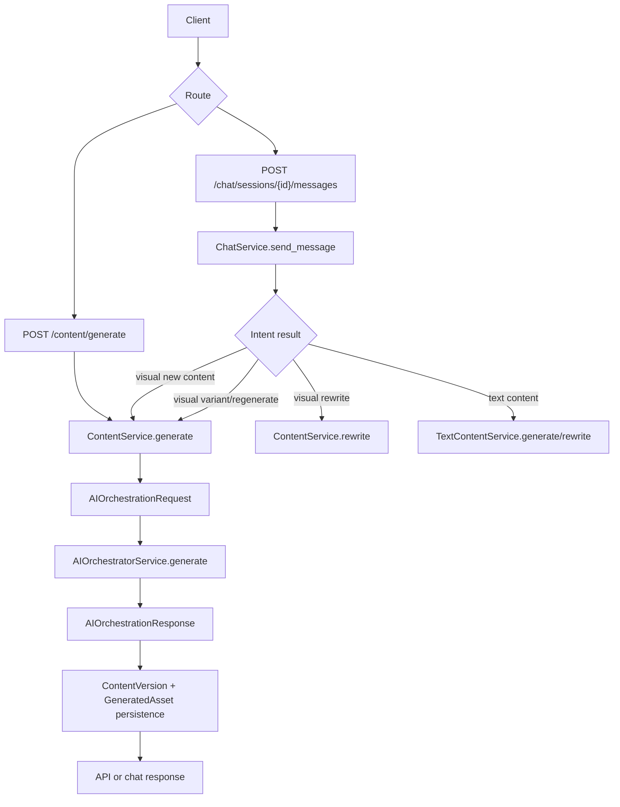
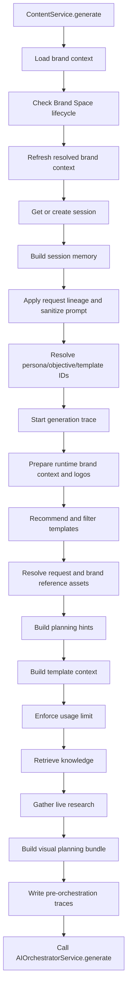
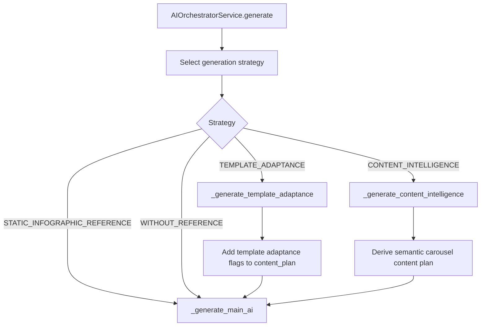
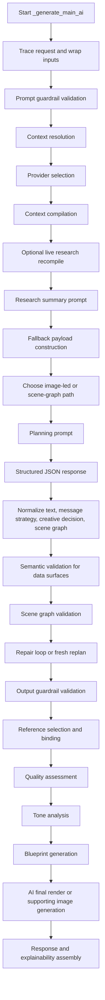
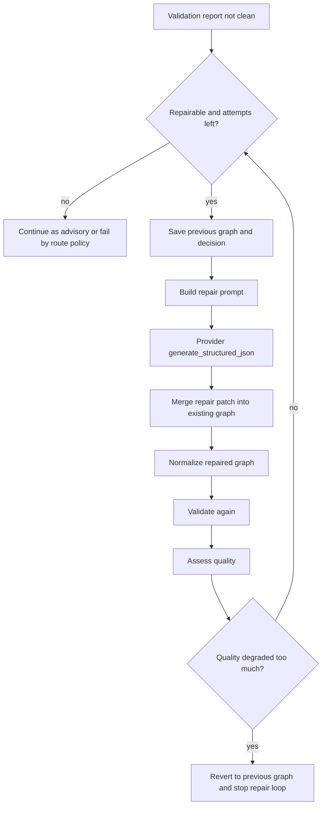
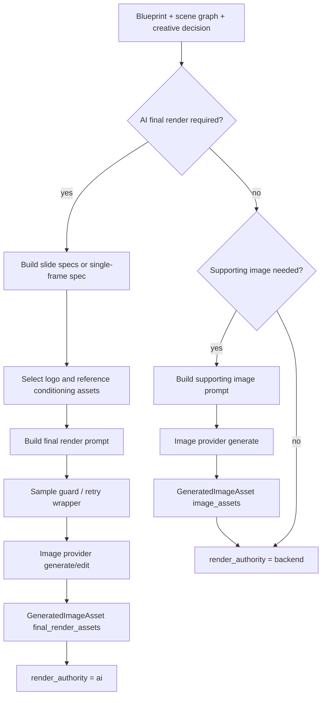
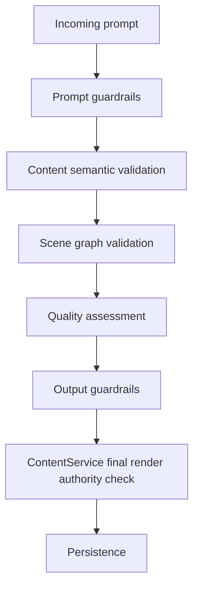
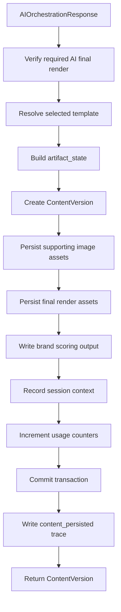
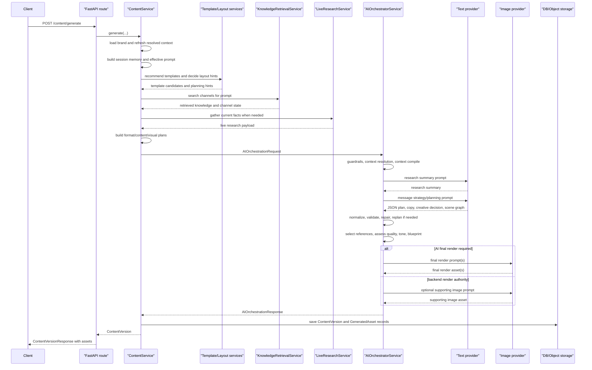

# Existing Orchestration and Generation Flow

## Purpose of this document

This document explains the current orchestration and generation flow as it is implemented today. It focuses on execution order: how a request enters the backend, which services prepare the request, how control moves into the AI orchestrator, how prompts are built and sent to providers, how validation and repair work, how image/final render assets are produced, and how the final result is persisted and returned.

The visual generation path is mainly synchronous from the API request point of view. Background workers exist, but they currently handle upstream and supporting work such as knowledge asset processing, template analysis, and RAGAS evaluation. The normal `/content/generate` path calls the content service directly, and the content service calls the AI orchestrator inside a worker thread so the async service flow is not blocked by the synchronous AI pipeline.

## Entry points into generation

There are two main user-facing ways to reach visual generation:

| Entry point | File | What it does |
|---|---|---|
| Direct content generation | `app/api/routes/content.py` | `POST /content/generate` validates brand scope, creates `ContentService`, calls `ContentService.generate`, loads generated assets, and returns `ContentVersionResponse`. |
| Chat-driven generation | `app/api/routes/chat.py` + `app/services/chat.py` | Chat intent routing decides whether the message is text, visual generation, rewrite, regenerate, or evaluation. Visual generation eventually calls `ContentService.generate` with a `ContentGenerateRequest`. |

Supporting job-based entry points exist, but they do not execute the main visual generation request:

| Job type | Worker path | Purpose |
|---|---|---|
| `KNOWLEDGE_PROCESS` | `app/workers/runner.py` | Processes uploaded knowledge/brand assets and indexes them for later retrieval. |
| `TEMPLATE_ANALYSIS` | `app/workers/runner.py` | Runs template analysis so template metadata can be used during generation. |
| `RAGAS_EVALUATION` | `app/workers/runner.py` | Evaluates generation traces after the fact. |

## Request routing overview



Direct content generation is the cleanest path to understand first. Chat generation is a higher-level wrapper around the same content service, with intent detection and conversation-state handling before it enters visual generation.

## Direct `/content/generate` route flow

`generate_content` in `app/api/routes/content.py` does only route-level work:

1. Reads the `ContentGenerateRequest` body.
2. Reads the brand scope from headers.
3. Checks the current principal and brand access.
4. Instantiates `ContentService`.
5. Calls `ContentService.generate(tenant_id, brand_scope, user_id, payload)`.
6. Loads assets for the persisted content version through `AssetRepository.list_by_content`.
7. Uses `attach_assets` to merge explainability fields and assets into `ContentVersionResponse`.

The route does not assemble prompts, query RAG, pick templates, call providers, or render images. All of that starts in the service layer.

## Chat-driven generation route flow

`send_chat_message` in `app/api/routes/chat.py` delegates to `ChatService.send_message`. The chat service first saves the user message and evaluates intent. Depending on the intent, it can call:

- `TextContentService.generate` for text-only outputs.
- `TextContentService.rewrite` for text rewrites.
- `ContentService.generate` for new visual content.
- `ContentService.generate` for visual variants/regeneration when the user asks for a fresh visual output based on the previous one.
- `ContentService.rewrite` when the user is editing an existing visual output rather than generating a new one.

For visual generation, chat builds a `ContentGenerateRequest` with the current studio panel, prompt, session ID, persona/objective/template IDs, request mode, inheritance policy, `generate_image`, and any reference asset IDs. From that point onward, the flow is the same as direct content generation.

Chat catches `GenerationFailureError` and `GuardrailViolationError` and turns them into assistant messages with a structured failure payload. Direct content routes let these exceptions reach the FastAPI exception handlers in `main.py`.

## ContentService generation flow

`ContentService.generate` is the pre-orchestration controller. Its job is to collect every piece of runtime state needed by the AI pipeline and then persist the AI response.



### 1. Brand and lifecycle setup

The method first gathers the brand context and checks that the brand space is active. If the brand space is not active, it raises `LifecycleError`.

It then calls `DataValidatorService.refresh_brand_context`. This refresh step matters because uploaded assets, brand sections, personas, objectives, and guardrails can change before generation. The AI layer should work from the current resolved context, not stale data.

### 2. Session memory and request lineage

The service finds or creates a content session and builds session memory through `SessionMemoryPlanner`. The memory result tells the pipeline whether the prompt looks like:

- a fresh generation
- a modification of previous output
- a variant of previous output

After that, `_apply_request_lineage` and `_sanitize_prompt_for_request` adjust the effective prompt and inheritance behavior. This is how the code decides whether old templates, reference assets, copy context, or layout context can be reused.

### 3. Persona, objective, brand context, and logo selection

The service resolves the selected persona and objective from the request or session memory, falling back to defaults when needed.

It then prepares runtime brand context with `_prepare_runtime_brand_context`. This step also resolves logo candidates and the selected logo asset path. Logo data is passed separately into the orchestrator because exact logo handling has special rules during final render and export.

### 4. Template recommendations and reference assets

The service calls the template service for recommendations, then applies several filters and merge steps:

- fetch preselected template if the user pinned one
- resolve request reference assets
- resolve brand reference assets
- filter references for the target studio format
- filter template recommendations based on prompt and follow-up mode
- merge request reference assets into template recommendations when applicable
- sort recommendations for the target format
- collapse carousel recommendations when needed
- annotate template selection

The output becomes `template_candidates` and `reference_assets` in the orchestration request.

### 5. Layout decision hints

`_resolve_generation_decision` calls `LayoutDecisionEngine.decide`. This produces backend planning hints such as:

- layout mode
- selected template ID/name
- confidence
- rationale
- adaptation plan
- asset strategy
- review flags
- primary recommended template metadata

These hints are not final authority. The payload explicitly marks `authoritative: False`, because the orchestrator still has to compile context, prompt the model, validate the scene graph, and decide final render behavior.

### 6. Template context

The service builds `template_context` from template metadata, selected/planned template ID, selected template name, template recommendations, reference assets, and the studio panel.

If the user did not pin a template but the layout decision selected one, the service tries to load that planned template metadata so zone maps and design DNA can still reach the orchestrator.

### 7. Knowledge retrieval

`_build_retrieved_knowledge` searches relevant knowledge channels for the current prompt and studio panel. For each channel, it:

1. Lists knowledge assets for the brand space.
2. Builds channel-specific query variants.
3. Searches FAISS through `KnowledgeRetrievalService`.
4. Merges duplicate results.
5. Records channel state with asset counts, indexed counts, processing counts, match count, and query count.

The method returns both `retrieved_knowledge` and `knowledge_state`. The first goes into the orchestrator. The second is saved later for explainability.

### 8. Live research and planning bundle

The service loads the content format guide, wraps retrieved knowledge, builds a knowledge brief, and calls `LiveResearchService.gather_sync`.

After research, it calls `VisualPlanningService.build_visual_plan`. That returns:

- `research_editorial_brief`
- `format_family_plan`
- `content_plan`
- `visual_plan`

These planning objects are included in `AIOrchestrationRequest`. They are also persisted later in explainability metadata.

### 9. AI orchestration request construction

After all pre-work is complete, the service calls:

```python
await asyncio.to_thread(
    self.orchestrator.generate,
    AIOrchestrationRequest(...)
)
```

This is the control handoff from async service orchestration into the synchronous AI orchestrator. The request includes:

- tenant, brand space, and user IDs
- effective prompt
- studio panel
- conversation context
- resolved brand context
- persona and objective context
- retrieved knowledge
- template context
- content format guide
- live research
- research/editorial brief
- format/content/visual plans
- template candidates
- layout decision hints
- session memory
- reference assets and asset catalog
- logo path and candidates
- platform constraints
- resolution policy
- trace ID
- `generate_image`
- input access tracker

## AI orchestrator generation flow

`AIOrchestratorService.generate` is the central execution router. It does not directly start with prompts. It first selects a generation strategy and dispatches to the main pipeline.



### Strategy selection

The strategy decision is based on studio format, pinned template state, auto-template selection, sample creative availability, and template availability.

| Strategy | What it means in practice |
|---|---|
| `STATIC_INFOGRAPHIC_REFERENCE` | Static/infographic reference behavior is handled inside the guarded main pipeline. |
| `TEMPLATE_ADAPTANCE` | The content plan is marked so a template/sample can guide visual layout while content stays tied to the user prompt and brand context. |
| `CONTENT_INTELLIGENCE` | Carousel planning is enriched with semantic slide contracts before entering the main pipeline. |
| `WITHOUT_REFERENCE` | The main pipeline runs with synthesized layout defaults. |

The important detail is that these strategy methods do not bypass the main AI flow. They only modify planning metadata and then call `_generate_main_ai`.

## `_generate_main_ai` execution sequence

`_generate_main_ai` is the main orchestration pipeline. It is long because it owns the whole generation lifecycle: context compilation, prompt calls, response normalization, semantic checks, visual validation, repairs, reference binding, image generation, final render, and response assembly.



### Stage 1: request trace and input access tracking

The orchestrator writes a raw request trace with the prompt, studio panel, template candidates, layout decision, reference assets, asset catalog, platform constraints, brand context, persona, objective, template context, content format guide, live research, and planning objects.

Then it wraps key inputs with `InputAccessTracker`. This lets explainability later report which inputs were actually read by the pipeline. It is useful when debugging why a generated output did or did not follow a specific brand asset, reference image, template, or RAG result.

### Stage 2: prompt guardrails

`GuardrailService.validate_prompt` checks the user prompt against brand guardrails. It can raise `GuardrailViolationError` before any model call if the prompt violates blocked words, restricted topics, restricted claims, or configured forbidden patterns.

This is the first hard stop in the generation pipeline.

### Stage 3: context resolution

`ContextResolutionService.build_plan` builds an ordered knowledge plan and conflict-resolution instructions. This is where source authority is established before prompt compilation.

The practical rule is:

- explicit request and saved brand context win first
- persona/objective context stays strong
- retrieved knowledge contributes evidence
- lower-priority retrieval should not override guardrails, foundations, or selected brand rules

The output is used by the context compiler and later included in explainability metadata.

### Stage 4: provider selection

The orchestrator resolves providers through `ProviderRouter`:

- `get_text_provider("research")`
- `get_text_provider("generation")`
- `get_image_provider()`

The selected providers can be OpenAI, Anthropic, or fallback providers depending on configuration and available API keys. Provider usage is captured after calls and written into generation traces when available.

### Stage 5: context compilation

`ContextCompilerService.compile` converts raw runtime inputs into a bounded compiled context. This step is important because the prompt builder should not receive unlimited raw objects.

The compiler receives:

- prompt
- brand context
- persona context
- objective context
- ordered retrieved knowledge
- studio panel
- conversation context
- session memory
- template context
- layout decision
- reference assets
- asset catalog
- content format guide
- research/editorial brief
- format/content/visual plans
- resolution instructions
- live research

It returns a structured context with brand copy brief, audience brief, objective brief, knowledge brief, template fit brief, visual grounding diagnostics, prompt intelligence brief, content format brief, research context, and other compacted objects.

If the orchestrator gathers live research inside this stage because none was provided, it recompiles context after research so verified facts are visible to later prompts.

### Stage 6: research summary prompt

The orchestrator builds a small `PromptEnvelope` that asks the research provider to turn compiled context into a compact downstream research memo.

This call uses `generate_text`, not structured JSON. The result is stored as `research_summary` in compiled context and later saved in explainability metadata.

Control then moves from research summarization to generation planning.

### Stage 7: fallback payload construction

Before the main planning call, the orchestrator builds deterministic fallback content. This includes:

- headline
- body
- CTA
- hashtags
- supporting line
- proof points
- stat highlights
- hook type
- trust builders
- claim/evidence pairs
- visual direction
- design style
- image prompt

These fallback values are used in three ways:

1. Provider fallback when the model call fails.
2. Normalization base when the model returns partial JSON.
3. Repair base when later stages need a safe known shape.

This fallback step is why the code can keep moving through many soft failures without returning malformed content.

### Stage 8: planning path selection

The orchestrator decides whether generation is image-led or scene-graph-led.

| Path | When it is used | What it changes |
|---|---|---|
| `image_led_social` | AI final render or image-led social/infographic style flows. | The image model becomes the final visual authority. The scene graph is still produced for validation, overlays, and metadata. |
| `scene_graph_social` | Backend-rendered or graph-led layouts. | The scene graph and blueprint remain central to rendering. |

For image-led flows, the orchestrator first generates `MessageStrategyPayload` through `compose_message_strategy_envelope`. Then it builds the image-led planning prompt with `compose_image_led_social_envelope`.

For scene-graph-led flows, it directly builds `compose_creative_planning_envelope`.

### Stage 9: main planning provider call

The generation provider receives a structured planning prompt through `generate_structured_json`. The expected output contains:

- text fields
- optional message strategy
- creative decision
- scene graph

The orchestrator writes the prompt and response into trace files, records usage if available, and then normalizes the response.

### Stage 10: response normalization

The LLM response is never trusted directly. The orchestrator normalizes each part:

- `normalize_text_payload` builds a valid `StructuredTextPayload` shape.
- `_repair_prompt_echo_text_payload` reduces direct prompt echo in visible text.
- `normalize_message_strategy_payload` repairs message strategy fields.
- `normalize_creative_decision_payload` repairs layout mode, template ID, adaptations, and asset strategy.
- `normalize_scene_graph_payload` repairs scene graph canvas, elements, geometry, text, assets, styles, and validation hints.

This is the control point where free-form model output becomes application contracts.

### Stage 11: content semantic validation

For data-heavy or research-sensitive requests, `_needs_content_semantic_validation` enables additional checks before visual rendering.

This is used for prompts involving tables, rankings, data lists, comparisons, chart-like outputs, exact values, and source-backed claims. If the generated text payload does not preserve required rows, values, fields, or facts, the orchestrator tries targeted semantic repair.

If unresolved data surface issues remain, the orchestrator raises `GenerationFailureError`. It does this intentionally instead of replacing a data request with a generic visual.

### Stage 12: scene graph validation

`validate_scene_graph` checks the generated graph. The validation report can be:

- clean
- dirty but repairable
- dirty and not repairable

Some final-render routes defer scene graph validation because the final image prompt and output QA are the true visual authority. This happens for style-reference carousel final renders and some static/infographic AI final render flows.

### Stage 13: scene graph repair loop

If validation is not clean and the report is repairable, the orchestrator enters a repair loop.



The repair response is merged into the existing scene graph instead of replacing the graph. This matters because model repair responses can be partial. The code keeps a previous graph and creative decision snapshot, then rolls back if the quality score drops significantly.

### Stage 14: fresh replan

If patch-style repair is unlikely to fix the graph, the orchestrator can request a fresh replan. It builds a new planning envelope with a replan note based on the validation report.

After fresh replan, it repeats normalization, semantic validation when required, scene graph normalization, and validation. If a data surface remains unresolved after replan, generation is blocked.

### Stage 15: output guardrail validation

After text and repairs settle, `GuardrailService.validate_output` checks the generated headline, body, and CTA against brand guardrails. This is a second hard stop after generation. A prompt can pass guardrails but the generated output can still fail if the model introduces disallowed wording or claims.

### Stage 16: final render graph decision

The orchestrator decides whether the current scene graph should be used for final render. If the graph remains unreliable but the route can continue through image-led final render, it can replace the final render graph with a clean fallback graph and attach a retry note to the final render prompt.

This keeps metadata and overlay behavior stable without forcing a weak graph to control the final image.

### Stage 17: reference asset selection and binding

The orchestrator selects reference images after repairs so the final creative decision and scene graph are current.

It can select references from:

- request reference assets
- brand reference assets
- selected template/sample context
- scene graph explicit asset bindings
- topic-relevant assets

It filters unavailable files and chooses conditioning references for final render. If exact logo overlay is required, logo-bearing reference images can be skipped for image conditioning so the image model does not redraw the logo.

The selected references are bound into the scene graph before quality scoring and final render prompt construction.

### Stage 18: creative quality assessment

The orchestrator scores the current plan with `assess_creative_quality`. If the quality score is below threshold, it can run quality-driven repair attempts. For some LLM-led static/infographic final renders, low pre-image quality can be deferred because the final image prompt and output quality checks are expected to recompose the visual.

If the route requires a high-quality final render and the plan remains below threshold, the orchestrator raises `GenerationFailureError`.

### Stage 19: tone analysis

`ToneIntelligenceService.evaluate` scores the generated copy after visual planning is stable. The tone score and feedback are returned in `AIOrchestrationResponse` and persisted on the content version.

Tone evaluation does not replace the main generation output here. It gives a quality signal for brand alignment and copy strength.

### Stage 20: blueprint generation

`BlueprintService.from_scene_graph` converts the final scene graph into `BlueprintPayload`. The blueprint is the renderer-facing layout contract.

The blueprint contains:

- zones
- hierarchy
- text blocks
- image zones
- logo rules
- CTA placement
- platform/export format
- overflow strategy
- source mode
- template ID
- layout archetype
- adaptation plan
- brand rules applied

If supporting image assets are generated after this point and bound back into the scene graph, the blueprint is rebuilt so it matches the final graph state.

## Image generation and final render flow

The orchestrator has two image output paths.



### AI final render path

When `_should_use_ai_final_render` returns true, the orchestrator expects the image provider to produce final visual assets.

For static and infographic requests, the final render is normally a one-slide sequence. For carousel requests, the orchestrator builds `carousel_slide_specs` and loops through each slide.

Each final render prompt can include:

- approved text payload
- message strategy
- creative decision
- final render scene graph
- reference images
- sample page blueprint
- slide role and visual focus
- style-reference rules
- exact logo overlay guidance
- legal footer guidance
- quality retry notes
- visual explanation plan

The image generation call is wrapped by `_generate_final_render_image_with_sample_guard`, which can retry when output drifts too far from the selected sample/reference layout.

Each final render asset includes metadata such as:

- render source
- generation stage
- provider/model
- prompt length metrics
- text overlay strategy
- requested size
- generation path
- layout mode
- whether scene graph was used
- reference image paths
- logo overlay strategy
- quality assessment
- output quality assessment
- sample page blueprint
- sample visual similarity
- slide index/count
- carousel role

If final render is required and no final render asset is produced, the orchestrator raises `GenerationFailureError`.

### Supporting image path

If AI final render is not required but the graph/creative decision needs a generated image, the orchestrator builds a supporting image prompt with `build_image_prompt` and calls `_generate_image_with_retries`.

The resulting image asset is bound back into the scene graph. Backend rendering remains the final authority, so `render_authority` stays `backend`.

## Retry handling

There are multiple retry or recovery layers in the generation process.

| Retry layer | Where it happens | What it protects against |
|---|---|---|
| OCR retry | `OCRService._with_retry` | Transient OCR/network failures during asset ingestion. |
| Provider fallback | Text/image providers | Missing clients, provider errors, malformed provider output. |
| Semantic repair | `_repair_text_payload_semantics_if_needed` | Missing or unsafe data/table/ranking/chart semantics. |
| Scene graph repair | `_generate_main_ai` repair loop | Invalid or weak scene graph layout. |
| Fresh replan | `_generate_main_ai` | Cases where patch repair is unlikely to fix the graph. |
| Quality retry | `_generate_main_ai` | Low-quality creative plan before final render. |
| Image generation retry | `_generate_image_with_retries` | Provider-level image generation failures. |
| Sample guard retry | `_generate_final_render_image_with_sample_guard` | Final image drifting away from sample/reference layout. |
| Worker retry | `JobService.fail_or_retry` via `app/workers/runner.py` | Background job failures for knowledge/template/evaluation jobs. |

The main visual generation request is not retried by the worker loop. Its retries are inside the orchestrator and provider helper methods.

## Validation stages

Validation happens throughout the pipeline, not only at the end.



| Validation | Owner | Failure behavior |
|---|---|---|
| Brand lifecycle check | `ContentService.generate` | Raises `LifecycleError` if the brand space is not active. |
| Usage limit enforcement | `ContentService.generate` | Raises usage/domain error before orchestration if quota is exceeded. |
| Prompt guardrails | `GuardrailService.validate_prompt` | Raises `GuardrailViolationError`. |
| Content semantic validation | Orchestrator semantic repair helpers | Repairs when possible; raises `GenerationFailureError` for unresolved data surface issues. |
| Scene graph validation | `AIOrchestratorService.validate_scene_graph` | Repairs or replans when possible; may be advisory for some AI final render routes. |
| Creative quality assessment | Orchestrator quality helpers | Repairs, defers, or raises `GenerationFailureError` depending on route. |
| Output guardrails | `GuardrailService.validate_output` | Raises `GuardrailViolationError`. |
| Final render authority check | `ContentService.generate` | Raises `GenerationFailureError` if AI final render was required but the response did not provide it. |

## Error handling

### FastAPI error handling

`main.py` defines the application-level handlers:

- `NotFoundError` returns 404.
- `DuplicateResourceError` returns 409.
- `GenerationFailureError` returns 400 with a `failure` payload from `exc.to_payload()`.
- `AuthorizationError`, `GuardrailViolationError`, `LifecycleError`, `UploadValidationError`, and `UsageLimitExceededError` return 400 with a detail message.

`GenerationFailureError` carries:

- `failure_type`
- `reason_code`
- `reason_summary`
- `user_safe_message`
- `retryable`
- `rule_source`
- `suggested_next_action`
- `details`

### Chat error handling

`ChatService.send_message` catches `GenerationFailureError` and `GuardrailViolationError`. Instead of failing the HTTP request, it creates an assistant message explaining the failure and stores a structured failure payload in the chat message.

This is why the same underlying generation failure can appear differently depending on entry point:

- direct content route: HTTP 400 with failure details
- chat route: assistant response message with failure metadata

### Worker error handling

The worker loop claims pending jobs, starts a heartbeat, dispatches based on job type, and marks jobs succeeded or failed. On exceptions, it calls `jobs.fail_or_retry`. This applies to knowledge processing, template analysis, and RAGAS evaluation jobs, not the main `/content/generate` path.

## Response persistence flow

Once `AIOrchestrationResponse` returns, control moves back into `ContentService.generate`.



The persisted content version stores:

- title from generated headline
- effective prompt
- selected persona/template/objective IDs
- studio panel
- `generated_payload`
- `blueprint_payload`
- explainability metadata
- tone score and feedback

The explainability metadata repeats important orchestration outputs:

- knowledge state
- live research
- research/editorial brief
- format/content/visual plans
- reference asset IDs
- message strategy
- creative decision
- scene graph
- validation report
- repair attempts
- render authority
- final render assets
- logo candidates and selection
- planning hints
- session memory
- request lineage
- prompt lineage
- generation trace ID
- artifact state

Supporting image assets and final render assets are persisted as `GeneratedAsset` records. Final render assets are marked with metadata such as `render_source: ai`, `generation_stage: final_render`, `slide_index`, and `slide_count`.

After persistence, the service records session context, increments usage counters, commits the database transaction, writes trace payloads, and returns the saved content version.

## Export and render continuation

Generation and export are separate flows.

During generation:

- AI final render flows may already produce final render assets.
- Backend-authority flows persist a scene graph and blueprint for later rendering.

During export:

- `POST /content/export` or render routes call `ContentService.export`.
- The service resolves stored blueprint, scene graph, text, templates, logos, fonts, and generated assets.
- It calls `RendererService.render` when backend composition or overlay export is needed.
- Rendered preview/export assets are persisted through `_persist_render_assets`.

This split is important. A generated content version can exist before every export format has been rendered.

## Complete end-to-end generation sequence



## Key control handoffs

| From | To | Payload | Why this handoff exists |
|---|---|---|---|
| Route | `ContentService.generate` | `ContentGenerateRequest` + tenant/brand/user IDs | Keeps HTTP validation separate from business orchestration. |
| Chat service | `ContentService.generate` | Constructed `ContentGenerateRequest` | Lets chat use the same visual generation pipeline as direct content generation. |
| Content service | Template/layout helpers | Prompt, studio panel, brand context, references | Produces recommendations and planning hints before AI prompting. |
| Content service | RAG/live research/planning services | Prompt, studio panel, compact context | Adds retrieved evidence and current facts before orchestration. |
| Content service | `AIOrchestratorService.generate` | `AIOrchestrationRequest` | Passes a complete runtime snapshot into the AI pipeline. |
| Orchestrator | Text provider | `PromptEnvelope` | Gets research summary, message strategy, creative plan, and repairs. |
| Orchestrator | Image provider | Final render/supporting image prompt + references | Produces AI image assets when required. |
| Orchestrator | Content service | `AIOrchestrationResponse` | Returns normalized contracts ready for persistence and rendering. |
| Content service | DB/object storage | `ContentVersion`, `GeneratedAsset` | Persists generated output, assets, metadata, and trace references. |

## Practical reading order for developers

To understand the flow in code, read in this order:

1. `app/api/routes/content.py` for the direct route.
2. `app/services/chat.py` if you need chat-triggered generation behavior.
3. `app/services/content.py`, starting at `ContentService.generate`.
4. `app/services/content.py`, `_resolve_generation_decision` and `_build_retrieved_knowledge`.
5. `app/ai/orchestrator.py`, `generate`, `_dispatch_generation_strategy`, `_generate_template_adaptance`, `_generate_content_intelligence`, and `_generate_main_ai`.
6. `app/ai/prompt_intelligence.py` for prompt envelope construction.
7. `app/ai/providers/router.py`, `openai_provider.py`, and `anthropic_provider.py` for provider behavior.
8. `app/ai/blueprint.py` and `app/services/renderer.py` for render handoff.
9. `main.py` and `app/core/exceptions.py` for error response behavior.

The safest mental model is: routes authenticate and scope the request, `ContentService` assembles the runtime world, `AIOrchestratorService` generates and validates the creative contracts, providers supply model output, and `ContentService` persists the result.
