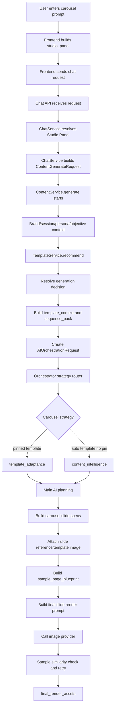

# Carousel Template And Content Intelligence Flow

This note explains the flow when a user gives a prompt in Brand Space chat and selects **Carousel** in the Studio Panel.

It covers two carousel paths:

```text
Pinned template carousel:
User selects/pins a template. The system follows that template's slide structure.

Carousel content intelligence:
User asks for a carousel without pinning a template. The system builds the carousel story structure automatically.
```

Example request:

```text
Prompt: create a 5-slide carousel about AI automation in healthcare
Format: carousel
File type: png
generate_image: true
template_id: selected only when user pins a template
studio_panel.pinned_template_id: present only when user pins a template
```

## One-Line Summary

Frontend sends the prompt and carousel Studio Panel to backend. ChatService converts it into a generation request. ContentService collects brand, template, reference, and planning context. For pinned templates it builds a `sequence_pack` so every generated slide can follow a matching template page. AI Orchestrator chooses either `template_adaptance` or `content_intelligence`, builds slide specs, builds a final image prompt for each slide, calls the image provider, checks sample similarity when a template reference exists, and returns one final image asset per carousel slide.

## Flowchart



## Request Schema Files

These files do not generate images. They define and validate the request shape.

```text
app/schemas/chat.py
ChatMessageCreateRequest: message, studio_panel, template_id, reference_asset_ids, generate_image.

app/schemas/content.py
ContentGenerateRequest: prompt, raw_user_prompt, template_id, studio_panel, generate_image, reference assets.

app/schemas/common.py
StudioPanelSelection: format, platform_preset, file_type, size, pinned_template_id.
```

Why needed:

```text
The backend needs predictable fields. Without schemas, later services may receive missing or malformed carousel/template values.
```

## Step 1: Frontend Builds Carousel Studio Panel

File:

```text
frontend/components/chat/WorkspaceChat.tsx
```

Important area:

```text
studioPanel useMemo
```

What it gets:

```text
studioFormat
studioPlatform
studioFileType
studioSizeLabel
selectedTemplateId
```

What it creates:

```text
studio_panel.format = "carousel"
studio_panel.platform_preset = "instagram" or "linkedin" etc.
studio_panel.file_type = "png" or "jpg" etc.
studio_panel.size = selected size
studio_panel.pinned_template_id = selectedTemplateId if user selected a template
```

Why needed:

```text
Carousel rendering depends on format, platform, size, file type, and template pin.
```

Without this:

```text
Backend cannot know this is carousel.
Pinned template routing will not happen.
The output may use default/static behavior or wrong size.
```

## Step 2: Frontend Sends Chat Request

File:

```text
frontend/components/chat/WorkspaceChat.tsx
```

Important function:

```text
dispatchGeneration()
```

What it sends:

```text
message
studio_panel
generate_image
template_id
reference_asset_ids
```

Important difference:

```text
template_id:
Used later to load the selected template.

studio_panel.pinned_template_id:
Used later to decide template_adaptance strategy.
```

Without this:

```text
Backend may receive prompt text but no template selection.
It cannot distinguish pinned template carousel from normal carousel.
```

## Step 3: Chat API Entry

File:

```text
app/api/routes/chat.py
```

Important function:

```python
send_chat_message()
```

What it gets:

```text
session_id
ChatMessageCreateRequest
brand scope
current user principal
database session
```

What it calls:

```python
ChatService(session).send_message(...)
```

Why needed:

```text
This is the first backend boundary. It validates brand access before generation.
```

Without this:

```text
Unauthorized users could trigger generation or access a brand space incorrectly.
```

## Step 4: ChatService Resolves Studio Panel

File:

```text
app/services/chat.py
```

Important function:

```python
_resolve_studio_panel()
```

What it gets:

```text
payload.studio_panel or session.studio_panel
```

What it returns:

```text
StudioPanelSelection with normalized format, platform, file_type, size, pinned_template_id.
```

Why needed:

```text
It guarantees defaults. For carousel, missing size/platform/file type can be filled safely.
```

Without this:

```text
ContentService may receive incomplete Studio Panel data.
Image size, export behavior, or carousel format detection can break.
```

## Step 5: ChatService Builds ContentGenerateRequest

File:

```text
app/services/chat.py
```

Important function:

```python
send_message()
```

What it passes:

```text
prompt
raw_user_prompt
session_id
template_id
studio_panel
generate_image
reference_asset_ids
```

What it calls:

```python
ContentService.generate(...)
```

Why needed:

```text
Chat request is conversational. ContentGenerateRequest is the structured generation request.
```

Without this:

```text
ContentService would not receive the selected template, image generation flag, or normalized Studio Panel.
```

## Step 6: ContentService Starts Generation

File:

```text
app/services/content.py
```

Main function:

```python
ContentService.generate()
```

What it gets:

```text
ContentGenerateRequest
tenant_id
brand_space_id
user_id
```

What it collects:

```text
brand context
session memory
persona context
objective context
template id
reference assets
logo candidates
retrieved knowledge
visual/content/format plans
```

Why needed:

```text
Carousel generation needs brand-safe content, correct template context, and visual constraints before AI planning.
```

Without this:

```text
The orchestrator would only have the raw prompt and could create generic, off-brand, or incorrectly structured slides.
```

## Step 7: Template Recommendation

Files:

```text
app/services/content.py
app/services/template.py
```

Important functions:

```python
template_service.recommend()
TemplateService.recommend()
```

What it gets:

```text
prompt
studio_panel
brand_context
available brand templates
template metadata
```

Pinned behavior:

```text
If studio_panel.pinned_template_id matches a template, score is boosted.
The pinned template becomes the primary recommendation.
```

Why needed:

```text
The system needs to know which template or template family should influence the carousel.
```

Without this:

```text
Pinned template may not become primary.
Auto carousel may not receive useful template candidates.
```

## Step 8: Resolve Generation Decision

File:

```text
app/services/content.py
```

Important function:

```python
_resolve_generation_decision()
```

What it gets:

```text
prompt
studio_panel
template_recommendations
selected_template_id
selected_template_name
reference_assets
```

What it returns:

```text
planning_hints
```

Example:

```text
mode = exact_template or adapted_template
template_id = selected template
primary_adaptation_matches_selected_template = true
template_recommendations = top candidates
```

Why needed:

```text
It tells orchestrator whether the request is exact/adapted template use or more open carousel planning.
```

Without this:

```text
Orchestrator may not know whether to trust the selected template or synthesize its own layout.
```

## Step 9: Build Template Context And Sequence Pack

File:

```text
app/services/content.py
```

Important function:

```python
_build_template_context_payload()
```

What it gets:

```text
prompt
template_meta
selected_template_id
selected_template_name
template_recommendations
reference_assets
studio_panel
```

What it returns:

```text
template_context
```

For carousel, it adds:

```text
sequence_pack
```

Meaning:

```text
sequence_pack converts a carousel template family into slide-by-slide reference instructions.
```

Example:

```text
slide 1 -> template page 1 reference image
slide 2 -> template page 2 reference image
slide 3 -> template page 3 reference image
```

Pinned rule:

```text
If pinned_template_id exists, keep the sequence pack even if prompt topic does not match the template topic.
```

Why needed:

```text
Final render needs to know which template page belongs to which generated carousel slide.
```

Without this:

```text
Pinned carousel would only know "a template was selected" but not how to map each slide to template pages.
The renderer may lose slide order, sample layout, and per-slide reference images.
```

## Step 10: Create AIOrchestrationRequest

File:

```text
app/services/content.py
app/ai/contracts.py
```

Important class:

```python
AIOrchestrationRequest
```

What it contains:

```text
prompt
studio_panel
template_context
template_candidates
layout_decision
content_plan
visual_plan
reference_assets
logo assets
generate_image
generation_trace_id
```

Why needed:

```text
This is the complete package sent from ContentService to AI Orchestrator.
```

Without this:

```text
Orchestrator would not have the brand, template, reference, and generation settings in one place.
```

## Step 11: Orchestrator Strategy Router

File:

```text
app/ai/orchestrator.py
```

Important functions:

```python
AIOrchestratorService.generate()
select_generation_engine()
_request_uses_pinned_template()
_request_uses_auto_template_selection()
```

What it checks:

```text
format = carousel
pin = true or false
auto template selection = true or false
has template
has sample/reference creative
```

Output:

```text
Pinned template carousel -> TEMPLATE_ADAPTANCE
Auto carousel -> CONTENT_INTELLIGENCE
```

Why needed:

```text
Pinned template and auto carousel need different planning rules.
```

Without this:

```text
All carousel requests would go through the same generic path and lose template authority or auto intelligence behavior.
```

## Step 12A: Pinned Template Carousel Path

File:

```text
app/ai/orchestrator.py
```

Important function:

```python
_generate_template_adaptance()
```

What it adds:

```text
_template_adaptance_enabled = true
generation_strategy = template_adaptance
template_authority_mode = visual_layout_only
```

Why needed:

```text
It tells the main AI flow that the selected template controls visual layout, but not the old template copy.
```

Without this:

```text
The output may ignore the pinned template structure or accidentally treat template text as reusable content.
```

## Step 12B: Carousel Content Intelligence Path

File:

```text
app/ai/orchestrator.py
```

Important function:

```python
_generate_content_intelligence()
```

What it adds:

```text
_content_intelligence_enabled = true
generation_strategy = content_intelligence
semantic_carousel_plan
carousel_slide_grammar
carousel_slide_contracts
preferred_slide_count
sequence_expectation
```

Why needed:

```text
When no template is pinned, the system still needs a strong carousel story structure.
```

Without this:

```text
Auto carousel may become a weak set of disconnected slides instead of a planned sequence.
```

## Step 13: Prompt Intelligence And Planning Prompts

File:

```text
app/ai/prompt_intelligence.py
```

Important examples:

```python
compose_message_strategy_envelope()
compose_image_led_social_envelope()
compose_creative_planning_envelope()
compose_scene_graph_repair_envelope()
```

What it gets:

```text
user prompt
compiled context
studio panel
template context
message strategy
validation report when repairing
```

Why needed:

```text
Prompt intelligence turns raw context into structured prompts for text AI planning and repair.
```

Without this:

```text
The AI would receive loose context instead of a controlled planning instruction.
Carousel copy, slide roles, visual focus, and scene graph quality would be less reliable.
```

Trace clues:

```text
storage/generation_traces/<trace_id>/message_strategy_prompt.json
storage/generation_traces/<trace_id>/planning_prompt.json
storage/generation_traces/<trace_id>/planning_response.json
```

## Step 14: Build Carousel Slide Specs

File:

```text
app/ai/orchestrator.py
```

Important function:

```python
_build_carousel_slide_specs()
```

What it gets:

```text
text_payload
content_plan
template_context / sequence_pack
creative_decision
```

What it returns:

```text
carousel_slide_specs
```

Each slide can contain:

```text
slide_index
slide_count
role
headline
supporting_line
proof_points
visual_focus
reference/template metadata
sample_page_blueprint
```

Why needed:

```text
Carousel cannot render as one single unit. It must become separate slide render jobs.
```

Without this:

```text
The final render cannot know what content belongs to slide 1, slide 2, slide 3, etc.
```

## Step 15: Attach Per-Slide Reference Images

File:

```text
app/ai/orchestrator.py
```

Important functions:

```python
_slide_reference_images()
_merge_slide_layout_anchor_reference()
_conditioning_reference_image_paths()
```

What it gets:

```text
slide spec
reference assets
conditioning reference assets
template/reference asset paths
```

What it returns:

```text
reference_image_paths
layout_reference_image_paths
```

Why needed:

```text
Pinned carousel needs the correct template page image for each generated slide.
```

Without this:

```text
The image model may not receive the selected template page and may create a generic slide.
```

## Step 16: Build Sample Page Blueprint

File:

```text
app/ai/orchestrator.py
```

Important functions:

```python
_annotate_slide_with_sample_page_blueprint()
_vision_enhance_page_blueprint()
_adapt_slide_copy_to_sample_blueprint()
```

What it gets:

```text
slide
layout reference image paths
template/sample page image
```

What it creates:

```text
sample_page_blueprint
```

Blueprint can include:

```text
layout_category
module_counts
visual_permissions
image_zones
text density
footer/logo safe areas
```

Why needed:

```text
The system needs a machine-readable description of the selected template page.
```

Without this:

```text
The prompt can say "follow the template", but it cannot strongly enforce module count, zones, density, and visual permissions.
```

## Step 17: Build Final Carousel Slide Image Prompt

File:

```text
app/ai/orchestrator.py
```

Important function:

```python
build_carousel_slide_render_prompt()
```

What it gets:

```text
request
creative_decision
message_strategy
slide
scene_graph
reference_images
sample_page_blueprint
visual_explanation_plan
compiled_context
retry_note
```

What it builds:

```text
final_render_prompt
```

Prompt includes:

```text
approved slide copy
brand palette and typography
logo-safe area
template/sample layout rules
sample module count lock
zone and spacing rules
carousel continuity
anti-copying rule for template text
anti-hallucination rules
retry note if any
```

Why needed:

```text
This is the final instruction sent to the image model for one carousel slide.
```

Without this:

```text
The image model would not know the exact slide copy, brand style, template layout, logo rules, or what not to copy.
```

## Step 18: Final Image Generation

Files:

```text
app/ai/orchestrator.py
app/ai/providers/router.py
app/ai/providers/openai_provider.py
```

Important functions:

```python
_generate_final_render_image_with_sample_guard()
_edit_image_with_retries()
_generate_image_with_retries()
```

What it gets:

```text
final_render_prompt
reference_image_paths
image_size
sample_page_blueprint
slide_index
slide_count
```

Provider behavior:

```text
If reference images exist, calls image_provider.edit().
If no reference images exist, calls image_provider.generate().
```

Why needed:

```text
This is where the actual carousel slide image is generated.
```

Without this:

```text
All planning would exist only as text/metadata; no slide image asset would be created.
```

## Step 19: Retry And Sample Similarity

File:

```text
app/ai/orchestrator.py
```

Important functions:

```python
_generate_final_render_image_with_sample_guard()
_sample_output_similarity_from_paths_with_vision()
_append_sample_similarity_repair_prompt()
```

What it checks:

```text
generated output vs selected sample/template page
layout category
module counts
text block count
visual permissions
logo/footer safety
premium quality drift
```

Why needed:

```text
Pinned carousel must stay close to the selected template page structure.
```

Without this:

```text
The first generated slide could drift away from the selected template and still be accepted.
```

Retry behavior:

```text
If similarity is poor, a repair instruction is appended to the prompt and image generation is tried again.
```

## Step 20: Final Output

File:

```text
app/ai/contracts.py
```

Important models:

```python
GeneratedImageAsset
AIOrchestrationResponse
```

Output:

```text
final_render_assets
final_render_asset
render_authority = ai
```

Each carousel slide asset stores:

```text
slide_index
slide_count
carousel_role
reference image paths
sample_page_blueprint
sample_visual_similarity
sample retry count
prompt length metadata
```

Why needed:

```text
Frontend and export flow need saved image assets, not only AI text responses.
```

Without this:

```text
The generated carousel would not be displayable or exportable.
```

## Important Trace Files

Trace folder:

```text
storage/generation_traces/<trace_id>/
```

Useful files:

```text
message_strategy_prompt.json
message_strategy_response.json
planning_prompt.json
planning_response.json
final_render_prompt_slide_01.json
final_render_sample_similarity_slide_01_attempt_01.json
final_render_generation.json
content_persisted.json
```

Meaning:

```text
These files show what prompt was sent, what AI returned, what final image prompt was used, whether sample similarity passed, and which image assets were saved.
```

## Core Difference

```text
Pinned template carousel:
Selected template page structure is the authority.

Carousel content intelligence:
Semantic story plan and carousel grammar are the authority.
```

