# Static Image Generation Flow

This note explains the full flow when a user gives a prompt in Brand Space chat and selects **Static** in the Studio Panel, for example:

```text
Prompt: create a LinkedIn static post about retirement planning
Format: static
Platform: linkedin or instagram
File type: png
generate_image: true
```

## One-Line Summary

Frontend sends the chat prompt and Studio Panel selection to backend. ChatService detects visual generation, ContentService collects brand/template/context data, AI Orchestrator plans the static creative, validates the content and visual metadata, builds the final image prompt, calls the image provider, saves the generated image asset, runs brand evaluation/scoring, commits the DB transaction, and frontend displays the saved static image.

## Flowchart

```mermaid
flowchart TD
    A[User enters prompt in Brand Space chat] --> B[Frontend sends chat request]
    B --> C[Chat API receives request]
    C --> D[ChatService reads prompt and Studio Panel]
    D --> E[ChatService decides this is visual generation]
    E --> F[ContentService.generate starts]
    F --> G[ContentService reads prompt, format, platform, size, file type]
    G --> H[ContentService collects brand, persona, objective, assets, knowledge]
    H --> I[ContentService selects matching template or sample]
    I --> J[ContentService creates AIOrchestrationRequest]
    J --> K[AI Orchestrator starts]
    K --> L[Guardrails and context preparation]
    L --> M[Research summary]
    M --> N[Message strategy]
    N --> O[Static planning prompt]
    O --> P[Planning response with headline, body, CTA, static panel metadata]
    P --> Q[Normalize text and metadata]
    Q --> R[Validate content and repair once if needed]
    R --> S[Build scene graph and blueprint]
    S --> T[Build final image prompt]
    T --> U[Call image provider]
    U --> V[Generated static image asset]
    V --> W[AIOrchestrationResponse returns to ContentService]
    W --> X[ContentService saves content, image asset, traces, brand scoring]
    X --> Y[DB commit]
    Y --> Z[API response goes to frontend]
    Z --> AA[Frontend displays static image]
```



Schema files are not shown as main boxes in this diagram because they do not perform generation. They only define and validate the request data shape.

```text
app/schemas/chat.py
validates chat message request data.

app/schemas/content.py
defines generation fields like prompt and generate_image.

app/schemas/common.py
defines Studio Panel fields like format, platform_preset, size, and file_type.
```

## Step 1: Chat API Entry

File:

```text
app\api\routes\chat.py
```

Important function:

```python
send_chat_message()
```

Purpose:

```text
This is the first backend entry point when user sends a prompt from chat.
It checks brand/user access and forwards the request to ChatService.
```

```text
chat.py route receives the frontend chat prompt and passes it to ChatService.send_message().
```

## Step 2: Chat Service Decides Visual Generation

File:

```text
app\services\chat.py
```

Important function:

```python
send_message()
```

Purpose:

```text
ChatService reads the chat message and Studio Panel values.
It decides whether this is normal chat, text generation, visual generation, rewrite, or retrieval.
```

For static image generation:

```text
message = "create a LinkedIn static post"
studio_panel.format = "static"
generate_image = true
```

Then ChatService calls:

```python
ContentService.generate(...)
```

```text
ChatService detects that the chat prompt plus Studio Panel needs static visual generation and routes it to ContentService.generate().
```

## Step 3: Request Schema Files

These files do not generate anything. They define what data is allowed in the request.

File:

```text
app\schemas\content.py
```

Purpose:

```text
Defines generation request fields like prompt and generate_image.
```

File:

```text
app\schemas\common.py
```

Purpose:

```text
Defines Studio Panel fields like format, platform, size, and file_type.
```

```text
Schema files define the request data shape. ChatService and ContentService read those values and act on them.
```

## Step 3A: Studio Panel Platform and File Type Meaning

Studio Panel values are selected in frontend, validated by schemas, and then used by backend to decide the generation and export behavior.

Files:

```text
app\schemas\common.py
app\core\studio.py
app\core\enums.py
```

Important class:

```python
StudioPanelSelection
```

Important helper:

```python
resolve_studio_panel_defaults()
```

Supported formats in code:

```text
static
carousel
infographic
```

Supported platforms in code:

```text
instagram
linkedin
x
youtube_thumbnail
```

Supported file types in code:

```text
doc
pdf
png
jpg
```

For this flow:

```text
format = static
platform_preset = linkedin or instagram
file_type = png / jpg / pdf / doc
```

The format decides the generation family:

```text
static means one single-panel social creative.
```

The platform changes platform-specific guidance:

```text
Instagram static usually needs mobile-first readability, square/portrait-safe composition, and strong visual hierarchy.
LinkedIn static usually needs professional/business readability, clearer text hierarchy, and more restrained design.
```

The file type controls output/export handling:

```text
png and jpg are image outputs.
pdf and doc can still use the generated final image asset, then package/export it into the requested document format.
```

The same static orchestrator flow runs for LinkedIn and Instagram. The difference is that platform, size, and export type are passed into planning, final prompt, image generation, asset saving, and export metadata.

## Step 4: ContentService Collects Context

File:

```text
app\services\content.py
```

Main function:

```python
ContentService.generate()
```

Purpose:

```text
This is the main backend generation service.
It reads prompt, Studio Panel, generate_image, brand context, persona, objective, assets, template data, knowledge, and research context.
```

It collects:

```text
brand context
persona context
objective context
tone and brand rules
reference assets
logo candidates
template recommendations
retrieved knowledge
live research
visual plan
content plan
format family plan
```

## Step 5: Template Recommendation

Template recommendation happens before AI Orchestrator starts.

Files:

```text
app\services\content.py
app\services\template.py
```

In ContentService, search:

```python
template_service.recommend
```

In TemplateService, search:

```python
async def recommend
```

Purpose:

```text
Backend selects a matching sample/template based on prompt and Studio Panel.
```

It checks:

```text
user prompt
studio_panel.format
platform
file_type
template metadata
layout type
tags
analysis_json
format match
confidence score
```

For static, it tries to find:

```text
single-panel social post samples
static/poster-like layouts
hero visual layouts
headline/body/CTA layouts
brand-safe ad creative patterns
```

```text
Frontend does not add template recommendation. ContentService calls TemplateService.recommend(), selects the best sample/template, and sends that template data to AI Orchestrator.
```

## Step 6: AIOrchestrationRequest

File:

```text
app\ai\contracts.py
```

Important class:

```python
AIOrchestrationRequest
```

Purpose:

```text
This is the package of data sent from ContentService to AI Orchestrator.
```

It can include:

```text
prompt
studio_panel
resolved_brand_context
persona_context
objective_context
retrieved_knowledge
template_context
template_candidates
reference_assets
asset_catalog
logo_asset_candidates
content_format_guide
live_research
format_family_plan
content_plan
visual_plan
generate_image
generation_trace_id
```

```text
contracts.py defines the shape of the data. ContentService fills it and sends it to Orchestrator.
```

## Step 7: Orchestrator Starts

File:

```text
app\ai\orchestrator.py
```

Main function:

```python
AIOrchestratorService.generate()
```

Purpose:

```text
This is the main service for AI planning and final image generation.
```

It does:

```text
trace request
validate guardrails
build context resolution plan
select text provider
select image provider
compile context
summarize research
build message strategy
build planning prompt
normalize text and metadata
validate and repair content if needed
build scene graph
build blueprint
build final image prompt
call image provider
return AIOrchestrationResponse
```

## Step 8: Text Provider Selection

Files:

```text
app\ai\providers\router.py
app\ai\providers\openai_provider.py
app\ai\providers\anthropic_provider.py
```

Purpose:

```text
ProviderRouter selects the text provider used for planning and structured content generation.
```

The text provider is used first, before image generation.

It is used for:

```text
research summary
message strategy
planning response
content repair
scene graph repair
structured JSON generation
```

```text
OpenAI or Anthropic can be used for text planning and structured JSON. This stage prepares the content, metadata, visual rules, scene graph, and final image prompt.
```

## Step 9: Research Summary

File:

```text
app\ai\orchestrator.py
```

Trace examples:

```text
storage/generation_traces/<trace_id>/research_summary_prompt.json
storage/generation_traces/<trace_id>/research_summary_provider_usage.json
```

Meaning:

```text
research_summary_prompt.json stores the prompt sent to AI for summarizing research.
The actual summary is added into compiled context and used later by planning.
```

```text
Research summary converts retrieved/live research into compact useful context for generation.
```

## Step 10: Message Strategy

File:

```text
app\ai\prompt_intelligence.py
```

Function:

```python
compose_message_strategy_envelope()
```

Output class:

```text
app\ai\contracts.py
MessageStrategyPayload
```

Purpose:

```text
Decides what the static creative is trying to communicate.
```

It decides:

```text
primary campaign theme
core audience message
headline direction
supporting copy direction
CTA intent
key value proposition
important keywords
```

```text
Message strategy is the communication plan before detailed static creative planning.
```

## Step 11: Static Planning Prompt

File:

```text
app\ai\prompt_intelligence.py
```

Function:

```python
compose_image_led_social_envelope()
```

Purpose:

```text
Asks the text AI to create structured planning for the static creative.
```

For static, it asks for metadata like:

```text
headline
body
cta
proof_points
stat_highlights
claim_evidence_pairs
visual_focus
static_panel_spec
structured_visual_metadata
table_intent
chart_intent
data_anchors
visual_treatment_preference
```

Trace examples:

```text
storage/generation_traces/<trace_id>/planning_prompt.json
storage/generation_traces/<trace_id>/planning_response.json
```

```text
Planning prompt asks AI to plan static post content, visual focus, single-panel hierarchy, and any supported data visual intent.
```

## Step 12: Visual Metadata and Data Safety Validation

Main file:

```text
app\ai\orchestrator.py
```

Important functions to search:

```python
normalize_metadata_payload
_normalize_structured_visual_metadata
_data_visualization_anchor_lines
_data_visualization_contract
_sanitize_visual_metadata_fields
```

Purpose:

```text
Orchestrator checks whether any table/chart/data visual is allowed and whether the visual focus is useful for the static creative.
```

Important distinction:

```text
For static, chart/table/data validation is conditional.
It mainly matters when the user prompt or metadata asks for comparison, ranking, metrics, scorecard, table, chart, dashboard, rates, fees, or other data-style visuals.
```

```text
For a normal static post without chart/table/data intent, the main focus is one clear dominant message, strong visual focus, brand fit, and readable single-panel hierarchy.
```

It checks:

```text
Did user ask for table/chart?
Are there real data anchors?
Are numbers/statements supported by prompt/research/proof points?
Does sample/template allow chart/table/dashboard style?
Should it use cards/modules instead of fake numeric charts?
Does the static panel have one clear dominant message?
```

Important rule:

```text
If no approved data anchors exist, do not create fake charts, fake tables, fake dashboards, fake metrics, or invented numbers.
```

```text
Static visuals are based on approved anchors like prompt, proof points, stat highlights, claim-evidence pairs, and research when the static creative needs data-style visuals. Orchestrator blocks unsupported fake charts/tables, but normal static posts do not need to become data-heavy layouts.
```

## Step 13: Content Semantic Validation and Repair

File:

```text
app\ai\orchestrator.py
```

Important lines/functions:

```python
CONTENT_SEMANTIC_REPAIR_ATTEMPTS = 1
_needs_content_semantic_validation()
_repair_text_payload_semantics_if_needed()
```

Important behavior:

```text
_needs_content_semantic_validation() applies to carousel, infographic, and static.
```

For static:

```text
Content can be repaired once before final image generation.
```

It checks:

```text
prompt match
missing important details
weak or generic content
repetition
unsupported claims
weak proof points
poor single-panel hierarchy
```

```text
For static, text/content used in the image is validated and can be repaired one time before image generation.
```

## Step 14: Scene Graph

Files:

```text
app\ai\orchestrator.py
app\ai\contracts.py
```

Class:

```python
GenerationSceneGraph
```

Purpose:

```text
Scene graph is the AI-generated layout map for the new static creative.
```

It describes:

```text
canvas
layers
headline area
body/proof modules
image zones
logo-safe area
footer area
visual elements
geometry and styles
```

Difference from template recommendation:

```text
Template recommendation selects an existing sample as reference.
Scene graph plans the actual new output layout.
```

```text
Template is reference. Scene graph is the actual planned structure for the new static image.
```

## Step 15: Blueprint

Files:

```text
app\ai\blueprint.py
app\ai\contracts.py
```

Purpose:

```text
Blueprint converts scene graph into a more stable render/design payload.
```

Difference:

```text
contracts.py defines blueprint structure.
blueprint.py builds blueprint from scene graph and request data.
```

```text
Blueprint is the prepared design structure generated from scene graph.
```

## Step 16: Final Image Prompt

File:

```text
app\ai\orchestrator.py
```

Function:

```python
build_final_render_prompt()
```

Purpose:

```text
Builds the final instruction sent to image provider.
```

It includes:

```text
user prompt
static format
platform and canvas size
brand colors and typography
template/sample guidance
scene graph/layout guidance
static panel plan
approved text
data visual safety rules
logo-safe area
footer-safe area
quality instructions
anti-hallucination rules
```

```text
Final image prompt combines content, brand, template, scene graph, and safety rules before calling the image provider.
```

## Step 17: Final Image Generation

Files:

```text
app\ai\orchestrator.py
app\ai\providers\router.py
app\ai\providers\openai_provider.py
```

Important functions:

```python
_generate_final_render_image_with_sample_guard()
_generate_image_with_retries()
```

Purpose:

```text
After text planning is complete and the final image prompt is ready, ProviderRouter selects the image provider.
Then orchestrator calls the image provider and returns a generated image asset.
```

What is generated at this stage:

```text
the full static image
small supporting visuals inside the image
icons
cards or callout modules
background/design elements
```

Important:

```text
Small visuals inside the static creative are normally not generated one by one.
They are generated together as part of the final single static image.
```

Output model:

```text
app\ai\contracts.py
GeneratedImageAsset
```

Trace example:

```text
storage/generation_traces/<trace_id>/final_render_generation.json
```

This stores:

```text
generated image asset list
storage_path
asset metadata
provider/model metadata
quality metadata
sample similarity metadata if available
slide_index and slide_count
```

For static:

```text
slide_count is usually 1.
```

## Step 18: Retry and Repair Rules for Static

Static and infographic behave similarly for final AI render retry.

### A. Content Repair Retry

File:

```text
app\ai\orchestrator.py
```

Value:

```python
CONTENT_SEMANTIC_REPAIR_ATTEMPTS = 1
```

Meaning:

```text
Static content/text can be repaired once before final image generation.
```

### B. Image Provider/API Retry

File:

```text
app\core\config.py
```

Value:

```python
image_retry_attempts: int = 2
```

Meaning:

```text
If image provider/API call fails due to retryable error, it can try up to 2 attempts.
```

### C. Final Image Quality/Sample Retry

File:

```text
app\ai\orchestrator.py
```

Important function:

```python
_llm_led_static_infographic_format()
```

This returns true for:

```python
{"static", "infographic"}
```

Important logic:

```python
static_infographic_no_retry = self._llm_led_static_infographic_format(...)
max_similarity_retries = 0 if static_infographic_no_retry else 1
max_output_quality_retries = 0 if static_infographic_no_retry else configured_output_quality_retries
```

Meaning:

```text
For static, sample similarity retry is 0.
For static, final image quality retry is 0.
```

### D. Image Quality Score

Files:

```text
app\ai\orchestrator.py
app\core\config.py
```

Values:

```python
IMAGE_QUALITY_MIN_SCORE = 0.72
image_quality_min_score: float = 0.72
```

Meaning:

```text
Static image quality can be checked against 0.72.
But if below 0.72, it usually records warning/metadata instead of regenerating the image.
```

Final static retry summary:

```text
Content repair retry: yes, 1 attempt.
Image provider/API retry: yes, up to 2 attempts.
Final image quality retry: no, usually disabled.
Sample similarity retry: no, usually disabled.
```

## Step 19: AIOrchestrationResponse

File:

```text
app\ai\contracts.py
```

Class:

```python
AIOrchestrationResponse
```

Purpose:

```text
This is the final response from Orchestrator back to ContentService.
```

It contains:

```text
generated text
message strategy
creative decision
scene graph
blueprint
validation report
repair attempts
image assets
final_render_asset
final_render_assets
render_authority
explainability data
generation trace data
```

```text
AIOrchestrationResponse returns all generated content, layout, metadata, and final image asset back to ContentService.
```

## Step 20: ContentService Saves Final Output

File:

```text
app\services\content.py
```

After Orchestrator returns, ContentService:

```text
checks final AI render exists
saves generated text into generated_payload
saves blueprint into blueprint_payload
saves explainability metadata
saves final image asset record
writes trace files
runs brand scoring/evaluation
commits DB transaction
returns ContentVersion
```

DB commit:

```python
await self.session.commit()
```

Meaning:

```text
Generated content and image asset are permanently saved in database.
```

## Step 21: Brand Scoring and Brand Evaluation

Files:

```text
app\services\content.py
app\services\brand_scoring.py
app\services\generation_trace.py
```

In ContentService, search:

```python
_write_brand_usage_trace
_write_brand_scoring_output
```

Purpose:

```text
After generation, system evaluates whether output follows brand.
```

It can check:

```text
brand tone
brand colors/style
brand rules
prompt adherence
relevance
static format quality
visual clarity
logo/asset usage
```

```text
Brand scoring is not image generation. It evaluates the generated static image after output exists and stores scoring/debug information.
```

## Step 22: Frontend Displays Image

After ContentService returns `ContentVersion`, API returns response to frontend.

Frontend receives:

```text
generated content
image asset details
storage_path or asset URL
brand evaluation metadata
```

Then frontend displays:

```text
final static image
```

```text
Frontend displays the generated static image using the saved image asset path/URL returned from backend.
```

## Important Trace Files

Trace folder:

```text
storage\generation_traces\<trace_id>\
```

Useful files:

```text
research_summary_prompt.json
research_summary_provider_usage.json
message_strategy_prompt.json
message_strategy_response.json
message_strategy_provider_usage.json
planning_prompt.json
planning_response.json
final_render_prompt.json
final_render_generation.json
content_persisted.json
```

Meaning:

```text
These files help identify what prompt was sent, what AI returned, what image was generated, what asset was saved, and where mistakes happened.
```
