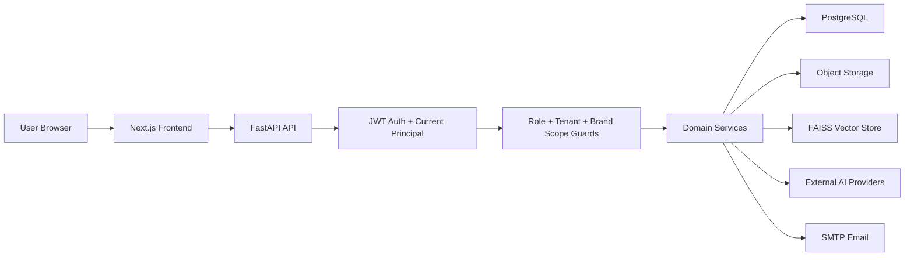

# Security and Privacy Architecture

## Scope

This document describes the security and privacy controls currently implemented in the Violyt / BrandLoveStudio.AI codebase.

It is based on the current repository implementation, especially:

- `main.py`
- `app/core/security.py`
- `app/core/dependencies.py`
- `app/core/config.py`
- `app/core/crypto.py`
- `app/services/auth.py`
- `app/services/tenant.py`
- `app/services/asset_delivery.py`
- `app/services/upload_preflight.py`
- `app/services/social.py`
- `app/api/routes/*.py`
- `frontend/lib/api/client.ts`
- `frontend/lib/api/session.ts`

This is not a certification statement. It documents implemented controls and known gaps that should be addressed before making formal compliance claims such as SOC 2, ISO 27001, GDPR, HIPAA, or similar.

## High-Level Security Architecture



The application is structured around:

- versioned FastAPI routes under `/api/v1`
- Pydantic request/response validation
- JWT bearer authentication
- tenant and Brand Space scoped authorization
- role-based access control
- signed asset delivery URLs
- upload preflight validation
- encrypted social connector token storage
- configurable environment-based secrets and infrastructure settings

## Authentication

### Implemented

- Users authenticate through `/api/v1/auth/login`.
- Passwords are hashed with bcrypt through `passlib`.
- JWT access tokens and refresh tokens are issued by `app/core/security.py`.
- Token payloads include:
  - `sub`
  - `exp`
  - `typ`
  - `tenant_id`
- Access token default lifetime is 12 hours.
- Refresh token default lifetime is 7 days.
- Inactive users are rejected during principal resolution.
- Invalid tokens return `401`.
- Inactive users return `401` or `403`, depending on flow.

### Two-Factor Authentication

Optional TOTP-based 2FA is implemented:

- setup endpoint
- enable endpoint
- disable endpoint
- verify endpoint
- 10-minute signed 2FA challenge ticket
- 6-digit TOTP verification with a small clock window

2FA state is currently stored in the user metadata JSON.

### Activation and Password Reset

- New users are activated through activation tokens.
- Activation tokens are stored server-side and marked as used after activation.
- Activation email links have been configured in tenant service flow to support the requested 48-hour activation period.
- Password reset uses an activation-token style flow with a 2-hour reset token.
- Password change requires the current password.
- Profile deletion soft-deactivates the user account.

## Frontend Session Handling

### Implemented

- The frontend attaches the access token as:

```http
Authorization: Bearer <access_token>
```

- On `401`, the frontend clears stored tokens and redirects to `/auth/login`.

### Current Risk

Access tokens, refresh tokens, and temporary 2FA tickets are stored in `localStorage`.

This is functional, but it increases exposure if an XSS vulnerability is introduced. A stronger production posture would use HttpOnly, Secure, SameSite cookies or another hardened session storage strategy.

## Authorization and Access Control

### Roles

The platform uses role codes defined in `app/core/enums.py`:

- `super_admin`
- `tenant_admin`
- `tenant_user`
- `brand_user`
- `external_reviewer`

### Implemented Authorization Controls

Authorization is centralized in `app/core/dependencies.py`.

Implemented controls include:

- current principal resolution from bearer token
- role checks through `require_roles`
- tenant access enforcement through `assert_tenant_access`
- Brand Space access enforcement through `assert_brand_access`
- required Brand Space header for brand-scoped endpoints
- explicit block preventing Super Admin users from accessing Brand Space content flows

### Multi-Tenant Isolation

Most business records are scoped by:

- `tenant_id`
- `brand_space_id`

The service/repository pattern enforces scoped reads and writes for tenants, Brand Spaces, content, knowledge assets, generated assets, chat, analytics, usage, and review resources.

Brand users are restricted to their assigned Brand Spaces through role assignments and Brand Space membership.

## API Security

### Implemented

- FastAPI routes are versioned under `/api/v1`.
- Pydantic schemas validate incoming request payloads before service logic runs.
- Domain exceptions are translated into structured HTTP responses.
- Protected routes use dependency injection for current-principal resolution and access checks.
- CORS origins are configured through settings.
- `withCredentials` is disabled on the frontend API client.

### CORS

Default CORS configuration allows:

- `http://localhost:3000`

Production deployments should set explicit trusted frontend origins through environment configuration.

## Data Storage Security

### Database

The application uses PostgreSQL through SQLAlchemy async models and repositories.

Security-relevant persistence patterns include:

- unique indexed email addresses
- hashed passwords only
- activation tokens with expiry and `used_at`
- tenant-scoped business tables
- Brand Space scoped business tables
- soft-delete or lifecycle-state patterns for retained records
- usage tracking by tenant and metric period

### Object Storage

The storage abstraction supports local storage and an S3 adapter.

Implemented safeguards include:

- tenant/brand/category path segmentation
- generated random object names
- filename sanitization
- path traversal prevention for local storage
- unsafe S3 path segment rejection
- optional S3 presigned URL generation

### Signed Asset URLs

Generated and uploaded assets are not directly exposed by default.

`AssetDeliveryService` issues signed download URLs with:

- HMAC signature
- encoded storage path
- filename
- download/inline disposition
- expiry timestamp

Default signed asset URL lifetime:

```text
30 minutes
```

The default local asset download base URL is:

```text
http://localhost:8000/api/v1/storage/download
```

In production, this must be configured to a public HTTPS backend domain if links need to work outside the local machine.

## Upload and File Handling Security

### Implemented

Upload preflight validation is implemented in `app/services/upload_preflight.py`.

Current controls include:

- base64 validation
- max decoded upload size
- allowed file extensions
- allowed MIME types
- PDF page-count limit
- PowerPoint slide-count limit
- image megapixel limit
- legacy `.doc` and `.ppt` rejection unless they resolve to modern Office container formats
- filename sanitization before storage

Default limits include:

- max file size: 25 MB
- max PDF pages: 120
- max presentation pages: 80
- max image size: 36 megapixels

### Current Gap

The codebase does not currently show an antivirus or malware scanning integration. Upload validation checks type, size, page count, and parseability, but it should not be considered malware scanning.

## Review and External Sharing

### Review Links

Review links are tokenized public resources.

Implemented:

- review links use random URL-safe tokens
- creating a review link requires authenticated Brand Space access
- external users can read review details by token
- external comments can be enabled or disabled per review link
- status updates are public by token

### Current Gap

The `ReviewLink` model has an `expires_at` field, but the current `ReviewService.get_by_token` flow does not enforce expiration. If review links need strict privacy controls, expiry enforcement should be added.

### Asset Share Links

Generated PDF/JPG/PNG/DOC links currently use signed asset URLs, not permanent public pages.

In local development they are localhost URLs. In production they become accessible to anyone who has the signed link until the token expires, assuming the configured backend URL is public.

## Social Connector Security

### Implemented

Social platform connection tokens are encrypted before storage.

Implemented in:

- `app/core/crypto.py`
- `app/services/social.py`

The encryption uses Fernet symmetric encryption. The key is sourced from `SOCIAL_ENCRYPTION_KEY` if configured; otherwise it is derived from `SECRET_KEY`.

Stored fields include:

- `access_token_encrypted`
- `refresh_token_encrypted`

### Production Recommendation

Use a dedicated `SOCIAL_ENCRYPTION_KEY` in production instead of deriving it from `SECRET_KEY`.

## Privacy Measures

### Tenant Data Isolation

Privacy is primarily enforced through tenant and Brand Space scoping:

- tenant-owned records include `tenant_id`
- brand-owned records include `brand_space_id`
- users only access resources permitted by role and scope
- Brand Users are restricted to assigned Brand Spaces
- Super Admins are blocked from Brand Space content workflows

### Data Minimization and Scoped Context

The system keeps user, tenant, brand, uploaded asset, generated content, chat, and analytics data scoped to the domain that needs it.

Brand knowledge retrieval uses tenant and Brand Space namespaces so retrieval does not intentionally cross tenants or brands.

### User Privacy Controls

Implemented:

- profile update
- password change
- account soft-deactivation through profile deletion
- notification preference storage
- optional 2FA

### Asset Privacy

Implemented:

- uploaded and generated assets are served through signed URLs
- signed URLs expire
- local storage protects against path traversal
- public static storage is disabled by default through `expose_public_storage = False`

### AI Provider Privacy Boundary

The platform sends generation prompts, brand context, and selected asset-derived context to configured AI providers.

Current implementation uses environment-configured providers and API keys. This means customer data may leave the application boundary when AI generation, embedding, image generation, OCR, or analysis calls are made.

Production privacy documentation should disclose:

- which providers are used
- what data categories are sent
- retention/training settings offered by each provider
- data processing agreements
- geographic processing constraints, if required

## Cybersecurity Practices Currently Present

Implemented in code:

- bcrypt password hashing
- JWT authentication with expiry
- access and refresh token separation
- optional TOTP 2FA
- role-based access checks
- tenant and Brand Space authorization checks
- signed asset URLs
- HMAC verification for asset tokens
- encrypted storage of social connector secrets
- upload type and size validation
- filename sanitization
- object storage path traversal protection
- scoped repositories and services
- CORS configuration
- lifecycle states for uploaded/generated/deleted assets
- usage limits for billable resources such as OCR pages and generations
- background job leasing and retry metadata

## Known Gaps and Recommended Hardening

The following items are not currently evident in the codebase and should be considered before production security review:

1. Add rate limiting for login, 2FA verification, password reset, activation, share links, and generation endpoints.
2. Move frontend token storage away from `localStorage` to HttpOnly Secure cookies or another hardened session approach.
3. Add a Content Security Policy and standard security headers.
4. Add CSRF protection if cookie-based auth is introduced.
5. Add malware scanning for uploaded files.
6. Enforce review-link expiration.
7. Add audit logs for login, failed login, user creation, role changes, tenant changes, asset sharing, exports, and admin actions.
8. Encrypt sensitive 2FA secrets at rest instead of storing them as plain metadata.
9. Add secret rotation procedures for JWT secret, social encryption key, SMTP credentials, and AI provider keys.
10. Add structured privacy retention policies for deleted users, chat history, generated content, uploaded assets, logs, and vector indexes.
11. Add database-level row-level security if stronger defense in depth is required.
12. Add automated dependency scanning and SAST checks in CI.
13. Add production TLS/HSTS requirements at deployment level.
14. Add formal DPIA/subprocessor documentation for AI provider data processing.

## Compliance Position

Current implementation supports several privacy and security foundations:

- access control
- tenant isolation
- credential hashing
- signed asset access
- upload validation
- encrypted third-party tokens
- soft account deactivation

However, the current repository should not be described as fully compliant with GDPR, SOC 2, ISO 27001, HIPAA, or similar frameworks without additional operational controls, policies, audit evidence, retention enforcement, logging, incident response procedures, and vendor/subprocessor documentation.

## Summary

Violyt currently has a solid application-level security foundation for a multi-tenant SaaS product:

- authenticated API access
- tenant and Brand Space scoped authorization
- role-based control boundaries
- signed temporary file delivery
- upload validation
- encrypted social connector tokens
- optional 2FA

The most important next improvements are:

- rate limiting
- audit logging
- review-link expiry enforcement
- hardened frontend token storage
- malware scanning
- security headers
- formal privacy retention and compliance documentation
